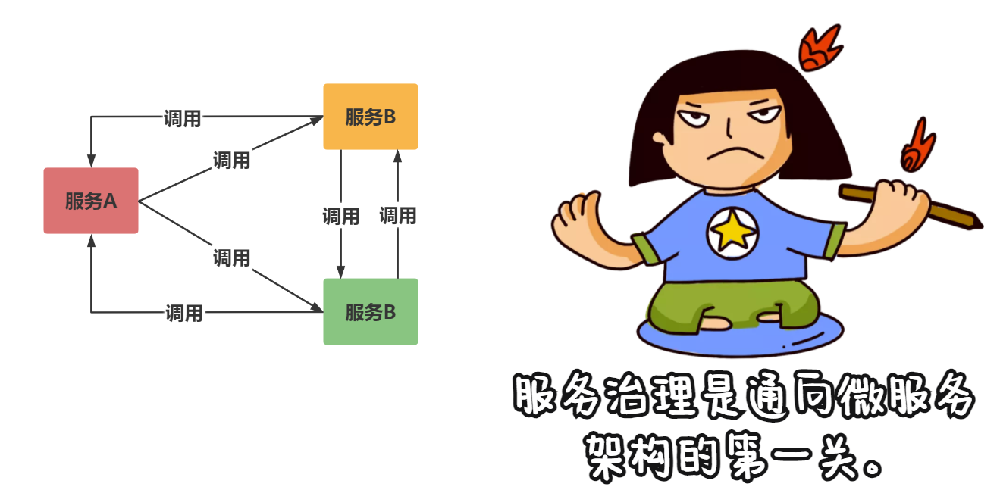
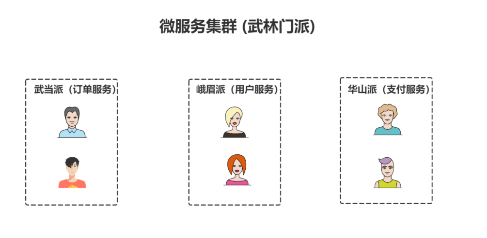
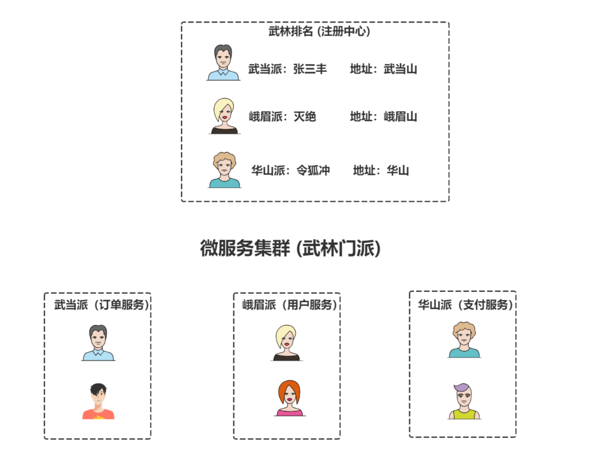
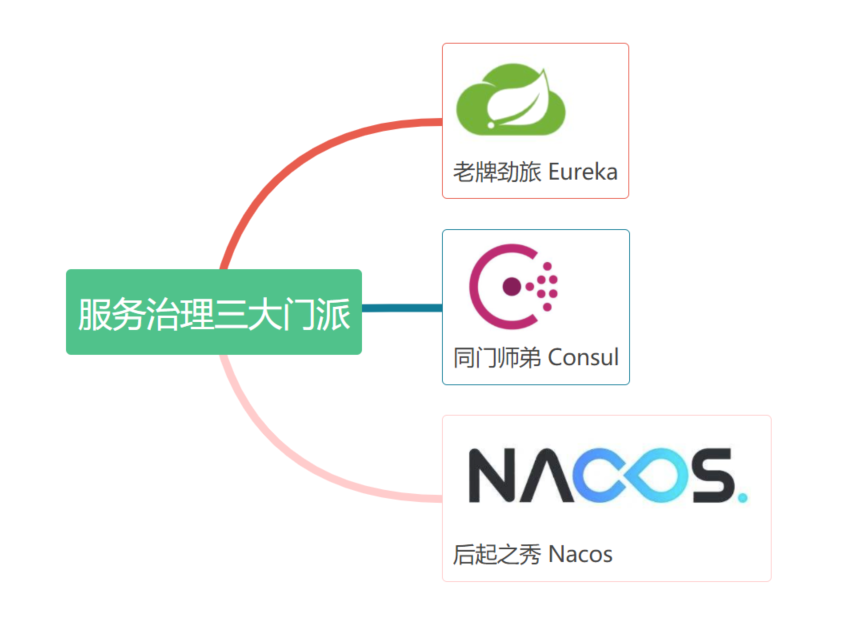
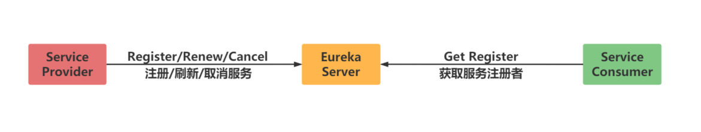
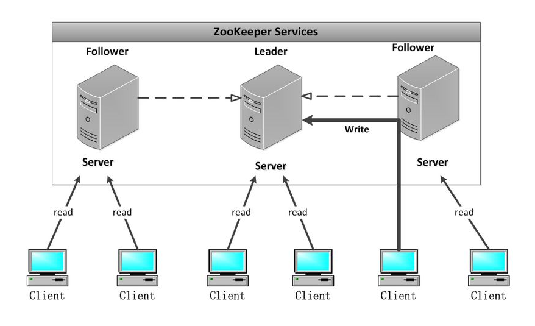

# 服务注册发现

## 什么是服务治理

### 为什么需要服务治理

在没有进行服务治理前,服务之间的通信是通过服务间直接相互调用来实现的。

> **过程：**
>
> 武当派直接调用峨眉派和华山派，同样，华山派直接调用武当派和峨眉派如果系统不复杂，这样调用没什么问题。但在复杂的微服务系统中，采用这样的调用方法就会产生问题。

微服务系统中服务众多，这样会导致服务间的相互调用非常不便，因为要记住提供服务的IP地址、名称、端口号等。这时就需要中间代理，通过中间代理来完成调用。

### 服务治理的解决方案

> **服务治理责任：**
>
> - 你是谁：服务注册 - 服务提供方自报家门
> - 你来自哪里：服务发现 - 服务消费者拉取注册数据
> - 你好吗：心跳检测，服务续约和服务剔除 一套由服务提供方和注册中心配合完成的去伪存真的过程
> - 当你死的时候：服务下线 - 服务提供方发起主动下线

### 服务治理技术选型

> **注意：**
>
> 在架构选型的时候，我们需要注意一下切记不能为了新而新，忽略了对于当前业务的支持，虽然Eureka2.0不开源了，但是谁知道以后会不会变化，而且1.0也是可以正常使用的，也有一些贡献者在维护这个项目，所以我们不必要过多的担心这个问题，要针对于业务看下该技术框架是否支持在做考虑。

## Eureka概述

Spring Cloud Eureka 是Netflix 开发的注册发现组件，本身是一个基于 REST 的服务。提供注册与发现，同时还提供了负载均衡、故障转移等能力。

**Eureka3个角色**

- 服务中心
- 服务提供者
- 服务消费者。

> **注意：**
>
> - **Eureka Server**：服务器端。它提供服务的注册和发现功能，即实现服务的治理。
> - **Service Provider**：服务提供者。它将自身服务注册到Eureka Server中，以便“服务消费者”能够通过服务器端提供的服务清单（注册服务列表）来调用它。
> - **Service Consumer**：服务消费者。它从 Eureka 获取“已注册的服务列表”，从而消费服务。

### 比Zookeeper好在哪里呢

当向注册中心查询服务列表时，我们可以容忍注册中心返回的是几分钟以前的注册信息，但不能接受服务直接down掉不可用。也就是说，服务注册功能对可用性的要求要高于一致性。

> **注意：**
>
> Zookeeper会出现这样一种情况，当Master节点因为网络故障与其他节点失去联系时，剩余节点会重新进行leader选举。问题在于，选举leader的时间太长，30～120s，且选举期间整个zk集群都是不可用的，这就导致在选举期间注册服务瘫痪。

### 结论

Eureka看明白了这一点，因此在设计时就优先保证可用性。
