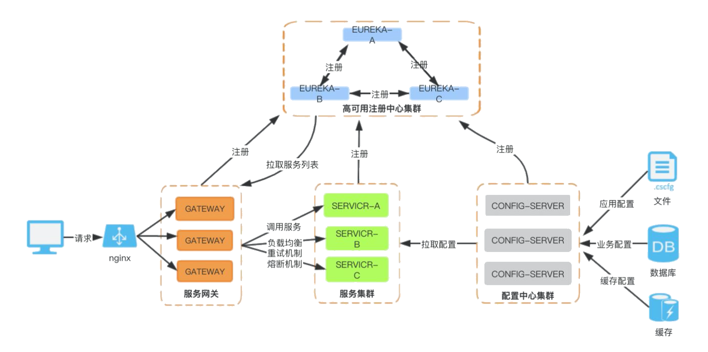

# 微服务架构进化论

### 单体应用阶段 (夫妻摊位)

在互联网发展的初期，用户数量少，一般网站的流量也很少，但硬件成本较高。因此，一般的企业会将所有的功能都集成在一起开发一个单体应用，然后将该单体应用部署到一台服务器上即可满足业务需求。

**生活中的单体应用**

小夫妻俩刚结婚，手里资金有限，就想着开一个路边烧烤摊。丈夫负责烤串做菜、妻子负责服务收银及上菜。这是一个典型的路边烧烤摊的经营模式。

> **单体应用的特点：**
>
> - 能够接纳的请求数量时有限的，因为服务器的内存、CPU配置是有限的。
> - 展现层、控制层、持久层全都在一个应用里面，调用方便、快速。单个请求的响应结果超快。
> - 开发简单、上手快、三五个人团队好管好用。

### 垂直应用阶段 （门面饭店）

随着小夫妻俩经营有方、待客有道，开始有人愿意为了吃他们做的烧烤排队了。夫妻俩一想，我们这俩人也干不过来啊，怎么办？招人吧、扩大规模吧。

- 招什么人？当然是厨师啊、端菜收银的妻子自己还能干得过来，主要是丈夫的活挺不住了。那就招厨师。
- 不能让人站着吃吧？租一个附近的门市、添置更多的桌椅板凳。

> **问题：**
>
> 在处理并发请求的能力和容量上增强了，但是在单个请求的处理速度上下降了。

### 分布式系统阶段 (酒店)

为了解决上一阶段遇到的问题：单个请求的处理速度下降。也就是饭店针对单个订单做菜响应速度下降了，但是由于饭店的菜确实好吃、菜品精良，客流量又持续的增高。该店又再次面临扩容的问题。

- 为了解决客流量持续增高，夫妻又招聘了4位厨师
- 为了解决单个订单处理速度下降的问题，将厨师分为两组，一组专门做烧烤，一组专门做饭菜。专业的人做专业的事情，注意力越集中，办事越熟练、效率越高。

### 服务治理阶段 （大酒店）

新的问题又出现了，有的顾客既点烧烤又点饭菜。导致后端两组厨师之间沟通不畅，怎么组合套餐推送给前台？厨师之间怎么调用、怎么沟通啊？谁是头？谁是大脑？谁记得A厨师的烧烤和B厨师的饭菜是一桌的？

随着服务数量的不断增加，服务中的资源浪费和调度问题日益突出。此时需要增加一个调度中心来治理服务。调度中心可基于访问压力来实时管理集群的容量，从而提高集群的利用率。

> **注意：**
>
> 在服务治理(SOA）架构中，需要一个企业服务总线(ESB）将基于不同协议的服务节点连接起来，它的工作是转换、解释消息和路由。说白了就是丈夫做菜品的配置管理、做订单的服务注册。丈夫负责主动观察问询各工种的工作状态并记录，妻子主动向丈夫问询后端厨师的状态，并根据丈夫的反馈分配订单。

### 微服务阶段 （五星大酒店）

饭店的规模越来越大了、岗位分工也越来越细了。真的成了超级大饭店了，怎么管？

> **什么是微服务：**
>
> 将系统的业务功能划分为极小的独立微服务，每个微服务只关注于完成某个小的任务。系统中的单个微服务可以被独立部署和扩展，且各个微服务之间是高内聚、松耦合的。微服务之间采用轻量化通信机制暴露接来实现通信。

> **解释：**
>
> - 服务网关：前台。所有的顾客进来，由前台统一接待。比如：Spring Cloud Gateway。
> - 熔断机制：菜品限量，法式菜品、意大利菜品、日本料理。什么时间可以吃得到、可提供多少人份？这些服务都是有限制的。
> - 工作效率监督：工作流程中每个岗位做了什么工作、用了多长时间。哪个环节出现问题、哪个岗位需要调整。比如： Sleuth、日志监控ELK等。
> - 配置中心：菜单，川菜，东北菜，杭帮菜，烩菜。
> - 服务集群：厨师微服务集群包含，川菜厨师微服务，杭帮菜厨师微服务等。
> - 高可用注册中心：大堂经理，负责那些人上班了,他在哪里干的什么工作。

# 微服务的拆分规范和原则

### 压力模型拆分

压力模型简单来说就是用户访问量，我们要识别出某些超高并发量的业务，尽可能把这部分业务独立拆分出来。

**压力模型拆解为三个维度：**

- 高频高并发场景

> **原因：**
>
> 比如商品详情页，它既是一个高频场景（时时刻刻都会发生），同时也是高并发的场景（QPS - Query per seconds极高）

#### 低频突发流量场景

> **原因：** 秒杀场景它并不是高频场景（偶尔发生），但是它会产生突发流量。再跟大家举一个例子，那就是“商品发布”，对新零售业务来说，当开设一个线下大型卖场以后，需要将所有库存商品一键上架，这里的商品总数是个非常庞大的数字（几十万+），瞬间就可以打出很高的QPS

#### 低频流量场景

> **原因：**
>
> 后台运营团队的服务接口，比如商品图文编辑，添加新的优惠计算规则，上架新商品。它发生的频率比较低，而且也不会造成很高的并发量。

### 业务模型拆分

业务模型拆分的维度有很多，我们在实际项目中应该综合各个不同维度做考量。我这里主要从主链路、领域模型和用户群体三个维度。

#### 主链路拆分

在电商领域"主链路"是一个很重要的业务链条，它是指用户完成下单场景所必须经过的场景。按照我们平时买买买的剁手经验，可以识别出很多核心主链路，比如商品搜索->商品详情页->购物车模块->订单结算->支付业务，这是就是一条最简单的主链路。如果这是一场战斗的话，那么主链路就是这场战斗的正面战场，我们必须力保主链路不失守。

**核心主链路拆分，有以下几个目的：**

1. 异常容错：为主链路建立层次化的降级策略（多级降级），以及合理的熔断策略。
2. 调配资源：主链路通常来讲都是高频场景，自然需要更多的计算资源，最主要的体现就是集群里分配的虚机数量多。
3. 服务隔离：主链路是主打输出的C位，把主链路与其他打辅助的业务服务隔离开来，避免边缘服务的异常情况影响到主链路。

#### 领域模型拆分

领域驱动设计DDD（Domain-Driven Design 领域驱动设计）不是一个新概念，但老外们有个毛病，做什么事情特别喜欢提炼方法论，本来一个非常简单的概念，愣是被吹到神乎其神高深莫测。

#### 用户群体拆分

根据用户群体做拆分，我们首先要了解自己的系统业务里有哪些用户，比如说电商领域，我们有2C的小卖家，也有2B的大客户，在集团内部有运营、采购、还有客服小二等等。对每个不同的用户群体来说，即便是相同的业务领域，也有该群体其独有的业务场景。

用户群体相当于一个二级域，我们建议先根据主链路和领域模型做一级域的拆分，再结合具体的业务分析，看是否需要在用户领域方向上做更细粒度的拆分。

# 为什么选择Spring Cloud

### Spring Cloud与Netflix

Netflix是一家做视频网站的公司，之所以要说一下这个公司是因为Spring Cloud在发展之初，Netflix做了很大的贡献。包括服务注册中心Eureka、服务调用Ribbon、Feign，服务容错限流Hystrix、服务网关Zuul等众多组件都是Netflix贡献给Spring Cloud社区的。

### 什么是SpringCloud

Spring Cloud是一个基于Spring Boot实现的微服务架构开发工具。它为微服务架构中涉及的配置管理、服务治理、断路器、智能路由、控制总线、分布式会话和集群状态管理等操作提供了一种简单的开发方式。

### 核心事件追踪

- 2018年6月底，Eureka 2.0 开源工作宣告停止，继续使用风险自负。
- 2018年11月底，Hystrix 宣布不再在开源版本上提供新功能。
- 2018年12月，Spring官方宣布Netflix的相关项目进入维护模式。

从此，Spring Cloud逐渐告别Netflix时代。

- 2018年10月31日，Spring Cloud Alibaba正式入驻了Spring Cloud官方孵化器，并在maven中央库发布了第一个版本。

### 服务注册中心选型

- **Eureka：**Spring Cloud与Netflix的大儿子，出生的时候家里条件一般，长大后素质有限。
- **Nacos：**后起之秀，曾经Spring Cloud眼中“别人家的孩子”，已经纳入收养范围（Spring Cloud Alibaba孵化项目）。
- **Apache Zookeeper：**关系户，与hadoop关系比较好
- **etcd：**关系户，与kubernetes关系比较好
- **Consul：**关系户，曾经与docker关系比较好

> **注意：**
>
> 如果你的应用已经使用到了Hadoop、Kubernetes、Docker，在Spring Cloud实施过程中可以考虑使用其关系户组件，避免搭建两套注册中心，节省资源。

### 分布式配置管理

目前可选的分布式配置管理中心，有阿里的Nacos、携程的Apollo、和Spring Cloud Config。

### 服务网关

服务网关这块就不多说了，没有任何悬念，Spring Cloud Gateway在各方面都碾压Zuul，Zuul2也基本上是胎死腹中。

### 熔断限流

#### Hystrix

2018年12月，Spring官方宣布Netflix的相关项目进入维护模式。不再开发新的功能，但是Hystrix整体上还是比较稳定的，对于老用户不必更换，影响也不大。

#### resilience4j

Hystrix停更之后，Netflix官方推荐使用resilience4j，它是一个轻量、易用、可组装的高可用框架，支持熔断、高频控制、隔离、限流、限时、重试等多种高可用机制。

#### Sentinel（重点）

Sentinel是阿里中间件团队开源的，面向分布式服务架构的轻量级高可用流量控制组件，主要以流量为切入点，从流量控制、熔断降级、系统负载保护等多个维度来帮助用户保护服务的稳定性。

# Spring Cloud版本选择

### SpringCloud版本号由来

SpringCloud的版本号是根据英国伦敦地铁站的名字进行命名的，由地铁站名称字母A-Z依次类推表示发布迭代版本。 

### SpringCloud和SpringBoot版本对应关系

> **注意事项：**
>
> 其实SpringBoot与SpringCloud需要版本对应，否则可能会造成很多意料之外的错误，比如eureka注册了结果找不到服务类啊，比如某些jar导入不进来啊，等等这些错误。

### **版本说明**

| 名字     | 描述                                                         |
| -------- | ------------------------------------------------------------ |
| SNAPSHOT | 快照版，可以稳定使用，且仍在继续改进版本。                   |
| PRE      | 预览版,内部测试版. 主要是给开发人员和测试人员测试和找BUG用的，不建议使用； |
| RC       | 发行候选版本，基本不再加入新的功能，主要修复bug。            |
| SR       | 修正版或更新版                                               |
| GA       | 正式发布的版本                                               |

从 Spring Cloud 2020.0.0-M1 开始，Spring Cloud 废除了这种英国伦敦地铁站的命名方式，而使用了全新的 "日历化" 版本命名方式。

# 如何学习微服务Spring Cloud

简单来说，就是“三大功能，两大特性”。

三大功能是指微服务核心组件的功能维度，由浅入深层次递进；而两大特性是构建在每个服务组件之上的高可用性和高可扩展性。别看微服务框架组件多，其实你完全可以按照这三大功能模块，给它们有简入难对号入座。

> **注意：**
>
> - **服务间通信**：包括服务治理、负载均衡、服务间调用；
> - **服务容错和异常排查**：包括流量整形、降级熔断、调用链追踪；
> - **分布式能力建设**：包括微服务网关、分布式事务、消息驱动、分布式配置中心。

### 从哪里入手

> 从微服务组件的功能维度来讲，服务间通信是最基础的功能特性，这个功能模块是最适合作为初学者学习微服务技术的切入点。
