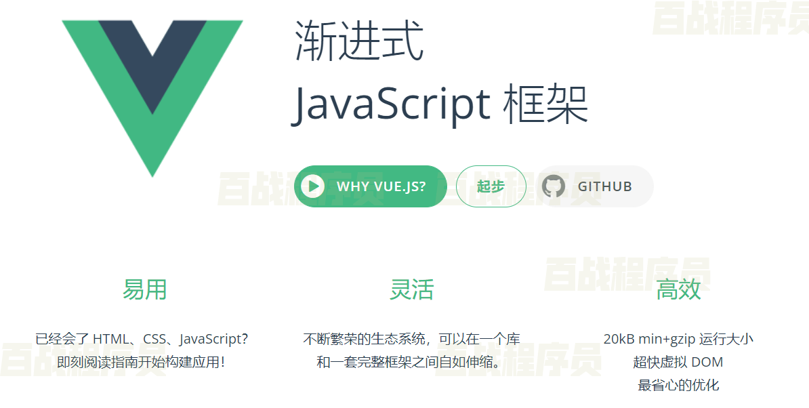
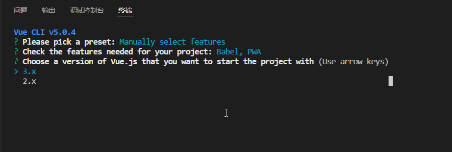
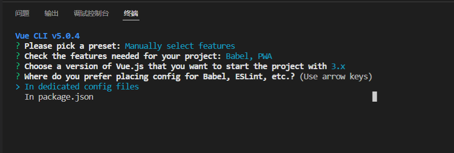
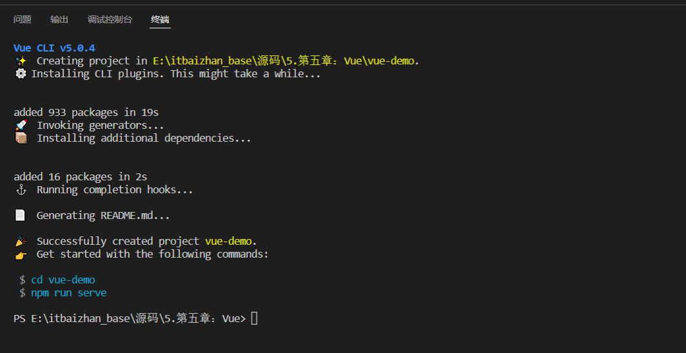
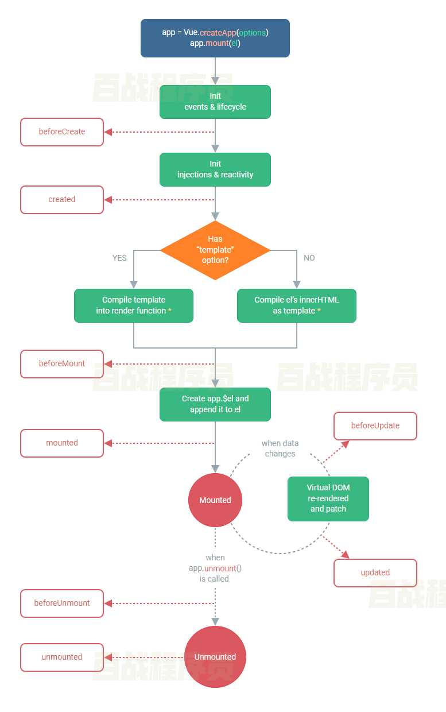
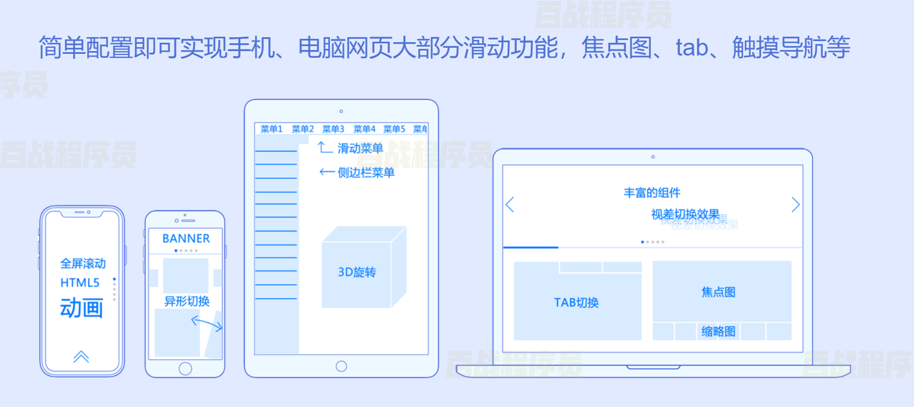
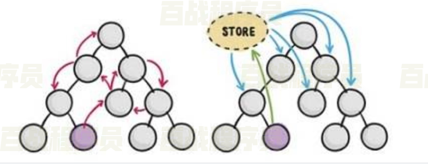

#  Vue是什么？



### Vue是什么？

Vue是前端优秀框架， 是一套用于构建用户界面的**渐进式框架**

### 为什么要学习Vue

1. Vue是目前前端最火的框架之一
2. Vue是目前企业技术栈中要求的知识点
3. Vue可以提升开发体验
4. Vue学习难度较低
5. ...


# Vue开发前的准备

### 安装Vue工具 `Vue CLI`

`Vue CLI` Vue.js 开发的标准工具，`Vue CLI` 是一个基于 Vue.js 进行快速开发的完整系统

```vue
npm install -g @vue/cli
```

安装之后，你就可以在命令行中访问 `vue` 命令。你可以通过简单运行 `vue`，看看是否展示出了一份所有可用命令的帮助信息，来验证它是否安装成功。

```vue
vue --version
```

### 创建一个项目

运行以下命令来创建一个新项目

```vue
vue create vue-demo
```

> **温馨提示**
>
> 在控制台中，可以用上下按键调整选择项
> 在控制台中，可以用空格(spacebar)选择是否选中和取消选中

可以选择默认项目模板，或者选“手动选择特性”来选取需要的特性。


我们选择`Babel`和`Progressive Web App (PWA) Support` 两个选项即可

> **温馨提示**
>
> 在学习期间，不要选中 `Linter / Formatter` 以避免不必要的错误提示


Vue目前有两个主流大版本`vue2`和`vue3`，我们本套课程选择`vue3`最新版本



配置放在哪里? `In dedicated config files` 专用配置文件或者 `In package.json`在package.json文件



将其保存为未来项目的预置? `y`代表保存，并添加名字，`n`不保存


项目创建成功如下提示信息



### 运行项目

第一步：进入项目根目录`cd vue-demo`

第二步：运行`npm run serve` 启动项目

### 安装Vue高亮插件

VSCode中安装`vetur`或者`volar`都可，前者针对Vue2版本，后者针对Vue3版本


# 模板语法

### 文本

数据绑定最常见的形式就是使用“Mustache” (双大括号) 语法的文本插值

```vue
<span>Message: {{ msg }}</span>
```

 一般配合`js` 中的`data()`设置数据

```vue
export default {
 name: 'HelloWorld',
 data(){
  return{
   msg:"消息提示"
   }
  }
}
```

### 原始 HTML

双大括号会将数据解释为普通文本，而非 HTML 代码。为了输出真正的 HTML，你需要使用`v-html` 指令

```vue
<p>Using mustaches: {{ rawHtml }}</p>
<p>Using v-html directive: <span v-html="rawHtml"></span></p>

data(){
  return{
    rawHtml:"<a href='https://www.itbaizhan.com'>百战</a>"
   }
}
```

### 属性 Attribute

Mustache 语法不能在 HTML 属性中使用，然而，可以使用 `v-bind` 指令

```vue
<div v-bind:id="dynamicId"></div>

data(){
  return{
    dynamicId:1001
   }
}
```

> **温馨提示**
> `v-bind`: 可以简写成`:`

### 使用 JavaScript 表达式

在我们的模板中，我们一直都只绑定简单的 property 键值，Vue.js 都提供了完全的 JavaScript 表达式支持

```vue
{{ number + 1 }}

{{ ok ? 'YES' : 'NO' }}

{{ message.split('').reverse().join('') }}
```

这些表达式会在当前活动实例的数据作用域下作为 JavaScript 被解析。有个限制就是，每个绑定都只能包含**单个表达式**，所以下面的例子都**不会**生效。

```vue
<!--  这是语句，不是表达式：-->
{{ var a = 1 }}

<!-- 流程控制也不会生效，请使用三元表达式 -->
{{ if (ok) { return message } }}
```


# 条件渲染

### v-if

`v-if` 指令用于条件性地渲染一块内容。这块内容只会在指令的表达式返回 `true` 值的时候被渲染。

```vue
<p v-if="flag">我是孙猴子</p>

data() {
  return {
    flag: true
   }
}
```
### v-else

你可以使用 `v-else` 指令来表示 `v-if` 的“else 块”

```vue
<p v-if="flag">我是孙猴子</p>
<p v-else>你是傻猴子</p>

data() {
  return {
    flag: false
   }
}
```

### v-show

另一个用于条件性展示元素的选项是 `v-show` 指令

```vue
<h1 v-show="ok">Hello!</h1>
```

### `v-if` vs `v-show` 的区别

`v-if` 是“真正”的条件渲染，因为它会确保在切换过程中，条件块内的事件监听器和子组件适当地被销毁和重建。

`v-if` 也是**惰性的**：如果在初始渲染时条件为假，则什么也不做——直到条件第一次变为真时，才会开始渲染条件块。

相比之下，`v-show` 就简单得多——不管初始条件是什么，元素总是会被渲染，并且只是简单地基于 CSS 进行切换。

一般来说，`v-if` 有更高的切换开销，而 `v-show` 有更高的初始渲染开销。因此，如果需要非常频繁地切换，则使用 `v-show` 较好；如果在运行时条件很少改变，则使用 `v-if` 较好


# 列表渲染

### 用 `v-for` 把一个数组映射为一组元素

我们可以用 `v-for` 指令基于一个数组来渲染一个列表。`v-for` 指令需要使用 `item in items` 形式的特殊语法，其中 items 是源数据数组，而 `item` 则是被迭代的数组元素的**别名**。

```vue
<ul>
  <li v-for="item in items">{{ item.message }}</li>
</ul>

data() {
  return {
    items: [{ message: 'Foo' }, { message: 'Bar' }]
   }
}
```

### 维护状态

当 Vue 正在更新使用 `v-for` 渲染的元素列表时，它默认使用“就地更新”的策略。如果数据项的顺序被改变，Vue 将不会移动 DOM 元素来匹配数据项的顺序，而是就地更新每个元素，并且确保它们在每个索引位置正确渲染。

为了给 Vue 一个提示，以便它能跟踪每个节点的身份，从而重用和重新排序现有元素，你需要为每项提供一个唯一的 `key` attribute：

```vue
<div v-for="(item,index) in items" :key="item.id|index">
 <!-- 内容 -->
</div>
```


# 事件处理

### 监听事件

我们可以使用 `v-on` 指令 (通常缩写为 `@` 符号) 来监听 DOM 事件，并在触发事件时执行一些 JavaScript。用法为 `v-on:click="methodName"` 或使用快捷方式 `@click="methodName"`

```vue
<button @click="counter += 1">Add 1</button>

data() {
  return {
    counter: 0
   }
}
```

### 事件处理方法

然而许多事件处理逻辑会更为复杂，所以直接把 JavaScript 代码写在 `v-on` 指令中是不可行的。因此 `v-on` 还可以接收一个需要调用的方法名称。

```vue
<button @click="greet">Greet</button>

methods: {
  greet(event) {
    // `event` 是原生 DOM event
    if (event) {
      alert(event.target.tagName)
     }
   }
}
```

### 内联处理器中的方法

这是官方的翻译称呼，其实我们可以直接叫他 "事件传递参数"

```vue
<button @click="say('hi')">Say hi</button>
<button @click="say('what')">Say what</button>

methods: {
  say(message) {
    alert(message)
   }
}
```


# 表单输入绑定

你可以用 `v-model` 指令在表单 `<input>`、`<textarea>` 及 `<select>` 元素上创建双向数据绑定。它会根据控件类型自动选取正确的方法来更新元素。尽管有些神奇，但 `v-model` 本质上不过是语法糖。它负责监听用户的输入事件来更新数据，并在某种极端场景下进行一些特殊处理。

```vue
<input v-model="message" placeholder="edit me" />
<p>Message is: {{ message }}</p>

data() {
  return {
    message:""
   }
}
```

### 修饰符

#### `.lazy`

在默认情况下，`v-model` 在每次 `input` 事件触发后将输入框的值与数据进行同步 。你可以添加 `lazy` 修饰符，从而转为在 `change` 事件之后进行同步

```vue
<input v-model.lazy="message" />
<p>Message is: {{ message }}</p>

data() {
  return {
    message:""
   }
}
```

#### `.trim`

如果要自动过滤用户输入的首尾空白字符，可以给 `v-model` 添加 `trim` 修饰符

```vue
<input v-model.trim="message" />

data() {
  return {
    message:""
   }
}
```


# 组件基础

### 单文件组件

Vue 单文件组件（又名 `*.vue` 文件，缩写为 **SFC**）是一种特殊的文件格式，它允许将 Vue 组件的模板、逻辑 **与** 样式封装在单个文件中

```vue
<template>
  <h3>单文件组件</h3>
</template>

<script>
export default {
  name:"MyComponent"
}
</script>

<style scoped>
h3{
  color: red;
}
</style>
```

### 加载组件

第一步：引入组件 `import MyComponentVue from './components/MyComponent.vue'`

第二步：挂载组件 `components: { MyComponentVue }`

第三步：显示组件 `<my-componentVue />`

### 组件的组织

通常一个应用会以一棵嵌套的组件树的形式来组织


# Props组件交互

组件与组件之间是需要存在交互的，否则完全没关系，组件的意义就很小了

`Prop` 是你可以在组件上注册的一些自定义 attribute

```vue
<my-componentVue title="标题"/>

<template>
  <h3>单文件组件</h3>
  <p>{{ title }}</p>
</template>


<script>
export default {
  name:"MyComponent",
  props:{
    title:{
      type:String,
      default:""
     }
   }
}
</script>
```

### Prop 类型

Prop传递参数其实是没有类型限制的

> **温馨提示**
>
> ​	数据类型为数组或者对象的时候，默认值是需要返回工厂模式


# 自定义事件组件交互

自定义事件可以在组件中反向传递数据，`prop` 可以将数据从父组件传递到子组件，那么反向如何操作呢，就可以利用自定义事件实现 `$emit`

```vue
<template>
  <h3>单文件组件</h3>
  <button @click="sendHandle">发送数据</button>
</template>

<script>
export default {
  name: "MyComponent",
  methods:{
    sendHandle(){
      this.$emit("onCustom","数据")
     }
   }
}
</script>


<style scoped>
h3 {
  color: red;
}
</style>
```

---

```vue
<template>
 <my-componentVue @onCustom="getData" />
</template>

<script>
import MyComponentVue from './components/MyComponent.vue'

export default {
 name: 'App',
 components: {
  MyComponentVue
  },
 methods: {
  getData(data) {
   console.log(data);
   }
  }
}
</script>
```


# 组件生命周期

每个组件在被创建时都要经过一系列的初始化过程——例如，需要设置数据监听、编译模板、将实例挂载到 DOM 并在数据变化时更新 DOM 等。同时在这个过程中也会运行一些叫做**生命周期钩子**的函数，这给了用户在不同阶段添加自己的代码的机会



为了方便记忆，我们可以将他们分类：

创建时：`beforeCreate`、`created`

渲染时：`beforeMount`、`mounted`

更新时：`beforeUpdate`、`updated`

卸载时：`beforeUnmount`、`unmounted`

 

# Vue引入第三方



`Swiper` 开源、免费、强大的触摸滑动插件

`Swiper` 是纯javascript打造的滑动特效插件，面向手机、平板电脑等移动终端

`Swiper` 能实现触屏焦点图、触屏Tab切换、触屏轮播图切换等常用效果

> **温馨提示**
> 	官方文档：https://swiperjs.com/vue
> 	安装指定版本: `npm instal --save swiper@8.1.6`

### 基础实现

```vue
<template>
 <div class="hello">
  <swiper class="mySwiper">
   <swiper-slide>Slide 1</swiper-slide>
   <swiper-slide>Slide 2</swiper-slide>
   <swiper-slide>Slide 3</swiper-slide>
  </swiper>
 </div>
</template>


<script>
import { Swiper, SwiperSlide } from 'swiper/vue';
import 'swiper/css';


export default {
 name: 'HelloWorld',
 components: {
  Swiper,
  SwiperSlide,
  }
}
</script>
```

### 添加指示器

```vue
<template>
 <div class="hello">
  <swiper class="mySwiper" :modules="modules" :pagination="{ clickable: true }">
   <swiper-slide>
    
   </swiper-slide>
   <swiper-slide>
    
   </swiper-slide>
   <swiper-slide>
    
   </swiper-slide>
  </swiper>
 </div>
</template>


<script>
import { Pagination } from 'swiper';
import { Swiper, SwiperSlide } from 'swiper/vue';
import 'swiper/css';
import 'swiper/css/pagination';


export default {
 name: 'HelloWorld',
 data(){
  return{
   modules: [ Pagination ]
   }
  },
 components: {
  Swiper,
  SwiperSlide,
  }
}
</script>
```


# Axios网络请求

Axios 是一个基于 promise 的网络请求库

### 安装

Axios的应用是需要单独安装的 `npm install --save axios`

### 引入

组件中引入: `import axios from "axios"`

全局引用:

```vue
import axios from "axios"


const app = createApp(App);
app.config.globalProperties.$axios = axios
app.mount('#app')


// 在组件中调用
this.$axios
```

### 网络请求基本示例

#### get请求

```vue
axios({
  method: "get",
  url: "http://iwenwiki.com/api/blueberrypai/getChengpinDetails.php"
}).then(res => {
  console.log(res.data);
})
```

#### post请求

> **温馨提示**
> post请求参数是需要额外处理的
>
> 1. 安装依赖: `npm install --save querystring`
> 2. 转换参数格式: `qs.stringify({})`

```vue
axios({
  method:"post",
  url:"http://iwenwiki.com/api/blueberrypai/login.php",
  data:qs.stringify({
    user_id:"iwen@qq.com",
    password:"iwen123",
    verification_code:"crfvw"
   })
}).then(res =>{
  console.log(res.data);
})
```

### 快捷方案

#### get请求

```vue
axios.get("http://iwenwiki.com/api/blueberrypai/getChengpinDetails.php")
   .then(res =>{
   console.log(res.data);
   })
```

#### post请求

```vue
axios.post("http://iwenwiki.com/api/blueberrypai/login.php", qs.stringify({
   user_id: "iwen@qq.com",
   password: "iwen123",
   verification_code: "crfvw"
   }))
    .then(res => {
    console.log(res.data);
    })
```


# Axios网络请求封装

在日常应用过程中，一个项目中的网络请求会很多，此时一般采取的方案是将网络请求封装起来

在`src`目录下创建文件夹`utils`，并创建文件`request`，用来存储网络请求对象 `axios`

```vue
import axios from "axios"
import qs from "querystring"

const errorHandle = (status,info) => {
  switch(status){
    case 400:
      console.log("语义有误");
      break;
    case 401:
      console.log("服务器认证失败");
      break;
    case 403:
      console.log("服务器拒绝访问");
      break;
    case 404:
      console.log("地址错误");
      break;
    case 500:
      console.log("服务器遇到意外");
      break;
    case 502:
      console.log("服务器无响应");
      break;
    default:
      console.log(info);
      break;
   }
}


const instance = axios.create({
  timeout:5000
})


instance.interceptors.request.use(
  config =>{
    if(config.method === "post"){
      config.data = qs.stringify(config.data)
     }
    return config;
   },
  error => Promise.reject(error)
)


instance.interceptors.response.use(
  response => response.status === 200 ? Promise.resolve(response) : Promise.reject(response),
  error =>{
    const { response } = error;
    errorHandle(response.status,response.info)
   }
)


export default instance;
```

在`src`目录下创建文件夹`api`，并创建文件`index`和`path`分别用来存放网络请求方法和请求路径

```vue
// path.js
const base = {
  baseUrl:"http://iwenwiki.com",
  chengpin:"/api/blueberrypai/getChengpinDetails.php"
}

export default base
```

```vue
// index.js
import path from "./path"
import axios from "../utils/request"

export default {
  getChengpin(){
    return axios.get(path.baseUrl + path.chengpin)
   }
}
```

在组件中直接调用网络请求

```vue
import api from "../api/index"

api.getChengpin().then(res =>{
  console.log(res.data);
})
```


# 网络请求跨域解决方案

JS采取的是同源策略

同源策略是浏览器的一项安全策略，浏览器只允许js 代码请求和当前所在服务器域名,端口,协议相同的数据接口上的数据,这就是同源策略.

也就是说，当协议、域名、端口任意一个不相同时，都会产生跨域问题，所以又应该如何解决跨域问题呢

### 跨域错误提示信息


### 目前主流的跨域解决方案有两种：

1. 后台解决：cors

2. 前台解决：proxy

	```vue
	devServer: {
	  proxy: {
	   '/api': {
	    target: '<url>',
	    changeOrigin: true
	    }
	   }
	}
	```

> **温馨提示**
> 	解决完跨域配置之后，要记得重启服务器才行哦！


# Vue引入路由配置

在Vue中，我们可以通过`vue-router`路由管理页面之间的关系

Vue Router 是 Vue.js 的官方路由。它与 Vue.js 核心深度集成，让用 Vue.js 构建单页应用变得轻而易举

### 在Vue中引入路由

第一步：安装路由 `npm install --save vue-router`

第二步：配置独立的路由文件

```vue
// index.js
import { createRouter, createWebHashHistory } from 'vue-router'
import HomeView from '../views/HomeView.vue'

const routes = [
  {
  path: '/',
  name: 'home',
  component: HomeView
  },
  {
  path: '/about',
  name: 'about',
  component: () => import('../views/AboutView.vue')
  }
]

const router = createRouter({
 history: createWebHashHistory(),
 routes
})

export default router
```

第三步：引入路由到项目

```vue
// main.js
import router from './router'
app.use(router)
```

第四步：指定路由显示入口 `<router-view/>`

第五步：指定路由跳转

```vue
<router-link to="/">Home</router-link> |
<router-link to="/about">About</router-link>
```


# 路由传递参数

页面跳转过程中，是可以携带参数的，这也是很常见的业务

例如：在一个列表项，点击进入查看每个列表项的详情

第一步：在路由配置中指定参数的`key`

```vue
{
  path:"/list/:name",
  name:"list",
  component:() => import("../views/ListView.vue")
}
```

第二步：在跳转过程中携带参数

```vue
<li><router-link to="/list/内蒙">内蒙旅游十大景区</router-link></li>
<li><router-link to="/list/北京">北京旅游十大景区</router-link></li>
<li><router-link to="/list/四川">四川旅游十大景区</router-link></li>
```

第三步：在详情页面读取路由携带的参数

```vue
<p>{{ $route.params.name }}城市旅游景区详情</p>
```


# 嵌套路由配置

路由嵌套是非常常见的需求

第一步：创建子路由要加载显示的页面

第二步：在路由配置文件中添加子路由配置

```vue
{
  path:"/news",
  name:"news",
  redirect:"/news/baidu",
  component:() => import("../views/NewsView.vue"),
  children:[
    {
         path:"baidu",
      component:() => import("../views/NewsList/BaiduNews.vue"),
    },
    {
      path:"wangyi",
      component:() => import("../views/NewsList/WangyiNews.vue"),
    }
   ]
}
```

第三步：指定子路由显示位置`<router-view></router-view>`

第四步：添加子路由跳转链接

```vue
<router-link to="/news/baidu">百度新闻</router-link> | 
<router-link to="/news/wangyi">网易新闻</router-link>
```

第五步：重定向配置 `redirect:"/news/baidu"`


# Vue状态管理(Vuex)

Vuex 是一个专为 Vue.js 应用程序开发的**状态管理模式 + 库**。它采用集中式存储管理应用的所有组件的状态，并以相应的规则保证状态以一种可预测的方式发生变化。

简单来说，状态管理可以理解成为了更方便的管理组件之间的数据交互，提供了一个集中式的管理方案，任何组件都可以按照指定的方式进行读取和改变数据



### 引入Vuex的步骤

第一步：安装Vuex `npm install --save vuex`

第二步：配置Vuex文件

```vue
import { createStore } from 'vuex'

export default createStore({
 state: {
   counter:0
  }
})
```

第三步：在主文件中引入Vuex

```vue
import store from './store'
app.use(store)
```

第四步：在组件中读取状态

```vue
<p>counter:{{ $store.state.counter }}</p>
// 或者
import { mapState } from 'vuex';
computed:{
   ...mapState(["counter"])
}
```


# Vue状态管理核心(Vuex)

最常用的核心概念包含: `State`、`Getter`、`Mutation`、`Action`

### Getter

对Vuex中的数据进行过滤

```vue
import { createStore } from 'vuex'

export default createStore({
 state: {
  counter: 0
  },
 getters: {
  getCount(state){
   return state.counter > 0 ? state.counter : "counter小于0，不符合要求"
   }
  }
})
```

```vue
import { mapState,mapGetters } from 'vuex';
computed:{
  ...mapGetters(["getCount"])
}

```

### Mutation

更改 Vuex 的 store 中的状态的唯一方法是提交 mutation。Vuex 中的 mutation 非常类似于事件：每个 mutation 都有一个字符串的事件类型 (type)和一个回调函数 (handler)。这个回调函数就是我们实际进行状态更改的地方，并且它会接受 state 作为第一个参数

```vue
import { createStore } from 'vuex'

export default createStore({
 state: {
  counter: 0
  },
 getters: {
  },
 mutations: {
  setCounter(state, num) {
   state.counter += num
   }
  }
})
```

```vue
import { mapState,mapMutations } from 'vuex';


methods:{
  ...mapMutations(["setCounter"]),
  clickHandler(){
   // this.$store.commit("setCounter",20)
     // 或者
   // this.setCounter(10)
   }
}
```

### Action

Action 类似于 mutation，不同在于：

- Action 提交的是 mutation，而不是直接变更状态

- Action 可以包含任意异步操作

```vue
import { createStore } from 'vuex'
import axios from "axios"


export default createStore({
 state: {
  counter: 0
  },
 getters: {
  getCount(state){
   return state.counter > 0 ? state.counter : "counter小于0，不符合要求"
   }
  },
 mutations: {
  setCounter(state, num) {
   state.counter += num
   }
  },
 actions: {
  asyncSetCount({ commit }){
   axios.get("http://iwenwiki.com/api/generator/list.php")
    .then(res =>{
    commit("setCounter",res.data[0])
    })
   }
  }
})
```

```vue
import { mapState,mapMutations,mapGetters,mapActions } from 'vuex';

methods:{
  ...mapActions(["asyncSetCount"]),
  clickAsyncHandler(){
    // this.$store.dispatch("asyncSetCount")
    // 或者
    // this.asyncSetCount()
   }
}
```


# Vue3新特性

Vue3是目前Vue的最新版本，自然也是新增了很多新特性

### 六大亮点

- Performance：性能更比Vue 2.0强。
- Tree shaking support：可以将无用模块“剪辑”，仅打包需要的。
- **Composition API：组合API**
- Fragment, Teleport, Suspense：“碎片”，Teleport即Protal传送门，“悬念”
- Better TypeScript support：更优秀的Ts支持
- Custom Renderer API：暴露了自定义渲染API

### ref或者reactive

在2.x中通过组件data的方法来定义一些当前组件的数据

```vue
data() {
 return {
  name: 'iwen',
  list: [],
  }
}
```

在3.x中通过ref或者reactive创建响应式对象

```vue
import { ref,reactive } from "vue"
export default {
 name: 'HelloWorld',
 setup(){
   const name = ref("iwen")
   const state = reactive({
     list:[]
    })

  return{
    name,
    state
   }
  }
}
```

### methods中定义的方法写在setup()

在2.x中methods来定义一些当前组件内部方法

```vue
methods:{
  http(){}
}
```

在3.x中直接在setup方法中定义并return

```vue
setup() {
  const http = ()=>{
    // do something
   }
  return {
   http
   };
}
```

### setup()中使用props和context

在2.x中，组件的方法中可以通过this获取到当前组件的实例，并执行data变量的修改，方法的调用，组件的通信等等，但是在3.x中，setup()在beforeCreate和created时机就已调用，无法使用和2.x一样的this，但是可以通过接收setup(props,ctx)的方法，获取到当前组件的实例和props

```vue
export default {
 props: {
  name: String,
  },
 setup(props,ctx) {
  console.log(props.name)
  ctx.emit('event')
  },
}
```

### 在setup中使生命周期函

你可以通过在生命周期钩子前面加上 “on” 来访问组件的生命周期钩子。

下表包含如何在 setup () 内部调用生命周期钩子

| Options API   | Hook inside setup |
| ------------- | ----------------- |
| beforeCreate  | Not needed*       |
| created       | Not needed*       |
| beforeMount   | onBeforeMount     |
| mounted       | onMounted         |
| beforeUpdate  | onBeforeUpdate    |
| updated       | onUpdated         |
| beforeUnmount | onBeforeUnmount   |
| unmounted     | onUnmounted       |

```vue
export default {
 setup() {
  // mounted
  onMounted(() => {
   console.log('Component is mounted!')
   })
  }
}
```

### Provide / Inject

- provide() 和 inject() 可以实现嵌套组件之间的数据传递。

- 这两个函数只能在 setup() 函数中使用。

- 父级组件中使用 provide() 函数向下传递数据。

- 子级组件中使用 inject() 获取上层传递过来的数据。

- 不限层级

```vue
// 父组件
import { provide } from "vue"

setup() {
  provide("customVal", "我是父组件向子组件传递的值");
}
```

```vue
// 子组件
import { inject } from "vue"

setup() {
  const customVal = inject("customVal");
  return {
   customVal
   }
}
```

### Fragment

Fragment翻译为：“碎片”

- 不再限于模板中的单个根节点

```vue
<template>
 
 <HelloWorld msg="Welcome to Your Vue.js App" />
</template>
```


# Vue3加载Element-plus

Element，一套为开发者、设计师和产品经理准备的基于 `Vue 2.0` 的桌面端组件库

Element Plus 基于 `Vue 3`，面向设计师和开发者的组件库

### 安装Element-Plus

```vue
npm install element-plus --save
```

### 完整引用

如果你对打包后的文件大小不是很在乎，那么使用完整导入会更方便

```vue
import { createApp } from 'vue'
import ElementPlus from 'element-plus'
import 'element-plus/dist/index.css'
import App from './App.vue'

const app = createApp(App)

app.use(ElementPlus)
app.mount('#app')
```

### 按需导入

按需导入才是我们的最爱，毕竟在真实的应用场景中并不是每个组件都会用到，这会造成不小的浪费

首先你需要安装`unplugin-vue-components` 和 `unplugin-auto-import`这两款插件

```vue
npm install -D unplugin-vue-components unplugin-auto-import
```

然后修改`vue.config.js`配置文件

```vue
const { defineConfig } = require('@vue/cli-service')
const AutoImport = require('unplugin-auto-import/webpack')
const Components = require('unplugin-vue-components/webpack')
const { ElementPlusResolver } = require('unplugin-vue-components/resolvers')

module.exports = defineConfig({
 transpileDependencies: true,
 configureWebpack: {
  plugins: [
   AutoImport({
    resolvers: [ElementPlusResolver()]
    }),
   Components({
    resolvers: [ElementPlusResolver()]
    })
   ]
  }
})
```

最后，可以直接在组件中使用

```vue
<template>
    <el-button>Default</el-button>
    <el-button type="primary">Primary</el-button>
</template>
```


# Vue3加载Element-plus的字体图标

`Element-plus`不仅仅是提供了各种组件，同时还提供了一整套的字体图标方便开发者使用

### 安装`icons`字体图标

```vue
npm install @element-plus/icons-vue
```

### 全局注册

在项目根目录下，创建`plugins`文件夹，在文件夹下创建文件`icons.js`文件

```vue
import * as components from "@element-plus/icons-vue";
export default {
  install: (app) => {
    for (const key in components) {
      const componentConfig = components[key];
      app.component(componentConfig.name, componentConfig);
     }
   },
};
```

### 引入文件

在`main.js`中引入`icons.js`文件

```vue
import elementIcon from "./plugins/icons";
app.use(elementIcon)
```

### 使用方式

接下来就可以直接在组件中引入使用了

```vue
<el-icon class="expand" color="#409EFC" :size="30">
  <expand/>
</el-icon>
```

