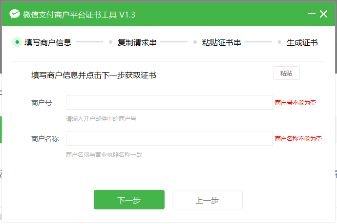
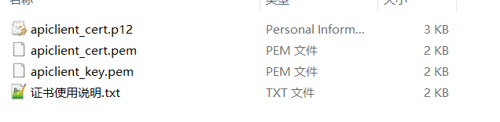

# 微信支付介绍

微信公众平台：https://mp.weixin.qq.com/


**注册流程**


**关联流程**

APPID：微信公众号 =》 开发管理 =》 开发设置 =》 获取AppID

微信支付_产品介绍


### 微信支付介绍

微信支付（[https://pay.weixin.qq.com](https://pay.weixin.qq.com/)）是腾讯集团旗下中国领先的第三方支付平台，一直致力于为用户和企业提供安全、便捷、专业的在线支付服务。

### 付款码支付

付款码支付是指用户展示微信钱包内的“付款码”给商户系统扫描后直接完成支付，适用于线下场所面对面收银的场景，例如商超、便利店、餐饮、医院、学校、电影院和旅游景区等具有明确经营地址的实体场所。

**使用示例**


### JSAPI支付

JSAPI支付是指商户通过调用微信支付提供的JSAPI接口，在支付场景中调起微信支付模块完成收款。

**应用场景有：**

- 线下场所：调用接口生成二维码，用户扫描二维码后在微信浏览器中打开页面后完成支付
- 公众号场景：用户在微信公众账号内进入商家公众号，打开某个主页面，完成支付
- PC网站场景：在网站中展示二维码，用户扫描二维码后在微信浏览器中打开页面后完成支付

**使用示例**


### 小程序支付

小程序支付是指商户通过调用微信支付小程序支付接口，在微信小程序平台内实现支付功能；用户打开商家助手小程序下单，输入支付密码并完成支付后，返回商家小程序。

**使用示例**


### Native支付

Native支付是指商户系统按微信支付协议生成支付二维码，用户再用微信“扫一扫”完成支付的模式。该模式适用于PC网站、实体店单品或订单、媒体广告支付等场景。

**使用示例**


### APP支付

APP支付是指商户通过在移动端应用APP中集成开放SDK调起微信支付模块来完成支付。适用于在移动端APP中集成微信支付功能的场景。

**使用示例**


### 刷脸支付

刷脸支付是指用户在刷脸设备前通过摄像头刷脸、识别身份后进行的一种支付方式，安全便捷。适用于线下实体场所的收银场景，如商超、餐饮、便利店、医院、学校等。

**使用示例**


# 前期准备工作


### 获取商户号

微信商户平台：https://pay.weixin.qq.com/

场景：Native支付


### 获取APPID

微信公众平台：https://mp.weixin.qq.com/


**注册流程**


**关联流程**

APPID：微信公众号 =》 开发管理 =》 开发设置 =》 获取AppID


### **申请商户API证书**

#### 获取秘钥和证书

> **注意：**
>
> 以上所有API秘钥和证书需妥善保管防止泄露。


#### 申请证书


#### 下载安装证书工具


#### 工具生成证书



#### 复制请求串


#### 验证密码


#### 生成证书


#### 生成证书


#### 本地文件



> **注意：**
>
> - aplclient_cert.p12：包含了私钥信息得证书文件。
> - apiclient_cert.pem：从apiclient_cert.p12中导出证书部分的文件，为pem格式，请妥善保管。
> - apiclient_key.pem：部分开发语言和环境不能使用p12文件，需要使用pem文件为了方便，直接提供。

### **获取API秘钥**

APIv2版本的接口需要此秘钥

步骤：登录商户平台 => 选择 账户中心 => 安全中心 => API安全 => 设置API密钥

生成随机密码https://suijimimashengcheng.bmcx.com/


 

# 信息安全的基础


### 密码学基本概念

密码学是网络安全、信息安全、区块链等产品的基础，常见的非对称加密、对称加密、散列函数等，都属于密码学范畴。

### 中国古代加密

公元683年，唐中宗即位。随后，武则天废唐中宗，立第四子李旦为皇帝，但朝政大事均由她自己专断。裴炎、徐敬业和骆宾王等人对此非常不满。徐敬业聚兵十万，在江苏扬州起兵。裴炎做内应，欲以拆字手段为其传递秘密信息。后因有人告密，裴炎被捕，未发出的密信落到武则天手中。这封密信上只有“青鹅”二字，群臣对此大惑不解。　　


> **破解：**
> 	武则天破解了“青鹅”的秘密：“青”字拆开来就是“十二月”，而“鹅”字拆开来就是“我自与”。密信的意思是让徐敬业、骆宾王等率兵于十二月进发，裴炎在内部接应。“青鹅”破译后，裴炎被杀。接着，武则天派兵击败了徐敬业和骆宾王。

### 明文

加密前的消息叫“明文”（plain text）。


### 密文

加密后的文本叫“密文”（cipher text）。

### 密钥

只有掌握特殊“钥匙”的人，才能对加密的文本进行解密，这里的“钥匙”就叫做“密钥”（key）。

### 加密算法

- MD5信息摘要算法
- DES是对称性加密算法
- RSA是一种非对称加密算法


# 消息摘要

摘要算法就是我们常说的散列函数、哈希函数（Hash Function），它能够把任意长度的数据“压缩”成固定长度、而且独一无二的“摘要”字符串，就好像是给这段数据生成了一个数字“指纹”。

**作用**：

​	保证信息的完整性

### 特点

- 不可逆：只有算法，没有秘钥，只能加密，不能解密
- 难题友好性：想要破解，只能暴力枚举
- 发散性：只要对原文进行一点点改动，摘要就会发生剧烈变化抗
- 碰撞性：原文不同，计算后的摘要也要不同

### 常见算法

- MD5
- SHA1
- SHA256
- SHA512

### 回顾之前数字摘要

百度搜索 `MySQL` ，进入官网下载 ，会经常发现有 `sha1`，`sha512` , 这些都是数字摘要。


点击signature


### 消息摘要实现

```Java
public static void main(String[] args) throws Exception{
  // 原文
  String input = "baizhan";
  // 算法
  String algorithm = "MD5";
  // 获取数字摘要对象
  MessageDigest messageDigest = MessageDigest.getInstance(algorithm);
  // 获取消息数字摘要的字节数组
  byte[] digest = messageDigest.digest(input.getBytes());
  System.out.println(new String(digest));
}
```


> **注意：**
>
> - 加密后编码表找不到对应字符, 出现乱码

### base64 编码

```Java
public static void main(String[] args) throws Exception{
  // 原文
  String input = "aa";
  // 算法
  String algorithm = "MD5";
  // 获取数字摘要对象
  MessageDigest messageDigest = MessageDigest.getInstance(algorithm);
  // 消息数字摘要
  byte[] digest = messageDigest.digest(input.getBytes());
  //     System.out.println(new String(digest));
  // base64编码
  System.out.println(new BASE64Encoder().encode(digest));
}
```


# 对称加密


### 对称加密

对称加密指的就是加密和解密使用同一个秘钥，所以叫做对称加密。对称加密只有一个秘钥，作为私钥。

### 对称加密算法

- DES
- AES
- 3DES

### **特点**

- 加密速度快, 可以加密大文件
- 密文可逆, 一旦密钥文件泄漏, 就会导致数据暴露
- 加密后编码表找不到对应字符, 出现乱码
- 一般结合Base64使用

> **注意：**
>
> ​	密钥是6个字节，DES加密算法规定，密钥key必须是8个字节，所以需要修改上面key改成key="12345678"


> **注意：**
>
> ​	出现乱码是因为对应的字节出现负数，但负数，没有出现在 ascii 码表里面，所以出现乱码，需要配合base64进行转码。

### 加密解密实现

```Java
public class DES {
    public static void main(String[] args) throws NoSuchPaddingException, IllegalBlockSizeException, NoSuchAlgorithmException, BadPaddingException, InvalidKeyException {
        // 原文
//        String input = "lixinlong"; //bAT55HRJEW5UxmJtHPlYoA==
        String input = "bAT55HRJEW5UxmJtHPlYoA=="; // lixinlong
        // des加密必须是8位
        String key = "12345678";
        // 算法
        String algorithm = "des";
//        String str = encryptDES(input, key, algorithm);
//        System.out.println(str);
        String decrypt = decrypt(input, key, algorithm);
        System.out.println(decrypt);
    }

    /**
     * 使用DES加密数据
     *
     * @param input      : 原文
     * @param key       : 密钥(DES,密钥的长度必须是8个字节)
     * @param algorithm    : 获取密钥的算法
     * @return : 密文
     * @throws Exception
     */
    private static String encryptDES(String input,String key,String algorithm) throws NoSuchPaddingException, NoSuchAlgorithmException, InvalidKeyException, IllegalBlockSizeException, BadPaddingException {
        // 获取加密对象
        Cipher cipher = Cipher.getInstance(algorithm);
        /**
         * // 创建加密规则
         * // 第一个参数key的字节
         * // 第二个参数表示加密算法
         */
        SecretKeySpec secretKeySpec = new SecretKeySpec(key.getBytes(), algorithm);
        // ENCRYPT_MODE：加密模式
        // DECRYPT_MODE: 解密模式
        // 初始化加密模式和算法
        cipher.init(Cipher.ENCRYPT_MODE,secretKeySpec);
        byte[] bytes = cipher.doFinal(input.getBytes());
        String encode = Base64.encode(bytes);
        return encode;
    }

    /**
     * 使用DES解密
     *
     * @param input      : 密文
     * @param key       : 密钥
     * @param algorithm    : 获取密钥的算法
     * @throws Exception
     * @return: 原文
     */
    private static String decrypt(String input,String key,String algorithm) throws NoSuchPaddingException, NoSuchAlgorithmException, InvalidKeyException, IllegalBlockSizeException, BadPaddingException {
        // 1.获取Cipher对象
        Cipher cipher = Cipher.getInstance(algorithm);
        // 2.指定密钥规则
        SecretKeySpec secretKeySpec = new SecretKeySpec(key.getBytes(), algorithm);
        // 3. 解密，上面使用的base64编码，下面直接用密文
        cipher.init(Cipher.DECRYPT_MODE,secretKeySpec);
        byte[] encode = Base64.decode(input.getBytes());
        byte[] bytes = cipher.doFinal(encode);
        //  因为是明文，所以直接返回
        return new String(bytes);
    }
}
```


# 非对称加密

### 非对称加密

非对称加密指的是：加密和解密使用不同的秘钥，一把作为公开的公钥，另一把作为私钥。公钥加密的信息，只有私钥才能解密。私钥加密的信息，只有公钥才能解密。

### 非对称加密算法

- RSA
- ECC

### 特点

- 加密和解密使用不同的密钥
- 如果使用私钥加密, 只能使用公钥解密
- 如果使用公钥加密, 只能使用私钥解密
- 处理数据的速度较慢, 因为安全级别高

### 非对称加密实现

#### 引入依赖

```Java
<dependency>
   <groupId>commons-io</groupId>
   <artifactId>commons-io</artifactId>
   <version>2.6</version>
 </dependency>
```

#### 生成公钥和私钥

```Java
import com.sun.org.apache.xml.internal.security.utils.Base64;
import org.apache.commons.io.FileUtils;


import javax.crypto.Cipher;
import java.io.File;
import java.nio.charset.Charset;
import java.security.*;
import java.security.spec.PKCS8EncodedKeySpec;
import java.security.spec.X509EncodedKeySpec;


/**
* 生成公钥和私钥
*/
public class RSAdemo { 


public static void main(String[] args) throws Exception {
  String input = "baizhan";
  // 加密算法
  String algorithm = "RSA";

  //生成密钥对并保存在本地文件中
  generateKeyToFile(algorithm, "a.pub", "a.pri");
 }


/**
 * 生成密钥对并保存在本地文件中
 *
 * @param algorithm : 算法
 * @param pubPath  : 公钥保存路径
 * @param priPath  : 私钥保存路径
 * @throws Exception
 */
private static void generateKeyToFile(String algorithm, String pubPath, String priPath) throws Exception {
  // 获取密钥对生成器
  KeyPairGenerator keyPairGenerator = KeyPairGenerator.getInstance(algorithm);
  // 获取密钥对
  KeyPair keyPair = keyPairGenerator.generateKeyPair();
  // 获取公钥
  PublicKey publicKey = keyPair.getPublic();
  // 获取私钥
  PrivateKey privateKey = keyPair.getPrivate();
  // 获取byte数组
  byte[] publicKeyEncoded = publicKey.getEncoded();
  byte[] privateKeyEncoded = privateKey.getEncoded();
  // 进行Base64编码
  String publicKeyString = Base64.encode(publicKeyEncoded);
  String privateKeyString = Base64.encode(privateKeyEncoded);
  // 保存文件
  FileUtils.writeStringToFile(new File(pubPath), publicKeyString, Charset.forName("UTF-8"));
  FileUtils.writeStringToFile(new File(priPath), privateKeyString, Charset.forName("UTF-8"));
}
```

运行程序：先打印的是私钥 ， 后面打印的是公钥


#### 公钥加密

```Java
public static void main(String[] args) throws NoSuchAlgorithmException, IOException, InvalidKeySpecException, NoSuchPaddingException, IllegalBlockSizeException, BadPaddingException, InvalidKeyException {
    // 原文
    String input = "lixinlong";
    // 算法
    String algorithm = "RSA";
    // 生成密钥文件
//        generateKeyToFile(algorithm,"a.pub","a.pri");

    PublicKey publicKey = getPublicKey("a.pub", algorithm);
    String s = encryptRSA(input, publicKey, algorithm);
    // O+wbAkd37AXM9lEnSwPm5ftHBiFqxq95BuChzI9SnQc9C3Gg6Zj6fuLv9otKDZGeCGiS7L1wNLyrVQZEWRy7h2JbExbeKrESO9IROHuA3MEa2CuQ/TEGOueRQzKbbsIRHRZY0nTm/fjEqr0KSENuYsKtDf8oytwBZpwiNoKKho6gaQMRnQ3FUwOkzcCPMT68hGzfKzEIPr0ZHtg17soqUZyTYE6TlKuJuiahYTxji2WuKTo0Vd0izUOE6ADprPdbXjIJvqzTYmHbc9OIMBUsZ+x3QyTP3UrlnVu4WIotx4uDEprUiqBkrJVcWp3/gUJpHEeJJo5ky+OxQKMfQr4yoA==
    System.out.println(s);
}

/**
   *  读取公钥文件
   * @param pubPath 公钥
   * @param algorithm 加密算法
   * @return
   */
  private static PublicKey getPublicKey(String pubPath,String algorithm) throws IOException, NoSuchAlgorithmException, InvalidKeySpecException {
      // 将文件内容转为字符串
      String publicKeyString = FileUtils.readFileToString(new File(pubPath), Charset.forName("UTF-8"));
      // 获取密钥工厂
      KeyFactory factory = KeyFactory.getInstance(algorithm);
      // 构建密钥规范 进行Base64解码
      X509EncodedKeySpec spec = new X509EncodedKeySpec(Base64.decode(publicKeyString));
      // 生成公钥
      return factory.generatePublic(spec);
  }

  /**
   * 公钥加密
   * @param input    原文
   * @param key
   * @param algorithm
   */
  private static String encryptRSA(String input,Key key,String algorithm) throws NoSuchPaddingException, NoSuchAlgorithmException, InvalidKeyException, IllegalBlockSizeException, BadPaddingException {
      // 创建加密对象
      Cipher cipher = Cipher.getInstance(algorithm);
      // 初始化加密
      cipher.init(Cipher.ENCRYPT_MODE,key);
      // 加密
      byte[] bytes = cipher.doFinal(input.getBytes());
      // 解码返回
      return Base64.encode(bytes);
  }
```

#### 私钥解密

```Java
public static void main(String[] args) throws NoSuchAlgorithmException, IOException, InvalidKeySpecException, NoSuchPaddingException, IllegalBlockSizeException, BadPaddingException, InvalidKeyException {
  // 原文
  String input = "lixinlong";
  // 算法
  String algorithm = "RSA";
  // 生成密钥文件
//        generateKeyToFile(algorithm,"a.pub","a.pri");

  // 加密
  PublicKey publicKey = getPublicKey("a.pub", algorithm);
  String password = encryptRSA(input, publicKey, algorithm);
  // O+wbAkd37AXM9lEnSwPm5ftHBiFqxq95BuChzI9SnQc9C3Gg6Zj6fuLv9otKDZGeCGiS7L1wNLyrVQZEWRy7h2JbExbeKrESO9IROHuA3MEa2CuQ/TEGOueRQzKbbsIRHRZY0nTm/fjEqr0KSENuYsKtDf8oytwBZpwiNoKKho6gaQMRnQ3FUwOkzcCPMT68hGzfKzEIPr0ZHtg17soqUZyTYE6TlKuJuiahYTxji2WuKTo0Vd0izUOE6ADprPdbXjIJvqzTYmHbc9OIMBUsZ+x3QyTP3UrlnVu4WIotx4uDEprUiqBkrJVcWp3/gUJpHEeJJo5ky+OxQKMfQr4yoA==
  System.out.println(password);

  // 解密
  PrivateKey privateKey = getPrivateKey("a.pri", algorithm);
  String str = decryptRSA(password, privateKey, algorithm);
  System.out.println(str);
}

/**
 * 读取私钥文件
 * @param priPath 私钥
 * @param algorithm 算法
 * @return
 */
private static PrivateKey getPrivateKey(String priPath,String algorithm) throws IOException, NoSuchAlgorithmException, InvalidKeySpecException {
    // 将文件内容转为字符串
    String privateKeyString = FileUtils.readFileToString(new File(priPath), Charset.forName("UTF-8"));
    // 获取密钥工厂
    KeyFactory factory = KeyFactory.getInstance(algorithm);
    // 构建密钥规范 进行Base64解码
    PKCS8EncodedKeySpec spec = new PKCS8EncodedKeySpec(Base64.decode(privateKeyString));
    // 生成私钥
    return factory.generatePrivate(spec);
}

/**
   * 私钥解密
   * @param password 密文
   * @param key   密钥
   * @param algorithm 算法
   * @return
   */
private static String decryptRSA(String password,Key key,String algorithm) throws NoSuchPaddingException, NoSuchAlgorithmException, IllegalBlockSizeException, BadPaddingException, InvalidKeyException {
    // 创建解密对象
    Cipher cipher = Cipher.getInstance(algorithm);
    // 初始化解密
    cipher.init(Cipher.DECRYPT_MODE,key);
    byte[] bytes = Base64.decode(password.getBytes());
    bytes = cipher.doFinal(bytes);
    return new String(bytes);
}
```

#  数字签名


### 数字签名是什么

数字签名（又称公钥数字签名）是只有信息的发送者才能产生的别人无法伪造的一段数字串，这段数字串同时也是对信息的发送者发送信息真实性的一个有效证明。数字签名是非对称密钥加密技术与数字摘要技术的应用。

### 生活中的数据签名

相信我们都写过信，在写信的时候落款处总是要留下自己的名字，用来表示写信的人是谁。我们签的这个字就是生活中的签名。


> **注意:**
>
> 在网络中传输数据时候，给数据添加一个数字签名，表示是谁发的数据，而且还能证明数据没有被篡改。OK，数字签名的主要作用就是保证了数据的有效性（验证是谁发的）和完整性（证明信息没有被篡改）。

### 基本原理


张三有两把钥匙，一把是公钥，另一把是私钥。张三把公钥送给他的朋友们----铁蛋、幺妹、李四----每人一把。


幺妹要给张三写一封保密的信。她写完后用张三的公钥加密，就可以达到保密的效果。


张三收信后，用私钥解密，就看到了信件内容。这里要强调的是，只要张三的私钥不泄露，这封信就是安全的，即使落在别人手里，也无法解密。


张三给幺妹回信，决定采用"数字签名"。他写完后先用Hash函数，生成信件的摘要（digest）。


张三使用私钥，对这个摘要加密，生成"数字签名"（signature）。幺妹收信后，取下数字签名，用张三的公钥解密，得到信件的摘要。由此证明，这封信确实是张三发出的。幺妹再对信件本身使用Hash函数，将得到的结果，与上一步得到的摘要进行对比。如果两者一致，就证明这封信未被修改过。


# 数字证书


### 为什么需要数字证书

复杂的情况出现了。李四想欺骗幺妹，他偷偷使用了幺妹的电脑，用自己的公钥换走了张三的公钥。此时，幺妹实际拥有的是李四的公钥，但是还以为这是张三的公钥。因此，李四就可以冒充张三，用自己的私钥做成"数字签名"，写信给幺妹，让幺妹用假的张三公钥进行解密。


后来，幺妹感觉不对劲，发现自己无法确定公钥是否真的属于张三。她想到了一个办法，要求张三去找"证书中心"（certificate authority，简称CA），为公钥做认证。证书中心用自己的私钥，对张三的公钥和一些相关信息一起加密，生成"数字证书"（Digital Certificate）。


### 理解数据证书

比如说我们的毕业证书，任何公司都会承认。为什么会承认？因为那是国家发得，大家都信任国家。也就是说只要是国家的认证机构，我们都信任它是合法的。

### 原理

为了解决公钥的信任问题，张三和幺妹找一家认证公司（CA *Ca*tificate Authority），把公钥进行认证，证书中心用自己的私钥，对A的公钥和一些相关信息一起加密，生成“**数字证书**”（Digital Certificate）


幺妹如果获取到证书，证书可以用CA的公钥（认证中心信用背书）进行解密，会得到发公钥人的信息，以及他的公钥，此时这个A的公钥是可信的。


所以张三给幺妹发送信息的时候，就会带上签名，和证书一并发送给到互联网上，幺妹接收到消息的时候，先用CA发布的公钥解密数字证书，得到张三的公钥，用张三的公钥解密签名，得到摘要，幺妹在用hash算法得到消息的摘要，对两个摘要对比，如果相等，说明消息在网络上没有被不法分子修改。


