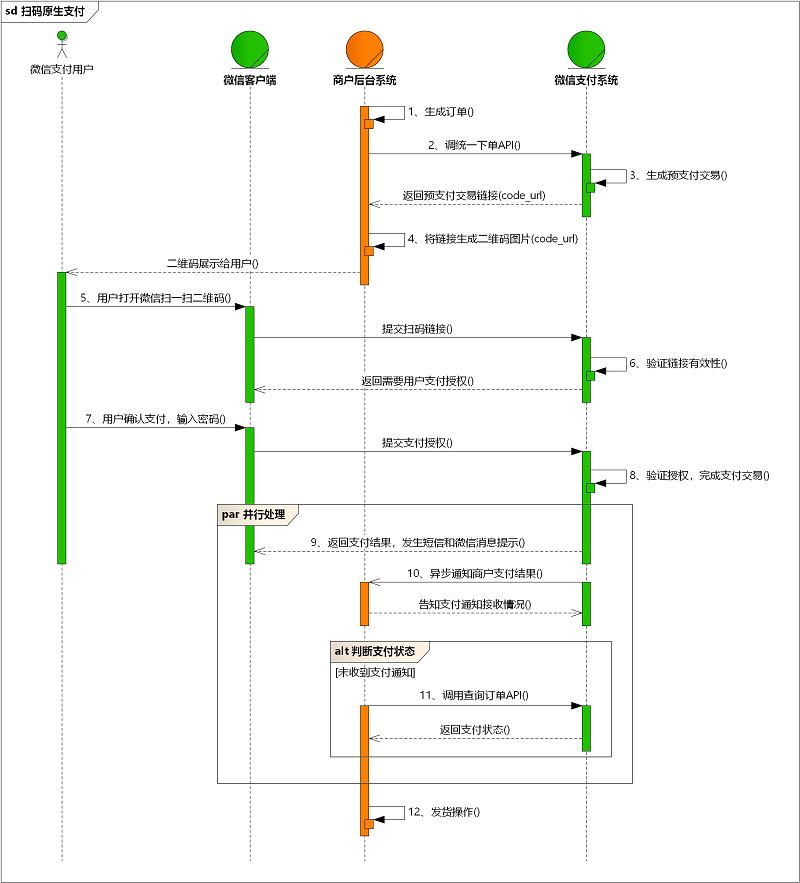
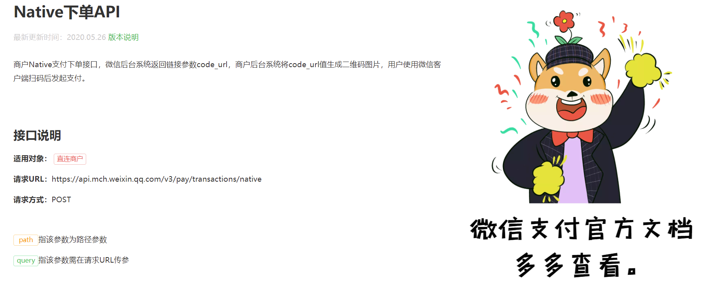

# 功能演示

### 首页


### 我的订单


### 订单详情页


 

# Postman工具使用


### Postman 是什么

Postman 是一款 API 开发协作工具，它可以帮助你测试和开发 API，Postman 提供了测试 API 的友好界面和功能，使用简单便捷，安全可靠。Postman 是每一位前后端开发者必掌握的开发工具。

### 如何安装 Postman

官网安装https://www.postman.com/


### 发送get请求

在Postman工作空间选定get请求。


### 发送POST请求


 # 创建支付工程

### 新建工程


> 注意：
>
> JDK版本选择8。

### 组件选择


### 字符编码


### Java编译版本选择


### 配置application.yml文件

```Java
server:
 # 端口号
  port: 9090
spring:
  application:
  #应用名
   name: payment
  
logging:
  pattern:
   console: logging.pattern.console=%d{MM/dd HH:mm:ss.SSS} %clr(%-5level) --- [%-15thread] %cyan(%-50logger{50}):%msg%n  
```

### 分层结构

不同功能的类放在不同功能的包里面。

- config：所有的配置 用于存放Spring Boot相关的配置类，包括启动类。
- controller：所有请求入口，前端访问后端的入口。
- sevice：逻辑层，负责所有的业务逻辑。
- mapper：或者叫Dao,持久层，负责java和数据库交互。包括interface和XML两类文件。
- entity(Po)：表映射实体，用一个java类来映射数据库表，类名就相当于表名，类的属性就相当于表字段。
- dto：数据传输对象（Data Transfer Object），用于前后端数据交互。

> **Domain和Dto区别：**
>
> - 从用法上来说：Domain用于java数据和数据库表记录映射，删除增加修改数据库的数据，用在service层和Mapper层。
> - Dto用在前后端数据传输：用在controller层和Service层Service层介于Controller和Mapper之间，也是Domain和Dto的转换层。

### 编写Controller

```Java
@RestController 
public class TestController {      
  @GetMapping("/test") 
  public String test(){ return "hello"; 
  } 
}
```

### 测试

请求http://localhost:9090/test


# 创建数据库表


### 创建订单表

```mysql
CREATE TABLE `order_info` (
 `id` bigint(11) UNSIGNED NOT NULL AUTO_INCREMENT COMMENT '订单id',
 `title` varchar(256) CHARACTER SET utf8mb4 COLLATE utf8mb4_general_ci NULL DEFAULT NULL COMMENT '订单标题',
 `order_no` varchar(50) CHARACTER SET utf8mb4 COLLATE utf8mb4_general_ci NULL DEFAULT NULL COMMENT '商户订单编号',
 `user_id` bigint(20) NULL DEFAULT NULL COMMENT '用户id',
 `total_fee` int(11) NULL DEFAULT NULL COMMENT '订单金额(分)',
 `code_url` varchar(50) CHARACTER SET utf8mb4 COLLATE utf8mb4_general_ci NULL DEFAULT NULL COMMENT '订单二维码连接',
 `order_status` varchar(10) CHARACTER SET utf8mb4 COLLATE utf8mb4_general_ci NULL DEFAULT NULL COMMENT '订单状态',
 `create_time` datetime(0) NULL DEFAULT CURRENT_TIMESTAMP(0) COMMENT '创建时间',
 PRIMARY KEY (`id`) USING BTREE
) ENGINE = InnoDB AUTO_INCREMENT = 1516240544441835523 CHARACTER SET = utf8mb4 COLLATE = utf8mb4_general_ci ROW_FORMAT = Dynamic;
```

### 创建支付表

```mysql
CREATE TABLE `payment_info` (
 `id` bigint(20) UNSIGNED NOT NULL AUTO_INCREMENT COMMENT '支付记录id',
 `order_no` varchar(50) CHARACTER SET utf8mb4 COLLATE utf8mb4_general_ci NULL DEFAULT NULL COMMENT '商户订单编号',
 `transaction_id` varchar(50) CHARACTER SET utf8mb4 COLLATE utf8mb4_general_ci NULL DEFAULT NULL COMMENT '支付系统交易编号',
 `payment_type` varchar(20) CHARACTER SET utf8mb4 COLLATE utf8mb4_general_ci NULL DEFAULT NULL COMMENT '支付类型',
 `trade_type` varchar(20) CHARACTER SET utf8mb4 COLLATE utf8mb4_general_ci NULL DEFAULT NULL COMMENT '交易类型',
 `trade_state` varchar(50) CHARACTER SET utf8mb4 COLLATE utf8mb4_general_ci NULL DEFAULT NULL COMMENT '交易状态',
 `payer_total` int(11) NULL DEFAULT NULL COMMENT '支付金额(分)',
 `content` text CHARACTER SET utf8mb4 COLLATE utf8mb4_general_ci NULL COMMENT '通知参数',
 `create_time` datetime(0) NULL DEFAULT CURRENT_TIMESTAMP(0) COMMENT '创建时间',
 PRIMARY KEY (`id`) USING BTREE
) ENGINE = InnoDB AUTO_INCREMENT = 12 CHARACTER SET = utf8mb4 COLLATE = utf8mb4_general_ci ROW_FORMAT = Dynamic;
```

### 创建退款表

```mysql
CREATE TABLE `refund_info` (
 `id` bigint(20) UNSIGNED NOT NULL AUTO_INCREMENT COMMENT '退款单id',
 `order_no` varchar(50) CHARACTER SET utf8mb4 COLLATE utf8mb4_general_ci NULL DEFAULT NULL COMMENT '商户订单编号',
 `refund_no` varchar(50) CHARACTER SET utf8mb4 COLLATE utf8mb4_general_ci NULL DEFAULT NULL COMMENT '商户退款单编号',
 `refund_id` varchar(50) CHARACTER SET utf8mb4 COLLATE utf8mb4_general_ci NULL DEFAULT NULL COMMENT '支付系统退款单号',
 `total_fee` int(11) NULL DEFAULT NULL COMMENT '原订单金额(分)',
 `refund` int(11) NULL DEFAULT NULL COMMENT '退款金额(分)',
 `reason` varchar(50) CHARACTER SET utf8mb4 COLLATE utf8mb4_general_ci NULL DEFAULT NULL COMMENT '退款原因',
 `refund_status` varchar(10) CHARACTER SET utf8mb4 COLLATE utf8mb4_general_ci NULL DEFAULT NULL COMMENT '退款状态',
 `content_return` text CHARACTER SET utf8mb4 COLLATE utf8mb4_general_ci NULL COMMENT '申请退款返回参数',
 `content_notify` text CHARACTER SET utf8mb4 COLLATE utf8mb4_general_ci NULL COMMENT '退款结果通知参数',
 `create_time` datetime(0) NULL DEFAULT CURRENT_TIMESTAMP(0) COMMENT '创建时间',
 PRIMARY KEY (`id`) USING BTREE
) ENGINE = InnoDB AUTO_INCREMENT = 5 CHARACTER SET = utf8mb4 COLLATE = utf8mb4_general_ci ROW_FORMAT = Dynamic;
```

# 集成MyBatis-Plus

### 引入依赖

```xml
<!-- 数据库 -->
<dependency>
    <groupId>com.baomidou</groupId>
    <artifactId>mybatis-plus-boot-starter</artifactId>
    <version>3.5.0</version>
</dependency>
<dependency>
    <groupId>mysql</groupId>
    <artifactId>mysql-connector-java</artifactId>
    <version>8.0.31</version>
</dependency>
```

### 配置

在 `application.yml` 配置文件中添加MySQL数据库的相关配置：

```yaml
spring:
  application:
    name: payment
  # 数据库配置
  datasource:
    driver-class-name: com.mysql.cj.jdbc.Driver
    url: jdbc:mysql://localhost:3306/payment
    username: root
    password: Mac001007
```

在 Spring Boot 启动类中添加 `@MapperScan` 注解，扫描 Mapper 文件夹：

```Java
@Slf4j
@MapperScan("com.liliwoya.mapper")
@SpringBootApplication
public class PaymentApplication {
    public static void main(String[] args) {
        SpringApplication.run(PaymentApplication.class, args);
        log.info("************** 支付项目启动成功 *****************");
    }
}
```


# MyBatis-Plus代码生成器

### 引入依赖

```xml
<!-- MyBatis-Plus代码生成器 -->
<dependency>
    <groupId>com.baomidou</groupId>
    <artifactId>mybatis-plus-generator</artifactId>
    <version>3.5.1</version>
</dependency>
<!-- 模版引擎 -->
<dependency>
    <groupId>org.apache.velocity</groupId>
    <artifactId>velocity-engine-core</artifactId>
    <version>2.2</version>
</dependency>
```

### 快速生成

```Java
public static void main(String[] args) {
    FastAutoGenerator.create("jdbc:mysql://localhost:3306/payment", "root", "Mac001007")
            .globalConfig(builder -> {
                builder.author("lixinlong") // 设置作者
                        .commentDate("MM-dd") // 注释日期格式 C:\Users\wangc\IdeaProjects\payment-demo2\src\main\java
                        .outputDir(System.getProperty("user.dir")+ "/src/main/java/") // 指定输出目录
                        .fileOverride(); //覆盖文件
            })
            // 包配置
            .packageConfig(builder -> {
                builder.parent("com.liliwoya") // 包名前缀
                        .entity("entity") //实体类包名
                        .mapper("mapper") //mapper接口包名
                        .service("service"); //service包名
            })

            .strategyConfig(builder -> {
                // 设置需要生成的表名
                List<String> tables = Arrays.asList("order_info", "payment_info", "refund_info");
                builder.addInclude(tables)
                        // 开始实体类配置
                        .entityBuilder()
                        // 开启lombok模型
                        .enableLombok()
                        //表名下划线转驼峰
                        .naming(NamingStrategy.underline_to_camel)
                        //列名下划线转驼峰
                        .columnNaming(NamingStrategy.underline_to_camel);
            })
            .execute();
}
```


# 统一结果返回封装类

### 统一接口返回类的意义

基于java的前后端分离项目中，前端获取后端controller层接口返回的JSON格式的数据，并展示出来。通常为了提高代码质量，会将后端返回的数据进行统一的格式处理。

### 创建枚举类

```Java
@Getter
@AllArgsConstructor
public enum CodeEnum {
    // 正常
    SUCCESS(200,"SUCCESS"),
    // 系统异常
    SYSTEM_ERROR(500,"系统异常"),
    // 业务异常
    ORDER_ERROR(600,"订单不存在"),
    PAYMENT_ERROR(601,"参数异常");

    // 状态码
    private final Integer code;
    // 响应信息
    private final String message;
}
```

### 创建统一返回类

```Java
/**
 * 统一结果类封装
 * @param <T>
 */
@Data
@AllArgsConstructor
@NoArgsConstructor
public class BaseResult<T> {
    private Integer code;
    private String message;
    private T data;

    // 构建成功结果
    public static <T> BaseResult<T> ok(){
        return new BaseResult<>(CodeEnum.SUCCESS.getCode()
                ,CodeEnum.SUCCESS.getMessage(),null);
    }

    // 构建成功结果,带数据
    public static <T> BaseResult<T> ok(T data){
        return new BaseResult<>(CodeEnum.SUCCESS.getCode()
                ,CodeEnum.SUCCESS.getMessage()
                ,data);
    }

    // 构建失败结果
    public static <T> BaseResult<T> error(CodeEnum codeEnum){
        return new BaseResult<>(codeEnum.getCode()
                ,codeEnum.getMessage(),null);
    }
}
```

### 修改TestController

修改test方法，返回统一结果

```Java
@RestController
public class TestController {

    @GetMapping("/test")
    public BaseResult test(){
        return BaseResult.ok("hello payment");
    }
}
```


# 引入微信支付配置参数

### 定义微信配置文件

创建wxpay.properties 文件到resources目录中。这个文件定义了之前我们准备的微信支付相关的参数，例如商户号、APPID、API秘钥等等。

```properties
# 微信支付相关参数
# 商户号
wxpay.mch-id=1532379511
# 商户API证书序列号
wxpay.mch-serial-no=412710B5824A1B89427A5ACFA500F412E336BA78
# 商户私钥文件
wxpay.private-key-path=apiclient_key.pem
# APIv3密钥
wxpay.api-v3-key=U4graSir01LOzjesPkbjTavLyxB7r17K
# APPID
wxpay.appid=wx0ec7c1c17dac84f2
# 微信服务器地址
wxpay.domain=https://api.mch.weixin.qq.com
# 接收结果通知地址
wxpay.notify-domain=https://7d92-115-171-63-135.ngrok.io
```

### 证书序号


### APIv3密钥生成

随机密码生成工具https://suijimimashengcheng.bmcx.com/


### 读取微信支付参数

```Java
@Data
@Configuration
@PropertySource("classpath:wxpay.properties")
@ConfigurationProperties(prefix = "wxpay")
public class WxPayConfig {
    // 商户号
    private String mchId;
    // 商户API证书序列号
    private String mchSerialNo;
    // 商户私钥文件
    private String privateKeyPath;
    // APIv3密钥
    private String apiV3Key;
    // APPID
    private String appid;
    // 微信服务器地址
    private String domain;
    // 接收结果通知地址
    private String notifyDomain;
}
```

### 配置Annotation Processor

可以帮助我们生成自定义配置的元数据信息，让配置文件和Java代码之间的对应参数可以自动定位，方便开发。

```xml
<dependency>
  <groupId>org.springframework.boot</groupId>
  <artifactId>spring-boot-autoconfigure-processor</artifactId>
  <optional>true</optional>
</dependency>

```

### **在IDEA中设置SpringBoot配置文件**

让IDEA可以识别配置文件，将配置文件的图标展示成SpringBoot的图标，同时配置文件的内容可以高亮显示。


### 测试支付参数数据

```Java
@RestController
public class TestController {
  
  @Autowired
  private WxPayConfig wxPayConfig;
  
  /**
   * 读写微信配置文件数据进行测试
   */
  @GetMapping("/getwxpayconfig")
  public BaseResult getWxPayConfig() {
    String mchId = wxPayConfig.getMchId();
    return BaseResult.ok(mchId);
   } 
}
```


# **配置商户证书**

### 商户API私钥

商户申请商户API证书时，会生成商户私钥，并保存在本地证书文件夹的文件`apiclient_key.pem` 中。私钥也可以通过工具从商户的p12证书中导出。请妥善保管好你的商户私钥文件。将下载的私钥文件复制到项目根目录

> **注意：**
>
> 不要把私钥文件暴露在公共场合，如上传到Github，写在客户端代码等。

### **引入微信SDK**

https://pay.weixin.qq.com/wiki/doc/apiv3/wechatpay/wechatpay6_0.shtml我们可以使用官方提供的 SDK，帮助我们完成开发。实现了请求签名的生成和应答签名的验证。

```xml
<dependency>
  <groupId>com.github.wechatpay-apiv3</groupId>
  <artifactId>wechatpay-apache-httpclient</artifactId>
  <version>0.4.4</version>
</dependency>
```

### **获取商户私钥**

```Java
@Bean
public PrivateKey getPrivateKey(){
    // 加载商户私钥（privateKey：私钥字符串）
    try {
        PrivateKey privateKey = PemUtil
                .loadPrivateKey(new FileInputStream(privateKeyPath));
        return privateKey;
    } catch (FileNotFoundException e) {
        throw new RuntimeException("私钥文件不存在",e);
    }
}
```

### **测试商户私钥的获取**

在 PaymentDemoApplicationTests 测试类中添加如下方法，测试私钥对象是否能够获取出来。

```Java
@SpringBootTest
class PaymentDemoApplicationTests {

  @Autowired
  private WxPayConfig wxPayConfig;

  /**
   * 测试商户私钥
   */
  @Test 
  public void testGetPrivateKey() {
    //获取商户私钥 
    PrivateKey privateKey = wxPayConfig.getPrivateKey();
    System.out.println(privateKey);
    }
}
```


# 加载平台证书和获取HttpClient对象

### 平台证书

微信支付平台证书是指由微信支付负责申请的，包含微信支付平台标识、公钥信息的证书。商户可以使用平台证书中的公钥进行验签。

> **注意:**
>
> 	不同的商户，对应的微信支付平台证书是不一样的平台证书会周期性更换。商户应	定时通过API下载新的证书。

### **获取签名验证器**

https://github.com/wechatpay-apiv3/wechatpay-apache-httpclient

- 平台证书：平台证书封装了微信的公钥，商户可以使用平台证书中的公钥进行验签。

- 签名验证器：帮助我们进行验签工作，我们单独将它定义出来，方便后面的开发。

	

```Java
/**
 * 获取签名验证器
 * @return
 */
@Bean
public AutoUpdateCertificatesVerifier getVerifier(PrivateKey privateKey) throws UnsupportedEncodingException {
    /**
     * 私钥签名对象
     * mchSerialNo:商户API证书序列号
     * privateKey:私钥
     */
    PrivateKeySigner privateKeySigner = new PrivateKeySigner(mchSerialNo, privateKey);
    // 身份认证
    WechatPay2Credentials wechatPay2Credentials = new WechatPay2Credentials(mchId, privateKeySigner);
    // 加载平台证书（mchId：商户号,mchSerialNo：商户证书序列号,apiV3Key：V3密钥）
    AutoUpdateCertificatesVerifier verifier = new AutoUpdateCertificatesVerifier(wechatPay2Credentials, apiV3Key.getBytes("utf-8"));
    return verifier;
}

```

### **获取HttpClient对象**

HttpClient 对象：是建立远程连接的基础，我们通过SDK创建这个对象。

```java
/**
* 获取http请求对象
 * @param verifier
 * @return
 */
@Bean(name = "wxPayHttpClient")
public CloseableHttpClient getWxPayHttpClient(PrivateKey privateKey,
                                              AutoUpdateCertificatesVerifier verifier){
    // 通过WechatPayHttpClientBuilder构造的HttpClient，
    // 会自动的处理签名和验签，并进行证书自动更新
    CloseableHttpClient httpClient = WechatPayHttpClientBuilder.create()
            .withMerchant(mchId, mchSerialNo, privateKey)
            .withValidator(new WechatPay2Validator(verifier))
            .build();
    return httpClient;
}
```


# Native支付API列表

微信支付官方文档https://pay.weixin.qq.com/wiki/doc/apiv3/open/pay/chapter2_7_3.shtml

### **定义枚举**

为了开发方便，我们预先在项目中定义一些枚举。枚举中定义的内容包括接口地址，支付状态等信息。

#### 支付接口api枚举

```Java
@AllArgsConstructor
@Getter
public enum WxApiType {
    /**
     * Native下单
     */
    NATIVE_PAY("/v3/pay/transactions/native"),
    /**
     * 查询订单
     *  https://api.mch.weixin.qq.com/v3/pay/transactions/out-trade-no/{out_trade_no}?mchid=1230000109
     */
    ORDER_QUERY_BY_NO("/v3/pay/transactions/out-trade-no/%s"),


    /**
     * 关闭订单
     */
    CLOSE_ORDER_BY_NO("/v3/pay/transactions/out-trade-no/%s/close"),


    /**
     * 申请退款
     */
    DOMESTIC_REFUNDS("/v3/refund/domestic/refunds"),


    /**
     * 查询单笔退款
     */
    DOMESTIC_REFUNDS_QUERY("/v3/refund/domestic/refunds/%s");

    /**
     * 类型
     */
    private final String type;
}
```

#### 支付状态枚举

```Java
@AllArgsConstructor
@Getter
public enum WxTradeState {
    /**
     * 支付成功
     */
    SUCCESS("SUCCESS"),


    /**
     * 未支付
     */
    NOTPAY("NOTPAY"),


    /**
     * 已关闭
     */
    CLOSED("CLOSED"),


    /**
     * 转入退款
     */
    REFUND("REFUND");


    /**
     * 类型
     */
    private final String type;
}
```


# **Native支付流程**

### 介绍

商户后台系统先调用微信支付的Native下单接口，微信后台系统返回链接参数code_url，商户后台系统将code_url值生成二维码图片，用户使用微信客户端扫码后发起支付。https://pay.weixin.qq.com/wiki/doc/apiv3/apis/chapter3_4_4.shtml

> #### 注意：
>
> code_url有效期为2小时，过期后扫码不能再发起支付。

### 业务流程时序图



> #### 业务流程说明：
>
> 1. 商户后台系统根据用户选购的商品生成订单。
> 2. 用户确认支付后调用微信支付【[Native下单API](https://pay.weixin.qq.com/wiki/doc/apiv3/apis/chapter3_4_1.shtml)】生成预支付交易；
> 3. 微信支付系统收到请求后生成预支付交易单，并返回交易会话的二维码链接code_url。
> 4. 商户后台系统根据返回的code_url生成二维码。
> 5. 用户打开微信“扫一扫”扫描二维码，微信客户端将扫码内容发送到微信支付系统。
> 6. 微信支付系统收到客户端请求，验证链接有效性后发起用户支付，要求用户授权。
> 7. 用户在微信客户端输入密码，确认支付后，微信客户端提交授权。
> 8. 微信支付系统根据用户授权完成支付交易。
> 9. 微信支付系统完成支付交易后给微信客户端返回交易结果，并将交易结果通过短信、微信消息提示用户。微信客户端展示支付交易结果页面。
> 10. 微信支付系统通过发送异步消息通知商户后台系统支付结果。商户后台系统需回复接收情况，通知微信后台系统不再发送该单的支付通知。
> 11. 未收到支付通知的情况，商户后台系统调用【[查询订单API](https://pay.weixin.qq.com/wiki/doc/apiv3/apis/chapter3_4_2.shtml)】。
> 12. 商户确认订单已支付后给用户发货。

### 生成二维码规则

对应链接格式：weixin：//weixin://pay.weixin.qq.com/bizpayurl/up?pr=NwY5Mz9&groupid=00。请商户调用第三方库将code_url生成二维码图片。该模式链接较短，生成的二维码打印到结账小票上的识别率较高。

> **例如:**
>
> 将weixin：//weixin://pay.weixin.qq.com/bizpayurl/up?pr=NwY5Mz9&groupid=00 生成二维码见下图


### 二维码相关知识

#### 参考文献：

商品二维码标准： [国家商品二维码标准](http://c.gb688.cn/bzgk/gb/showGb?type=online&hcno=F5AD425C27157698599E7B19DF7128E6)

名片二维码： [名片二维码通用技术规范](http://c.gb688.cn/bzgk/gb/showGb?type=online&hcno=CA759A0DC00BF44159CAF4D7670CA5B2)


# 创建订单


### 接口说明

请求URL：/api/order/createOrder

请求方式：POST

### 请求参数

| 参数名     | 变量     | 必填 |
| ---------- | -------- | ---- |
| 订单标题   | title    | 是   |
| 金额（分） | totalFee | 是   |

### 什么是DTO

数据传输对象（DTO）(Data Transfer Object)，是一种设计模式之间传输数据的软件应用系统。

### 创建订单DTO

```Java
@Data
public class OrderInfoDto {
    /**
     * 订单标题
     */
    private String title;
    /**
     * 订单金额(分)
     */
    private Integer totalFee;
}
```

### 创建订单接口

```Java
public interface IOrderInfoService extends IService<OrderInfo> {
     OrderInfo createOrder(OrderInfoDto orderInfoDto);
}
```

### 创建订单状态枚举类

```Java
@Getter
@AllArgsConstructor
public enum OrderStatus {
    /**
     * 支付成功
     */
    SUCCESS("支付成功"),


    /**
     * 未支付
     */
    NOTPAY("未支付"),


    /**
     * 已关闭
     */
    CLOSED("已关闭"),


    /**
     * 转入退款
     */
    REFUND("转入退款"),

    /**
     * 退款成功
     */
    REFUND_SUCCESS("退款成功"),

    /**
     * 取消订单
     */
    CANCEL("用户取消订单");


    /**
     * 类型
     */
    private final String type;
}
```

### 编写订单接口实现类

```Java
@Slf4j
@Service
public class OrderInfoServiceImpl extends ServiceImpl<OrderInfoMapper, OrderInfo> implements IOrderInfoService {
    @Autowired
    private OrderInfoMapper orderInfoMapper;

    @Override
    public OrderInfo createOrder(OrderInfoDto orderInfoDto) {
        log.info("*********** 订单开始生成 *************");
        OrderInfo orderInfo = new OrderInfo();
        // 订单名称
        orderInfo.setTitle(orderInfoDto.getTitle());
        // 订单编号
        orderInfo.setOrderNo(String.valueOf(System.currentTimeMillis()));
        // 用户id
        orderInfo.setUserId(123456L);
        // 订单金额(分)
        orderInfo.setTotalFee(orderInfoDto.getTotalFee());
        // 订单状态
        orderInfo.setOrderStatus(OrderStatus.NOTPAY.getType());
        // 订单创建时间
        orderInfo.setCreateTime(LocalDateTime.now());

        // 写入数据库
        int insert = orderInfoMapper.insert(orderInfo);
        if (insert > 0){
            log.info("*********** 订单创建成功 *************");
        }
        return orderInfo;
    }
}
```

### 编写创建订单控制层

```Java
@RestController
@RequestMapping("/api/order")
public class OrderInfoController {
    @Autowired
    private IOrderInfoService orderInfoService;

    @PostMapping("/createOrder")
//    @ResponseBody
    public BaseResult createOrder(OrderInfoDto orderInfoDto){
        OrderInfo order = orderInfoService.createOrder(orderInfoDto);
        return BaseResult.ok(order);
    }
}
```

### 测试


# Native下单API



### 接口说明

请求URL：/api/wx-pay/native/{orderNo}

请求方式：POST

### 请求参数

| 参数名   | 变量    | 必填 |
| -------- | ------- | ---- |
| 订单编号 | orderNo | 是   |

### Native支付开发指引

商户端发起支付请求，微信端创建支付订单并生成支付二维码链接，微信端将支付二维码返回给商户端，商户端显示支付二维码，用户使用微信客户端扫码后发起支付。[Native支付开发指引](https://pay.weixin.qq.com/wiki/doc/apiv3/open/pay/chapter2_7_2.shtml)


### 创建微信支付接口

```Java
public interface IWxPayService {
    /**
     * 支付下单接口
     * @param orderNo
     * @return
     */
    BaseResult nativePay(String orderNo) throws Exception;
}
```

### 创建微信支付实现类

```Java
@Slf4j
@Service
public class WxPayServiceImpl implements IWxPayService {
    @Autowired
    private IOrderInfoService orderInfoService;
    @Autowired
    private WxPayConfig wxPayConfig;
    @Autowired
    private CloseableHttpClient wxPayHttpClient;

    @Override
    public BaseResult nativePay(String orderNo) throws Exception{
        log.info("************开始 Native 下单************");
        // 1.根据订单编号查询订单信息
        OrderInfo orderInfo = orderInfoService.findByOrderNo(orderNo);
        if (orderInfo == null){
            return BaseResult.error(CodeEnum.ORDER_ERROR);
        }
        // 2.调用统一下载API https://api.mch.weixin.qq.com/v3/pay/transactions/native
        HttpPost httpPost = new HttpPost(wxPayConfig.getDomain()
                .concat(WxApiType.NATIVE_PAY.getType()));

        // 3.组装请求参数
        HashMap<String, Object> paramsMap = new HashMap<>();
        paramsMap.put("appid",wxPayConfig.getAppid()); //公众号id
        paramsMap.put("mchid",wxPayConfig.getMchId()); //商户号id
        paramsMap.put("description","商品描述测试"); //商品描述
        paramsMap.put("out_trade_no",orderInfo.getOrderNo()); //订单编号
        paramsMap.put("notify_url",wxPayConfig.getDomain()
                .concat(wxPayConfig.getNotifyDomain())); //接收结果通知地址
        HashMap<String, Object> amountMap = new HashMap<>();
        amountMap.put("total",orderInfo.getTotalFee());
        paramsMap.put("amount",amountMap); //订单金额

        // 4.转为json字符串
        String jsonString = JSON.toJSONString(paramsMap);
        log.info("Native下参数======>{}"+jsonString);

        // 5.设置请求 body
        StringEntity entity = new StringEntity(jsonString, "UTF-8");
        entity.setContentType("application/json");
        httpPost.setEntity(entity);

        // 6.设置请求头
        httpPost.setHeader("Accept","application/json");

        // 7.完成签名并执行请求
        CloseableHttpResponse response = wxPayHttpClient.execute(httpPost);

        try {
            // 8.拿出body 响应体
            String bodyString = EntityUtils.toString(response.getEntity());
            // 9.获取响应码
            int statusCode = response.getStatusLine().getStatusCode();
            if (statusCode == 200){
                HashMap<String,String> responseMap = JSON.parseObject(bodyString, HashMap.class);
                // 11.取出code_url
                String code_url = responseMap.get("code_url");
                PayInfoVo payInfoVo = new PayInfoVo();
                payInfoVo.setCodeUrl(code_url);
                payInfoVo.setOrderNo(orderInfo.getOrderNo());
                return BaseResult.ok(payInfoVo);
            }else {
                log.error("Native下单失败\n");
                log.error("响应码:"+statusCode+"错误信息:"+bodyString);
                return BaseResult.error(CodeEnum.ORDER_ERROR);
            }
        }finally {
            response.close();
        }
    }
}
```

### 创建支付结果返回 VO层

```Java
/**
 * 支付返回的结果Vo
 */
@Data
public class PayInfoVo {
    // 二维码链接
    private String codeUrl;
    // 订单编号
    private String orderNo;
}
```

### 创建WxPayController

```Java
/**
 * 微信支付控制层
 */
@RestController
@RequestMapping("/api/wx-pay")
public class WxPayController {
    @Autowired
    private IWxPayService iWxPayService;
    /**
     *  weixin://wxpay/bizpayurl?pr=CPckce2zz
     * @param orderNo
     * @return
     * @throws Exception
     */
    @PostMapping("/native/{orderNo}")
    public BaseResult nativePay(@PathVariable String orderNo) throws Exception {
        BaseResult baseResult = iWxPayService.nativePay(orderNo);
        return baseResult;
    }
}
```


# 二维码生成


### **二维码概念**

二维码又称QR Code，QR全称Quick Response，是一个近几年来移动设备上超流行的一种编码方式。是用某种特定的几何图形按一定规律在平面（二维方向上）分布的黑白相间的图形记录数据符号信息的；在代码编制上巧妙地利用构成计算机内部逻辑基础的“0”、“1”比特流的概念。

### 什么是 QRCode.js

QRCode.js 是一个用于生成二维码的 JavaScript 库。主要是通过获取 DOM 的标签,再通过 HTML5 Canvas 绘制而成,不依赖任何库。

### 基本用法

```javascript
<div id="qrcode"></div>
<script type="text/javascript">
new QRCode(document.getElementById("qrcode"), "http://www.baidu.com"); // 设置要生成二维码的链接
</script>
```

### 引入QRCode

```javascript
<!DOCTYPE html>
<html lang="en">
<head>
    <meta charset="UTF-8">
    <title>QR</title>
    <script type="text/javascript" src="//cdn.staticfile.org/jquery/2.1.1/jquery.min.js"></script>
    <script type="text/javascript" src="//static.runoob.com/assets/qrcode/qrcode.min.js"></script>
    <style>
        #qrcode{
            width: 200px;
            height: 200px;
            margin-top: 50px;
            margin-left: 50px;
        }
    </style>
</head>
<body>
<div id="qrcode">

</div>

<script>
    new QRCode(document.getElementById("qrcode"),{
        text: "weixin://wxpay/bizpayurl?pr=CPckce2zz",
        width: 200,
        height: 200
    })
</script>
</body>
</html>
```


# 重复支付解决


### 编写更新CodeUrl接口=> IOrderInfoService

```Java
/**
 *
 * @param id 订单id
 * @param codeUrl 二维码
 */
void saveCodeUrl(Long id,String codeUrl);
```

### 编写更新CodeUrl接口实现类=>OrderInfoServiceImpl

```Java
/**
 * 保存二维码，防止重复点击更新二维码
 * @param id 订单id
 * @param codeUrl 订单二维码
 */
@Override
public void saveCodeUrl(Long id, String codeUrl) {
    UpdateWrapper<OrderInfo> updateWrapper = new UpdateWrapper<>();
    updateWrapper.set("code_url",codeUrl);
    updateWrapper.eq("id",id);
    orderInfoMapper.update(null, updateWrapper);
}
```

### 支付业务层编写逻辑=>WxPayServiceImpl

```Java
@Slf4j
@Service
public class WxPayServiceImpl implements IWxPayService {
    @Autowired
    private IOrderInfoService iOrderInfoService;
    @Autowired
    private WxPayConfig wxPayConfig;
    @Autowired
    private CloseableHttpClient wxPayHttpClient;

    @Transactional(rollbackFor = Exception.class)
    @Override
    public BaseResult nativePay(String orderNo) throws Exception{
        log.info("************开始 Native 下单************");
        // 1.根据订单编号查询订单信息
        OrderInfo orderInfo = iOrderInfoService.findByOrderNo(orderNo);
        if (orderInfo == null){
            return BaseResult.error(CodeEnum.ORDER_ERROR);
        }
        if (orderInfo != null && !StringUtils.isNullOrEmpty(orderInfo.getCodeUrl())){
            // 直接返回二维码
            PayInfoVo payInfoVo = new PayInfoVo();
            payInfoVo.setCodeUrl(orderInfo.getCodeUrl());
            payInfoVo.setOrderNo(orderInfo.getOrderNo());
            return BaseResult.ok(payInfoVo);
        }
        // 2.调用统一下载API https://api.mch.weixin.qq.com/v3/pay/transactions/native
        HttpPost httpPost = new HttpPost(wxPayConfig.getDomain()
                .concat(WxApiType.NATIVE_PAY.getType()));

        // 3.组装请求参数
        HashMap<String, Object> paramsMap = new HashMap<>();
        paramsMap.put("appid",wxPayConfig.getAppid()); //公众号id
        paramsMap.put("mchid",wxPayConfig.getMchId()); //商户号id
        paramsMap.put("description","商品描述测试"); //商品描述
        paramsMap.put("out_trade_no",orderInfo.getOrderNo()); //订单编号
        paramsMap.put("notify_url",wxPayConfig.getDomain()
                .concat(wxPayConfig.getNotifyDomain())); //接收结果通知地址
        HashMap<String, Object> amountMap = new HashMap<>();
        amountMap.put("total",orderInfo.getTotalFee());
        paramsMap.put("amount",amountMap); //订单金额

        // 4.转为json字符串
        String jsonString = JSON.toJSONString(paramsMap);
        log.info("Native下参数======>{}"+jsonString);

        // 5.设置请求 body
        StringEntity entity = new StringEntity(jsonString, "UTF-8");
        entity.setContentType("application/json");
        httpPost.setEntity(entity);

        // 6.设置请求头
        httpPost.setHeader("Accept","application/json");

        // 7.完成签名并执行请求
        CloseableHttpResponse response = wxPayHttpClient.execute(httpPost);

        try {
            // 8.拿出body 响应体
            String bodyString = EntityUtils.toString(response.getEntity());
            // 9.获取响应码
            int statusCode = response.getStatusLine().getStatusCode();
            if (statusCode == 200){
                HashMap<String,String> responseMap = JSON.parseObject(bodyString, HashMap.class);
                // 11.取出code_url
                String code_url = responseMap.get("code_url");
                // 12.更新数据库的code_url
                iOrderInfoService.saveCodeUrl(orderInfo.getId(),code_url);

                PayInfoVo payInfoVo = new PayInfoVo();
                payInfoVo.setCodeUrl(code_url);
                payInfoVo.setOrderNo(orderInfo.getOrderNo());
                return BaseResult.ok(payInfoVo);
            }else {
                log.error("Native下单失败\n");
                log.error("响应码:"+statusCode+"错误信息:"+bodyString);
                return BaseResult.error(CodeEnum.ORDER_ERROR);
            }
        }finally {
            response.close();
        }
    }
}
```


# 内网穿透


### 什么是内网穿透

内网穿透也叫做内网映射，也叫“NAT穿透”。一句话来说就是，让外网能访问你的内网；把自己的内网（主机）当成服务器，让外网能访问。


### 内网穿透有哪些作用

- 访问内部网络
- 映射成功后，你的电脑其实就变成了一台服务器，别人可以正常访问你的网站
- 搭建一个临时的的服务器和网站

#### 内网穿透的工具平台

- Sunny-Ngrok
- 花生壳
- NATAPP


# 下载安装内网穿透

### 下载注册ngrok

官网https://natapp.cn/login


### 购买隧道


### 我的隧道


### 下载安装客户端


### 启动服务

```bash
./natapp -authtoken=9ab6b9040a624f40
```


### **测试外网访问**

请求[http://2b6bafd196724185.natapp.cc](http://2b6bafd196724185.natapp.cc/)


# 接收通知

支付通知API：https://pay.weixin.qq.com/wiki/doc/apiv3/apis/chapter3_4_5.shtml

### **设置通知地址**

修改wxpay.properties配置文件，重新设置回调地址

```properties
# 接收结果通知地址
wxpay.notify-domain=http://liliwoya.natapp1.cc
```

> **注意：**
>
> 每次重新启动ngrok，都需要根据实际情况修改这个配置。
>

### 修改WxPayServiceImpl中的=>接收结果地址

```Java
paramsMap.put("notify_url",wxPayConfig.getNotifyDomain()
              .concat(WxNotifyType.NATIVE_NOTIFY.getType())); //接收结果通知地址
```

### **通知接口规则**

用户支付完成后，微信会把相关支付结果和用户信息发送给商户，商户需要接收处理该消息，并返回应答。对后台通知交互时，如果微信收到商户的应答不符合规范或超时，微信认为通知失败，微信会通过一定的策略定期重新发起通知，尽可能提高通知的成功率，但微信不保证通知最终能成功。

> **注意：**
>
> 通知频率15s/15s/30s/3m/10m/20m/30m/30m/30m/60m/3h/3h/3h/6h/6h - 总计 24h4m。

### 通知报文

支付结果通知是以POST 方法访问商户设置的通知url，通知的数据以JSON 格式通过请求主体（BODY）传输。通知的数据包括了加密的支付结果详情。

> **注意：** 由于涉及到回调加密和解密，商户必须先设置好apiv3秘钥后才能解密回调通知，apiv3秘钥设置文档指引详见[APIv3秘钥设置指引](https://kf.qq.com/faq/180830E36vyQ180830AZFZvu.html)）。

### 创建支付通知枚举

```Java
@Getter
@AllArgsConstructor
public enum WxNotifyType {
    /**
     * 支付通知
     */
    NATIVE_NOTIFY("/api/wx-pay/native/notify");

    /**
     * 类型
     */
    private final String type;
}
```

### 编写HttpUtils工具

```Java
public class HttpUtils {
    /**
     * 将通知参数转化为字符串
     * @param request
     * @return
     */
    public static String readData(HttpServletRequest request) {
        BufferedReader br = null;
        try {
            StringBuilder result = new StringBuilder();
            br = request.getReader();
            for (String line; (line = br.readLine()) != null; ) {
                if (result.length() > 0) {
                    result.append("\n");
                }
                result.append(line);
            }
            return result.toString();
        } catch (IOException e) {
            throw new RuntimeException(e);
        } finally {
            if (br != null) {
                try {
                    br.close();
                } catch (IOException e) {
                    e.printStackTrace();
                }
            }
        }
    }
}
```

### 创建通知接口=>WxPayController

```Java
/**
 * http://liliwoya.natapp1.cc/api/wx-pay/native/notify
 * @param request
 * @param response
 * @return
 */
@PostMapping("/native/notify")
public String notify(HttpServletRequest request, HttpServletResponse response){
    HashMap<String,String> responseMap = new HashMap<>();

    // 1.处理接收结果
    String body = HttpUtils.readData(request);
    // 2.将json转为map
    HashMap<String,Object> bodyMap = JSON.parseObject(body,HashMap.class);

    log.info("支付通知id=====>{}"+bodyMap.get("id"));
    log.info("支付通知完整数据=====>{}"+body);

    // TODO: 签名验证
    // TODO: 处理订单

    /**
     * {
     *     "code": "FAIL",
     *     "message": "失败"
     * }
     */
    // 成功应答:成功应答必须为200或204，否则就是失败应答
    response.setStatus(200);
    responseMap.put("code","SUCCESS");
    responseMap.put("message","成功");
    return JSON.toJSONString(responseMap);
}
```

### **测试失败应答**

```Java
@PostMapping("/native/notify")
public String nativeNotify(HttpServletRequest request, HttpServletResponse response) {
  Gson gson = new Gson();
  Map<String, String> map = new HashMap<>();
  try {

   } catch (Exception e) { 
    e.printStackTrace();
    response.setStatus(500); 
    map.put("code", "ERROR"); 
    map.put("message", "系统错误"); 
    return gson.toJson(map);
   }
}
```

### **测试超时应答**

回调通知注意事项：[文档](https://pay.weixin.qq.com/wiki/doc/apiv3/Practices/chapter1_1_5.shtml)商户系统收到支付结果通知，需要在 5秒内 返回应答报文，否则微信支付认为通知失败，后续会重复发送通知。


# 验签


### 验签工具类

```Java
/**
 * 微信通知验签
 */
public class WxVerifierUtils {

    /**
     * 验签
     * @param request
     * @param verifier
     * @param body
     * @return
     * HTTP/1.1 200 OK
     * Server: nginx
     * Date: Tue, 02 Apr 2019 12:59:40 GMT
     * Content-Type: application/json; charset=utf-8
     * Content-Length: 2204
     * Connection: keep-alive
     * Keep-Alive: timeout=8
     * Content-Language: zh-CN
     * Request-ID: e2762b10-b6b9-5108-a42c-16fe2422fc8a
     * Wechatpay-Nonce: c5ac7061fccab6bf3e254dcf98995b8c
     * Wechatpay-Signature: CtcbzwtQjN8rnOXItEBJ5aQFSnIXESeV28Pr2YEmf9wsD
       Q8Nx25ytW6FXBCAFdrr0mgqngX3AD9gNzjnNHzSGTPBSsaEkIfhPF4b8YRRTpny88t
       NLyprXA0GU5ID3DkZHpjFkX1hAp/D0fva2GKjGRLtvYbtUk/OLYqFuzbjt3yOBzJSK
       QqJsvbXILffgAmX4pKql+Ln+6UPvSCeKwznvtPaEx+9nMBmKu7Wpbqm/+2ksc0XwjD
       +xlvlECkCxfD/OJ4gN3IurE0fpjxIkvHDiinQmk51BI7zQD8k1znU7r/spPqB+vZjc
       5ep6DC5wZUpFu5vJ8MoNKjCu8wnzyCFdA==
     * Wechatpay-Timestamp: 1554209980
     * Wechatpay-Serial: 5157F09EFDC096DE15EBE81A47057A7232F1B8E1
     * Cache-Control: no-cache, must-revalidate
     */
    public static boolean verifier(HttpServletRequest request,
                                   Verifier verifier,
                                   String body) throws UnsupportedEncodingException {
        // 1.获取随机串
        String nonce = request.getHeader("Wechatpay-Nonce");
        // 2.获取微信传递过来的签名
        String signature = request.getHeader("Wechatpay-Signature");
        // 3.证书序列号
        String serial = request.getHeader("Wechatpay-Serial");
        // 4.获取应答时间戳
        String timestamp = request.getHeader("Wechatpay-Timestamp");
        // 5.构造签名串
        /**
         * 应答时间戳\n
         * 应答随机串\n
         * 应答报文主体\n
         */
        String signStr = Stream.of(timestamp, nonce, body)
                .collect(Collectors.joining("\n", "", "\n"));
        boolean verify = verifier.verify(serial, signStr.getBytes("UTF-8"), signature);
        return verify;
    }
}
```

### 编写验签逻辑=>WxPayController

```Java
/**
 * 微信支付控制层
 */
@Slf4j
@RestController
@RequestMapping("/api/wx-pay")
public class WxPayController {
    @Autowired
    private IWxPayService iWxPayService;
    @Autowired
    private Verifier verifier;

    /**
     * 二维码:weixin://wxpay/bizpayurl?pr=eofYHq8zz
     * @param orderNo
     * @return
     * @throws Exception
     */
    @PostMapping("/native/{orderNo}")
    public BaseResult nativePay(@PathVariable String orderNo) throws Exception {
        BaseResult baseResult = iWxPayService.nativePay(orderNo);
        return baseResult;
    }

    /**
     * http://liliwoya.natapp1.cc/api/wx-pay/native/notify
     * @param request
     * @param response
     * @return
     */
    @PostMapping("/native/notify")
    public String notify(HttpServletRequest request, HttpServletResponse response) throws UnsupportedEncodingException {
        HashMap<String,String> responseMap = new HashMap<>();

        // 1.处理接收结果
        String body = HttpUtils.readData(request);
        // 2.将json转为map
        HashMap<String,Object> bodyMap = JSON.parseObject(body,HashMap.class);

        log.info("支付通知id=====>{}"+bodyMap.get("id"));
        log.info("支付通知完整数据=====>{}"+body);

        // TODO: 签名验证
        boolean verifier = WxVerifierUtils.verifier(request, this.verifier, body);
        if (!verifier){
            // 失败应答
            response.setStatus(200);
            responseMap.put("code","FAIL");
            responseMap.put("message","失败");
        }

        // TODO: 处理订单

        /**
         * {
         *     "code": "FAIL",
         *     "message": "失败"
         * }
         */
        // 成功应答:成功应答必须为200或204，否则就是失败应答
        response.setStatus(200);
        responseMap.put("code","SUCCESS");
        responseMap.put("message","成功");
        return JSON.toJSONString(responseMap);
    }
}
```


# 修改订单状态

### 编写更新订单状态接口=>IOrderInfoService

```Java
/**
* 根据订单id修改订单状态
* @param id
* @param orderStatus
*/
void updateOrderStatus(Long id,String orderStatus);
```

### 编写更新订单状态接口实现类=>OrderInfoServiceImpl

```Java
/**
 * 根据订单id修改订单状态
 * @param id
 * @param orderStatus
 */
@Override
public void updateOrderStatus(Long id, String orderStatus) {
    LambdaUpdateWrapper<OrderInfo> lo = new LambdaUpdateWrapper<>();
    lo.eq(OrderInfo::getId,id);
    lo.set(OrderInfo::getOrderStatus,orderStatus);
    orderInfoMapper.update(null,lo);
}
```

### 编写更新支付状态接口=>IWxPayService

```Java
/**
 * 修改支付状态
 * @param bodyMap
 */
void updateOrderStatus(Map<String,Object> bodyMap);
```

### 实现更新支付状态接口=>WxPayServiceImpl

```Java
/**
 * 更新支付状态
 * @param bodyMap
 */
@Override
public void updateOrderStatus(Map<String, Object> bodyMap) throws GeneralSecurityException {
    log.info("********** 修改订单状态 ***********");
    // 1.获取明文
    String plainText = WxVerifierUtils.decrypt(bodyMap, wxPayConfig.getApiV3Key());
    // 2.转为Map
    HashMap plainTextMap = JSON.parseObject(plainText, HashMap.class);
    // 3.取出订单编号
    String orderNo = (String) plainTextMap.get("out_trade_no");
    // 4.查询订单
    OrderInfo orderInfo = iOrderInfoService.findByOrderNo(orderNo);
    // 5.判定
    if (!OrderStatus.NOTPAY.getType().equals(orderInfo.getOrderStatus())){
        return;
    }
    // 修改订单状态
    iOrderInfoService.updateOrderStatus(orderInfo.getId(),OrderStatus.SUCCESS.getType());
}
```

### 编写解密方法=>WxVerifierUtils

```Java
/**
* 解密
* @param bodyMap
* @param apiv3
* @return
* @throws GeneralSecurityException
*/
public static String decrypt(Map<String,Object> bodyMap,String apiv3) throws GeneralSecurityException {
  // 1.获取通知数据
  Map<String,String> resourceMap = (Map<String, String>) bodyMap.get("resource");
  // 2.获取密文
  String ciphertext = resourceMap.get("ciphertext");
  // 3.获取附加数据
  String associated_data = resourceMap.get("associated_data");
  // 4.获取随机串
  String nonce = resourceMap.get("nonce");
  log.info("密文===>{}",ciphertext);
  // 5.构建解密对象
  AesUtil aesUtil = new AesUtil(apiv3.getBytes(StandardCharsets.UTF_8));
  // 6.解密
  String plainText = aesUtil.decryptToString(associated_data.getBytes(StandardCharsets.UTF_8),
          nonce.getBytes(StandardCharsets.UTF_8),
          ciphertext);
  log.info("明文===>{}",plainText);
  return plainText;
}
```

### 修改WxPayController

```Java
// TODO: 处理订单
iWxPayService.updateOrderStatus(bodyMap);
```


# 添加交易记录

### 创建交易类型枚举

```Java
@Getter
@AllArgsConstructor
public enum PayType {
    /**
     * 微信
     */
    WXPAY("微信"),


    /**
     * 支付宝
     */
    ALIPAY("支付宝");

    private final String type;
}
```

### 创建交易记录接口=>IPaymentInfoService

```Java
/**
 * 添加交易记录
 * @param plainTextMap
 */
void createPaymentInfo(HashMap<String,Object> plainTextMap);
```

### 实现交易记录接口=>PaymentInfoServiceImpl

```Java
@Slf4j
@Service
public class PaymentInfoServiceImpl extends ServiceImpl<PaymentInfoMapper, PaymentInfo> implements IPaymentInfoService {
    @Autowired
    private PaymentInfoMapper paymentInfoMapper;

    /**
     * 创建交易记录
     * @param plainTextMap
     */
    @Override
    public void createPaymentInfo(HashMap<String, Object> plainTextMap) {
        // 获取订单号
        String orderNo = (String) plainTextMap.get("out_trade_no");
        // 微信支付系统生成的订单号
        String transactionId = (String) plainTextMap.get("transaction_id");
        // 获取交易类型
        String tradeType = (String) plainTextMap.get("trade_type");
        // 获取订单状态
        String tradeState = (String) plainTextMap.get("trade_state");
        // 获取订单金额
        Map<String,Object> amountMap = (Map<String, Object>) plainTextMap.get("amount");
        Integer payerTotal = (Integer) amountMap.get("payer_total");

        PaymentInfo paymentInfo = new PaymentInfo();
        paymentInfo.setOrderNo(orderNo);
        paymentInfo.setTransactionId(transactionId);
        // 交易类型  微信或支付宝
        paymentInfo.setPaymentType(PayType.WXPAY.getType());
        paymentInfo.setTradeType(tradeType);
        paymentInfo.setTradeState(tradeState);
        paymentInfo.setPayerTotal(payerTotal);
        paymentInfo.setContent(JSON.toJSONString(plainTextMap));
        paymentInfo.setCreateTime(LocalDateTime.now());
        // 写入数据库
        int insert = paymentInfoMapper.insert(paymentInfo);
        if (insert > 0){
            log.info("*************添加交易记录成功****************");
        }else {
            log.info("*************添加交易记录失败****************");
        }
    }
}
```

### 添加交易记录=>WxPayServiceImpl=>updateOrderStatus

```Java
// 7.添加交易记录
iPaymentInfoService.createPaymentInfo(plainTextMap);
```


# ReentrantLock数据锁


### 什么是ReentrantLock

ReentrantLock基于**AQS**，在并发编程中可以实现**公平锁**和**非公平锁**来对资源进行同步，同时，和synchronized一样，ReentrantLock支持**可重入**，ReentrantLock在**调度**上更灵活，支持更多丰富的功能。

> **温馨提示：**
>
> ReentrantLock是java.util.concurrent包下提供的一套互斥锁，相比Synchronized，ReentrantLock类提供了一些高级功能。

### 公平锁和非公平锁


第一只兔子还没喝完水又来一只兔子。


第一只兔子喝水喝的有点慢，之后来了两只兔子，都被小狗安排进了队列。


### 非公平和公平锁的区别


### ReentrantLock和synchronized区别


- synchronized是独占锁，加锁和解锁的过程自动进行，易于操作，但不够灵活。ReentrantLock也是独占锁，加锁和解锁的过程需要手动进行，不易操作，但非常灵活。
- synchronized可重入，因为加锁和解锁自动进行，不必担心最后是否释放锁；ReentrantLock也可重入，但加锁和解锁需要手动进行，且次数需一样，否则其他线程无法获得锁。

### 业务加锁=>WxPayServiceImpl

```Java
// 独占锁
private final ReentrantLock lock = new ReentrantLock();

/**
 * 更新支付状态
 *
 * @param bodyMap
 */
@Override
public void updateOrderStatus(Map<String, Object> bodyMap) throws GeneralSecurityException {
    {
        log.info("********** 修改订单状态 ***********");
        // 1.获取明文
        String plainText = WxVerifierUtils.decrypt(bodyMap, wxPayConfig.getApiV3Key());
        // 2.转为Map
        HashMap plainTextMap = JSON.parseObject(plainText, HashMap.class);
        // 3.取出订单编号
        String orderNo = (String) plainTextMap.get("out_trade_no");

        /**
         * 在对业务数据进行状态检查和处理之前
         * 要采用数据锁进行并发控制
         * 以避免函数重入造成的数据混乱
         *
         * 尝试获取锁
         * 成功获取则立即返回true，获取失败则立即返回false。不必一直等待锁的释放
         */
        if (lock.tryLock()){
            try{
                // 4.查询订单
                OrderInfo orderInfo = iOrderInfoService.findByOrderNo(orderNo);
                // 5.判定
                if (!OrderStatus.NOTPAY.getType().equals(orderInfo.getOrderStatus())) {
                    return;
                }
                // 6.修改订单状态
                iOrderInfoService.updateOrderStatus(orderInfo.getId(), OrderStatus.SUCCESS.getType());
                // 7.添加交易记录
                iPaymentInfoService.createPaymentInfo(plainTextMap);
            }finally {
                //要主动释放锁
                lock.unlock();
            }
        }
    }
}
```


# 查询订单

商户后台未收到异步支付结果通知时，商户应该主动调用《微信支付查单接口》，同步订单状态。

### 接口说明

请求URL：/api/wx-pay/queryOrder/{orderNo}

请求方式：GET

### 请求参数

| 参数名   | 变量    | 必填 |
| -------- | ------- | ---- |
| 订单编号 | orderNo | 是   |

### 编写查询订单状态接口

```Java
/**
 * 根据订单号查询订单状态
 * @param orderNo
 * @return
 */
String queryOrder(String orderNo) throws IOException;
```

### 编写查询订单状态接口实现类

```Java
@Override
public String queryOrder(String orderNo) throws IOException {
    log.info("********* 根据订单号查询订单 ************");
    // 拼接请求路径
    // https://api.mch.weixin.qq.com
    // /v3/pay/transactions/out-trade-no/{out_trade_no}
    // ?mchid=1230000109
    String url = String.format(WxApiType.ORDER_QUERY_BY_NO.getType(), orderNo);
    url = wxPayConfig.getDomain()
            .concat(url)
            .concat("?mchid=")
            .concat(wxPayConfig.getMchId());
    // 创建Get请求
    HttpGet httpGet = new HttpGet(url);
    httpGet.setHeader("Accept","application/json");
    // 完成签名并执行请求
    CloseableHttpResponse response = wxPayHttpClient.execute(httpGet);
    try{
        // 获取响应体
        String bodyString = EntityUtils.toString(response.getEntity());
        // 获取状态码
        int statusCode = response.getStatusLine().getStatusCode();
        if (statusCode == 200){
            log.info("请求成功 => {}",bodyString);
            log.info("状态码:{}",statusCode);
        }else if (statusCode == 204){
            log.info("成功");
        }else {
            log.info("请求失败 =>{}",bodyString);
            log.info("状态码:{}",statusCode);
            throw new IOException("request failed");
        }
        return bodyString;
    }finally {
        response.close();
    }
}
```

### **WxPayController新增查询订单状态接口**

```Java
@GetMapping("/queryOrder/{orderNo}")
public BaseResult queryOrder(@PathVariable String orderNo) throws IOException {
    String orderInfo = iWxPayService.queryOrder(orderNo);
    return BaseResult.ok(orderInfo);
}
```


# 集成Spring Task


### 什么是Spring Task

Spring 3.0后提供Spring Task实现任务调度。

### Cron表达式

| 名称              | 藐视                                                  |
| ----------------- | ----------------------------------------------------- |
| Seconds (秒)      | 可以用数字0－59 表示                                  |
| Minutes(分)       | 可以用数字0－59 表示                                  |
| Hours(时)         | 可以用数字0-23表示                                    |
| Day-of-Month(天)  | 可以用数字1-31 中的任一一个值，但要注意一些特别的月份 |
| Month(月)         | 可以用0-11                                            |
| Day-of-Week(每周) | 以用数字1-7表示（1 ＝ 星期日）                        |

> **参数：**
>
> - \* ： 表示所有值；
> - ?： 表示未说明的值，即不关心它为何值；
> - -：表示一个指定的范围；
> - , ：表示附加一个可能值；
> - / ：符号前表示开始时间，符号后表示每次递增的值；

### 实现Spring Task

#### **启动类添加注解**

```Java
/**
 * 主启动类
 */
@Slf4j
@MapperScan("com.liliwoya.mapper")
@SpringBootApplication
// 开启任务调度
@EnableScheduling
public class PaymentApplication {
    public static void main(String[] args) {
        SpringApplication.run(PaymentApplication.class, args);
        log.info("************** 支付项目启动成功 *****************");
    }
}
```

#### 定时任务案例

```Java
@Slf4j
@Component
public class WxPaymentTask {

    // 秒 分 时 天 月 年
    @Scheduled(cron = "0/3 * * * * *")
    public void test(){
        log.info("*********** test执行 ************");
    }
}
```


### **常用表达式例子**

```Java
0 0 2 1 * ? *       表示在每月的1日的凌晨2点调整任务
0 0 10,14,16 * * ?  每天上午10点，下午2点，4点 
0 0/30 9-17 * * ?   朝九晚五工作时间内每半小时 
0 0 12 * * ?  			每天中午12点触发 
0 15 10 ? * *  			每天上午10:15触发 
```


# 定时查找超时订单

### 创建超时订单接口

```Java
/**
* 查找超时订单
* @param minutes 超时时间
* @return
*/
List<OrderInfo> getTimeOutOrder(int minutes);
```

### 实现超时订单接口

```Java
/**
 * 查找超时订单
 * @param minutes 超时时间
 * @return
 */
@Override
public List<OrderInfo> getTimeOutOrder(int minutes) {
    // 获取5分钟之前的时间
    Instant instant = Instant.now().minus(Duration.ofMinutes(5));
    // 构建查询条件
    LambdaQueryWrapper<OrderInfo> lambdaQueryWrapper = new LambdaQueryWrapper<>();
    // 订单类型
    lambdaQueryWrapper.eq(OrderInfo::getOrderStatus,OrderStatus.NOTPAY.getType());
    // 订单创建时间
    lambdaQueryWrapper.le(OrderInfo::getCreateTime,instant);
    List<OrderInfo> orderInfoList = orderInfoMapper.selectList(lambdaQueryWrapper);
    return orderInfoList;
}
```

**创建定时任务WxPayTask**

从第0秒开始每隔30秒执行1次，查询创建超过5分钟，并且未支付的订单。

```Java
@Slf4j
@Component
public class WxPaymentTask {
    @Autowired
    private IOrderInfoService iOrderInfoService;
    
    // 秒 分 时 天 月 年
    @Scheduled(cron = "0/5 * * * * *")
    public void timeoutOrder(){
        log.info("******** 查找超时订单 ************");
        List<OrderInfo> timeOutOrder = iOrderInfoService.getTimeOutOrder(5);
        for (OrderInfo orderInfo : timeOutOrder) {
            System.out.println(orderInfo);
        }
    }
}
```


# 核实订单状态

### 编写核实订单状态接口=>IWxPayService

```Java
/**
 * 检查订单状态
 * @param orderNo 订单编号
 */
void checkOrderStatus(String orderNo) throws IOException;
```

### 实现核实订单状态接口=>WxPayServiceImpl

```Java
@Override
public void checkOrderStatus(String orderNo) throws IOException {
    log.info("**********根据订单编号核实订单状态**********");
    // 查询订单
    String result = this.queryOrder(orderNo);
    // 转为Map
    HashMap<String,Object> resultMap = JSON.parseObject(result,HashMap.class);
    // 获取订单状态
    String tradeState = (String) resultMap.get("trade_state");
    // 判断订单状态
    if (WxTradeState.SUCCESS.getType().equals(tradeState)){
        log.warn("核实订单已支付=>{}",orderNo);
        // 如果确认订单已支付则更新本地订单状态
        iOrderInfoService.updateOrderStatus(orderNo,OrderStatus.SUCCESS.getType());
        // 添加交易记录
        iPaymentInfoService.createPaymentInfo(resultMap);
    }
    // 关单处理
    if (WxTradeState.NOTPAY.getType().equals(tradeState)){
        log.warn("核实订单未支付 ===> {}", orderNo);
        // TODO: 如果订单未支付，则调用关单接口
        // 更新本地订单状态
        iOrderInfoService.updateOrderStatus(orderNo,OrderStatus.CLOSED.getType());
    }
}
```

### 修改定时任务=>WxPaymentTask

```Java
@Slf4j
@Component
public class WxPaymentTask {
    @Autowired
    private IOrderInfoService iOrderInfoService;
    @Autowired
    private IWxPayService iWxPayService;

    // 秒 分 时 天 月 年
    @Scheduled(cron = "0/5 * * * * *")
    public void timeoutOrder() throws IOException {
        log.info("******** 查找超时订单 ************");
        List<OrderInfo> timeOutOrder = iOrderInfoService.getTimeOutOrder(5);
        for (OrderInfo orderInfo : timeOutOrder) {
            iWxPayService.checkOrderStatus(orderInfo.getOrderNo());
        }
    }
}
```


# 用户取消订单_关闭订单


### 接口说明

请求URL：/api/wx-pay/cancel/{orderNo}

请求方式：POST

### 请求参数

| 参数名   | 变量    | 必填 |
| -------- | ------- | ---- |
| 订单编号 | orderNo | 是   |

**定义取消订单接口=>IWxPayService**

WxPayController中添加接口方法

```Java
/**
 * 手动取消订单
 * @param orderNo
 * @return
 */
@PostMapping("/cancel/{orderNo}")
public BaseResult cancel(@PathVariable String orderNo){
    iWxPayService.cancelOrder(orderNo);
    return BaseResult.ok("订单取消成功");
}
```

### 修改订单枚举类=>OrderStatus

```Java
@Getter
@AllArgsConstructor
public enum OrderStatus {
    /**
     * 支付成功
     */
    SUCCESS("支付成功"),


    /**
     * 未支付
     */
    NOTPAY("未支付"),


    /**
     * 已关闭
     */
    CLOSED("已关闭"),


    /**
     * 转入退款
     */
    REFUND("转入退款"),

    /**
     * 取消订单
     */
    CANCEL("用户取消订单");


    /**
     * 类型
     */
    private final String type;
}
```

### 编写取消订单接口=>IWxPayService

```Java
/**
 * 取消订单
 * @param orderNo 订单编号
 */
void cancelOrder(String orderNo);
```

### 实现取消订单接口

```Java
/**
 * 手动取消订单
 * @param orderNo 订单编号
 */
@Override
public void cancelOrder(String orderNo) {
    iOrderInfoService.updateOrderStatus(orderNo,OrderStatus.CANCEL.getType());
}
```

```html
<div class="login-container">
    <div class="login-box">
        <h1>欢迎登录</h1>
        <form id="loginForm">
            <label for="username">用户名：</label>
            <input type="text" id="username" name="username" required>

            <label for="password">密码：</label>
            <input type="password" id="password" name="password" required>

            <button type="submit">登录</button>
        </form>
    </div>
</div>
<script src="./js/admin.js"></script>
```


# 调用微信支付的关单接口


### 以下情况需要调用关单接口

- 1、商户订单支付失败需要生成新单号重新发起支付，要对原订单号调用关单，避免重复支付；
- 2、系统下单后，用户支付超时，系统退出不再受理，避免用户继续，请调用关单接口。

> #### 注意：
>
> 关单没有时间限制，建议在订单生成后间隔几分钟（最短5分钟）再调用关单接口，避免出现订单状态同步不及时导致关单失败。

### 关单接口的调用=>WxPayServiceImpl

```Java
/**
 * 调用微信api关闭订单
 * @param orderNo 订单编号
 */
private void closeOrder(String orderNo) throws IOException {
    log.info("***********开始调用微信的关闭订单接口************");
    // 组装请求
    String url = String.format(WxApiType.CLOSE_ORDER_BY_NO.getType(), orderNo);
    url = wxPayConfig.getDomain().concat(url);
    // 创建post请求
    HttpPost httpPost = new HttpPost(url);
    // 封装请求参数
    HashMap<String, Object> paramsMap = new HashMap<>();
    paramsMap.put("mchid",wxPayConfig.getMchId());
    // 转为json字符串
    String jsonString = JSON.toJSONString(paramsMap);
    // 设置请求body
    StringEntity entity = new StringEntity(jsonString,"UTF-8");
    httpPost.setEntity(entity);
    // 设置请求头
    httpPost.setHeader("Accept","application/json");
    httpPost.setHeader("Content-Type","application/json");
    // 完成签名并执行请求
    CloseableHttpResponse response = wxPayHttpClient.execute(httpPost);
    // 取得响应码
    int statusCode = response.getStatusLine().getStatusCode();
    try {
        if (statusCode == 200){
            log.info("关单成功");
        }else if (statusCode == 204){
            log.info("关单成功");
        }else {
            log.warn("关单失败,状态码 = "+statusCode);
            throw new IOException("request failed");
        }
    }finally {
        response.close();
    }
}
```

### 实现取消订单接口=>

```Java
/**
 * 手动取消订单
 * @param orderNo 订单编号
 */
@Override
public void cancelOrder(String orderNo) throws IOException {
    // 关单
    this.closeOrder(orderNo);
    // 更新订单状态
    iOrderInfoService.updateOrderStatus(orderNo,OrderStatus.CANCEL.getType());
}
```

```Java
// 关单处理
if (WxTradeState.NOTPAY.getType().equals(tradeState)){
    log.warn("核实订单未支付 ===> {}", orderNo);
    // TODO: 如果订单未支付，则调用关单接口
    this.closeOrder(orderNo);
    // 更新本地订单状态
    iOrderInfoService.updateOrderStatus(orderNo,OrderStatus.CLOSED.getType());
}
```


# 申请退款_创建退款单


### 接口说明

请求URL：/api/wx-pay/refunds/{orderNo}/{reason}

请求方式：POST

### 请求参数

| 参数名   | 变量    | 必填 |
| -------- | ------- | ---- |
| 订单编号 | orderNo | 是   |
| 退款理由 | reason  | 是   |

### 编写申请退款接口=>WxPayController

```Java
/**
 * 退款
 * @param orderNo 订单编号
 * @param reason 退款原因
 * @return
 */
@PostMapping("/refunds/{orderNo}/{reason}")
public BaseResult refund(@PathVariable String orderNo,
                         @PathVariable String reason){
    iWxPayService.refundByOrderNo(orderNo, reason);
    return BaseResult.ok();
}
```

### 添加退款接口

```Java
/**
 * 退款
 * @param orderNo 订单编号
 * @param reason 退款原因
 */
void refundByOrderNo(String orderNo,String reason);
```

### 实现退款接口=>IWxPayService

```java
/**
 * 退款
 * @param orderNo 订单编号
 * @param reason 退款原因
 */
@Override
public void refundByOrderNo(String orderNo, String reason) {
    log.info("******生成退款订单*******");
    iRefundInfoService.createRefundOrder(orderNo, reason);
}
```

### 添加退款记录接口=>IRefundInfoService

```Java
/**
 * 生成退款订单
 * @param orderNo 订单编号
 * @param reason 退款原因
 * @return
 */
RefundInfo createRefundOrder(String orderNo,String reason);
```

### 退款记录接口实现

```Java
@Service
public class RefundInfoServiceImpl extends ServiceImpl<RefundInfoMapper, RefundInfo> implements IRefundInfoService {
    @Autowired
    private IOrderInfoService iOrderInfoService;
    @Autowired
    private RefundInfoMapper refundInfoMapper;

    @Override
    public RefundInfo createRefundOrder(String orderNo, String reason) {
        // 根据订单编号查找订单
        OrderInfo orderInfo = iOrderInfoService.findByOrderNo(orderNo);
        // 生成退款单
        RefundInfo refundInfo = new RefundInfo();
        // 退款订单编号
        refundInfo.setOrderNo(orderNo);
        // 原订单金额（分）
        refundInfo.setTotalFee(orderInfo.getTotalFee());
        // 退款单号
        refundInfo.setRefundNo(String.valueOf(System.currentTimeMillis()));
        // 退款金额（分）
        refundInfo.setRefund(orderInfo.getTotalFee());
        // 退款原因
        refundInfo.setReason(reason);
        // 保存退款订单
        refundInfoMapper.insert(refundInfo);
	      return refundInfo;
    }
}
```


# 调用微信支付退款API


交易发生之后一年内，由于买家或者卖家的原因需要退款时，卖家可以通过退款接口将支付金额退还给买家，微信支付将在收到退款请求并且验证成功之后，将支付款按原路退还至买家账号上。

> #### 注意：
>
> 1、交易时间超过一年的订单无法提交退款
>
> 2、微信支付退款支持单笔交易分多次退款（不超50次），多次退款需要提交原支付订单的商户订单号和设置不同的退款单号。申请退款总金额不能超过订单金额。 一笔退款失败后重新提交，请不要更换退款单号，请使用原商户退款单号
>
> 3、错误或无效请求频率限制：6qps，即每秒钟异常或错误的退款申请请求不超过6次
>
> 4、每个支付订单的部分退款次数不能超过50次
>
> 5、如果同一个用户有多笔退款，建议分不同批次进行退款，避免并发退款导致退款失败
>
> 6、申请退款接口的返回仅代表业务的受理情况，具体退款是否成功，需要通过退款查询接口获取结果
>
> 7、一个月之前的订单申请退款频率限制为：5000/min
>
> 8、同一笔订单多次退款的请求需相隔1分钟

### 创建微信退款接口

```Java
/**
 * 退款
 * @param orderNo 订单编号
 * @param reason 退款原因
 */
void refundByOrderNo(String orderNo,String reason) throws IOException;
```

### 实现微信退款接口

```Java
/**
* 退款
* @param orderNo 订单编号
* @param reason 退款原因
*/
@Transactional(rollbackFor = Exception.class)
@Override
public void refundByOrderNo(String orderNo, String reason) throws IOException {
    log.info("******生成退款订单*******");
    RefundInfo refundOrder = iRefundInfoService.createRefundOrder(orderNo, reason);
    System.out.println(refundOrder);
    log.info("******调用微信的退款接口*******");
    // 组装请求路径
    String url = wxPayConfig.getDomain()
            .concat(WxApiType.DOMESTIC_REFUNDS.getType());
    // 生成请求
    HttpPost httpPost = new HttpPost(url);
    // 封装请求参数
    HashMap<String, Object> paramsMap = new HashMap<>();
    // 订单编号
    paramsMap.put("out_trade_no",refundOrder.getOrderNo());
    // 商户退款单号
    paramsMap.put("out_refund_no",refundOrder.getRefundNo());
    paramsMap.put("reason",reason);
    Map<String, Object> amountMap = new HashMap<>();
    amountMap.put("refund",refundOrder.getRefund());
    amountMap.put("total",refundOrder.getTotalFee());
    amountMap.put("currency","CNY");
    paramsMap.put("amount",amountMap);
    // 转为字符串
    String jsonString = JSON.toJSONString(paramsMap);
    log.info("请求参数=>{}",jsonString);
    // 准备请求体 body
    StringEntity entity = new StringEntity(jsonString);
    entity.setContentType("application/json");
    httpPost.setEntity(entity);
    httpPost.setHeader("Accept","application/json");
    // 发送完成签名的请求
    CloseableHttpResponse response = wxPayHttpClient.execute(httpPost);
    try {
        // 获取响应体
        String bodyString = EntityUtils.toString(response.getEntity());
        int statusCode = response.getStatusLine().getStatusCode();
        if (statusCode == 200){
            log.info("退款请求成功");
        }else if (statusCode == 204){
            log.info("退款请求成功");
        }else {
            log.warn("退款请求失败,状态码 = "+statusCode);
            throw new IOException("request failed");
        }
        // 请求成功，更新订单状态
        iOrderInfoService.updateOrderStatus(refundOrder.getOrderNo()
                ,OrderStatus.REFUND.getType());
        // TODO 更新退款单
        iRefundInfoService.updateRefund(bodyString);
    }finally {
        response.close();
    }
}
```

### 创建更新退款单接口

```java
/**
 * 更新退款单
 * @param bodyString 请求返回的响应数据，内包含退款单所需信息
 */
void updateRefund(String bodyString);
```

### 实现退款单接口

```Java
@Override
public void updateRefund(String bodyString) {
    // 将响应结果转为Map集合
    Map resultMap = JSON.parseObject(bodyString, HashMap.class);
    // 退款状态
    String status = (String) resultMap.get("status");
    // 微信支付退款号
    String refundId = (String) resultMap.get("refund_id");
    // 商户退款单号
    String refundNo = (String) resultMap.get("out_refund_no");

    LambdaUpdateWrapper<RefundInfo> luw = new LambdaUpdateWrapper<>();
    luw.set(RefundInfo::getRefundStatus,status);
    luw.set(RefundInfo::getRefundId,refundId);
    luw.set(RefundInfo::getContentReturn,bodyString);
    luw.eq(RefundInfo::getRefundNo,refundNo);
    refundInfoMapper.update(null,luw);
}
```


# 退款结果通知


退款状态改变后，微信会把相关退款结果发送给商户。

> #### 注意：
>
> 对后台通知交互时，如果微信收到应答不是成功或超时，微信认为通知失败，微信会通过一定的策略定期重新发起通知，尽可能提高通知的成功率，但微信不保证通知最终能成功。
>
> **特别提醒：**商户系统对于开启结果通知的内容一定要做签名验证，并校验通知的信息是否与商户侧的信息一致，防止数据泄露导致出现“假通知”，造成资金损失。

### 修改WxNotifyType

```Java
@Getter
@AllArgsConstructor
public enum WxNotifyType {
    /**
     * 支付通知
     */
    NATIVE_NOTIFY("/api/wx-pay/native/notify"),

    /**
     * 退款通知
     */
    REFUND_NOTIFY("/api/wx-pay/refunds/notify");
    
    /**
     * 类型
     */
    private final String type;
}
```

### 拼接退款通知的url=>WxPayServiceImpl=>refundByOrderNo

```Java
// 退款通知的url
paramsMap.put("notify_url",wxPayConfig.getNotifyDomain()
        .concat(WxNotifyType.REFUND_NOTIFY.getType()));
```

### 调用微信退款API

```Java
@PostMapping("/refunds/notify")
public String refunds(HttpServletRequest request,HttpServletResponse response) throws UnsupportedEncodingException, GeneralSecurityException {
    HashMap<String,String> responseMap = new HashMap<>();

    // 1.处理接收结果
    String body = HttpUtils.readData(request);
    // 2.将json转为map
    HashMap<String,Object> bodyMap = JSON.parseObject(body,HashMap.class);

    log.info("退款通知id=====>{}"+bodyMap.get("id"));
    log.info("退款通知完整数据=====>{}"+body);

    // TODO: 签名验证
    boolean verifier = WxVerifierUtils.verifier(request, this.verifier, body);
    if (!verifier){
        // 失败应答
        response.setStatus(200);
        responseMap.put("code","FAIL");
        responseMap.put("message","失败");
    }

    // TODO:处理退款单
    iWxPayService.processRefunds(bodyMap);

    // 成功应答:成功应答必须为200或204，否则就是失败应答
    response.setStatus(200);
    responseMap.put("code","SUCCESS");
    responseMap.put("message","成功");
    return JSON.toJSONString(responseMap);
}
```

### 编写处理退款单接口

```Java
/**
 * 处理退款
 * @param resultMap 请求响应的结果
 */
void processRefunds(Map<String,Object> resultMap) throws GeneralSecurityException;
```

### 实现处理退款单接口

```Java
/**
 * 处理退款
 * @param resultMap 请求响应的结果
 */
@Transactional(rollbackFor = Exception.class)
@Override
public void processRefunds(Map<String, Object> resultMap) throws GeneralSecurityException {
    log.info("********** 处理退款单 ***********");
    // 1.获取明文
    String plainText = WxVerifierUtils.decrypt(resultMap, wxPayConfig.getApiV3Key());
    // 2.转为Map
    HashMap plainTextMap = JSON.parseObject(plainText, HashMap.class);
    // 3.取出订单编号
    String orderNo = (String) plainTextMap.get("out_trade_no");
    if (lock.tryLock()){
        try {
            // 查询订单
            OrderInfo orderInfo = iOrderInfoService.findByOrderNo(orderNo);
            // 判断订单状态
            if (!OrderStatus.REFUND.getType().equals(orderInfo.getOrderStatus())){
                return ;
            }
            // 更新订单状态
            iOrderInfoService.updateOrderStatus(orderInfo.getId()
                    ,OrderStatus.REFUND_SUCCESS.getType());
            // 更新退款单状态
            iRefundInfoService.updateRefundStatus(plainText);
        }finally {
            lock.unlock();
        }
    }
}
```

### 编写更新退款状态接口

```java
/**
 * 更新退款单状态
 * @param plainText 明文
 */
void updateRefundStatus(String plainText);
```

### 实现更新退款状态接口

```Java
/**
 * 更新退款单状态
 * @param plainText 明文
 */
@Override
public void updateRefundStatus(String plainText) {
    Map<String,Object> resultMap = JSON.parseObject(plainText, HashMap.class);
    String status = (String) resultMap.get("refund_status");
    String refundNo = (String) resultMap.get("out_refund_no");

    LambdaUpdateWrapper<RefundInfo> luw = new LambdaUpdateWrapper<>();
    luw.set(RefundInfo::getRefundStatus,status);
    luw.eq(RefundInfo::getRefundNo,refundNo);
    refundInfoMapper.update(null,luw);
}
```


# 解决跨域

```Java
@Configuration
@EnableWebMvc
public class WebConfig implements WebMvcConfigurer {

    @Override
    public void addCorsMappings(CorsRegistry registry) {
        registry.addMapping("/**")
                .allowedOrigins("http://localhost:8080") // 允许的前端源
                .allowedMethods("GET", "POST", "PUT", "DELETE", "OPTIONS")
                .allowedHeaders("Origin", "X-Requested-With", "Content-Type", "Accept")
                .allowCredentials(true)
                .maxAge(3600);
    }
}
```


# 收工大吉

