# 产品介绍

### 简介

为解决网页、移动、平台商户及线下支付等场景支持用户使用支付宝付款需求，支付宝提供了如下支付能力供商家快速集成。

| 能力名称                                                     | 应用场景                                                     | 支持账户类型             |
| ------------------------------------------------------------ | ------------------------------------------------------------ | ------------------------ |
| [当面付](https://opendocs.alipay.com/open/194/105072)        | 超市、餐馆线下交易场景，商家可生成订单二维码供用户扫码支付；也可扫描用户二维码完成收款。 | 企业支付宝账户个体工商户 |
| [App 支付](https://opendocs.alipay.com/open/204/105051)      | 支付宝为商家提供了客户端&服务端 SDK，帮助商家快速在自有 App 中集成支付宝支付功能。 | 企业支付宝账户个体工商户 |
| [手机网站支付](https://opendocs.alipay.com/open/203/105288)  | 为商家移动端网页应用提供集成支付宝支付功能接口。             | 企业支付宝账户个体工商户 |
| [电脑网站支付](https://opendocs.alipay.com/open/270/105898)  | 为商家 PC 端网页应用提供集成支付宝支付功能接口。             | 企业支付宝账户个体工商户 |
| [刷脸付](https://opendocs.alipay.com/open/20180402104715814204/intro) | 商场、无人售货等线下自助支付场景，用户可通过刷脸操作使用支付宝付款。 | 企业支付宝账户个体工商户 |
| [互联网平台直付通](https://opendocs.alipay.com/open/00faww)  | 集支付、结算、分账等功能为一体的直付通能力，可帮助电商、互娱平台解决可能存在的合规问题。 | 企业支付宝账户           |
| [支付宝预授权](https://opendocs.alipay.com/open/20180417160701241302/intro) | 租车、充电宝、酒店预订等需要用户在服务前做一笔预授权，商家在服务完结时从预授权资金中扣除消费金额场景，可通过支付宝预授权能力实现。 | 企业支付宝账户           |
| [新当面资金授权](https://opendocs.alipay.com/open/318/106376) | 酒店、景区等线下需要提前缴纳一定的押金，消费结束进行结算时，再根据实际消费情况从押金中扣除消费金额的消费场景，可通过新当面资金授权能力实现。 | 企业支付宝账户           |
| [周期扣款](https://opendocs.alipay.com/open/20190319114403226822/intro) | 会员收费、话费定时充值等周期定额扣款场景，可通过周期扣款能力进行代扣订单创建及扣款，无需用户重复确认及输入支付密码。 | 企业支付宝账户           |

### 当面付

在国内线下场景，商家可通过以下任一方式进行收款。提升商家收银效率，资金实时到账。

1. 商家通过扫描顾客支付宝钱包中的条码、二维码等方式完成支付。
2. 顾客通过使用支付宝钱包扫一扫，扫描商家的二维码等方式完成支付。

**基本介绍**


### 周期扣款

适用于周期自动扣款的业务和场景，例如会员费自动续费，周期租赁费、定期还款、定期缴费等。用户只需授权商家端进行扣款，并在授权同时约定后续扣款周期、间隔时间、扣款金额等信息；授权成功后商家获取授权扣款协议号，后续按照约定的扣款规则进行自动扣款。

**基本介绍**

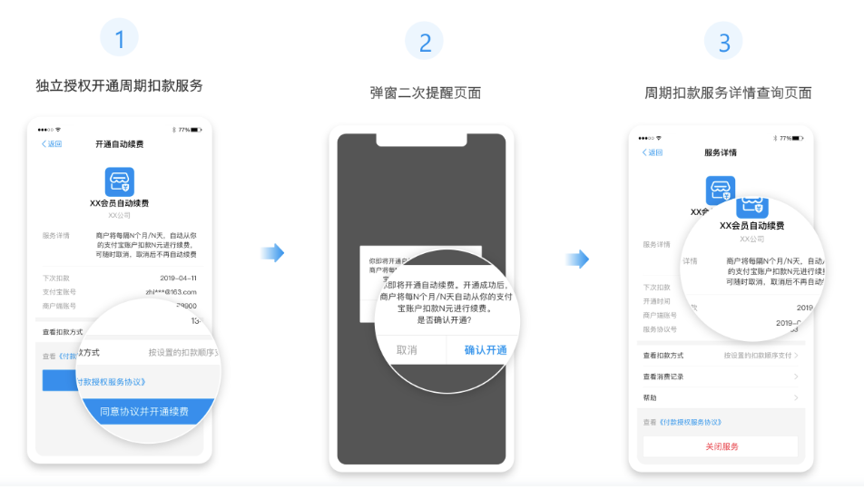

### APP支付

商家APP集成支付宝提供的支付能力，在线上轻松收款：用户在商家APP消费，自动跳转支付宝完成付款，付款后自动跳回。 轻松享受更全面、更安全的支付服务。

**基本介绍**

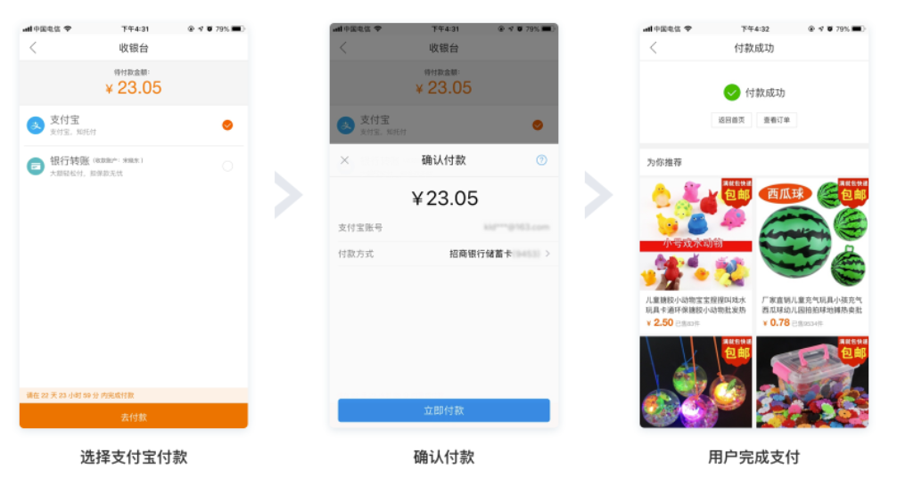

### 刷脸付

当不便使用手机或没有手机时，用户亦可“刷脸”完成——通过线下支付机具读取脸部完成自助结账等支付行为，快捷安全方便。 商家多一种方案，用户多一种选择，同样方便安全。

**基本介绍**


### 手机网站支付

用户在商家手机网站消费，通过浏览器自动跳转支付宝APP或支付宝网页完成付款。 轻松实现和APP支付相同的支付体验。

**基本介绍**

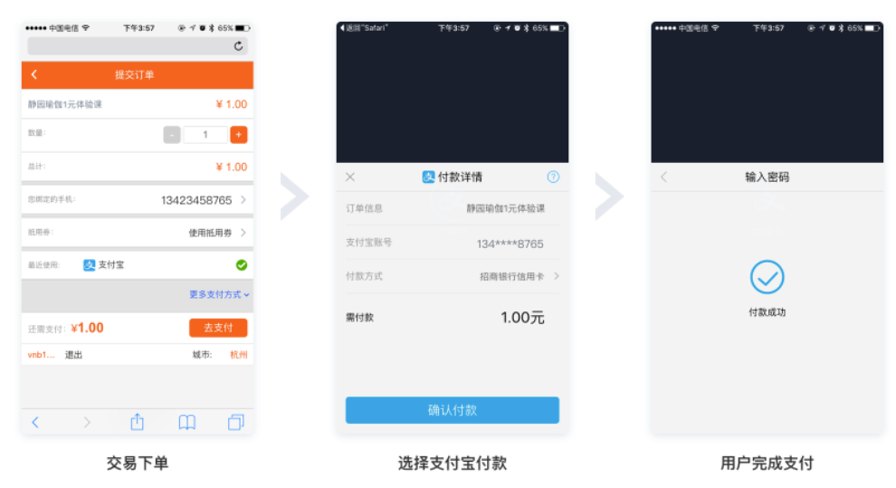

### 电脑网站支付

用户在商家PC网站消费，自动跳转支付宝PC网站收银台完成付款。 交易资金直接打入商家支付宝账户，实时到账。

**基本介绍**

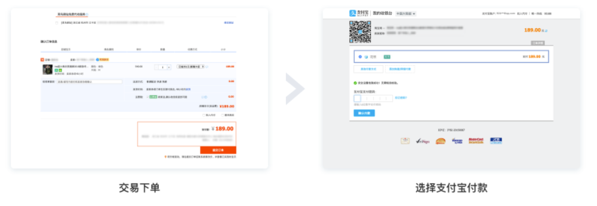

# 开发者入驻

### 创建应用

登录[ 支付宝开放平台](https://open.alipay.com/)，创建应用并提交审核，审核通过后会生成应用唯一标识 APPID，并且可以申请开通开放产品使用权限。通过 APPID 应用才能调用开放产品的接口能力。

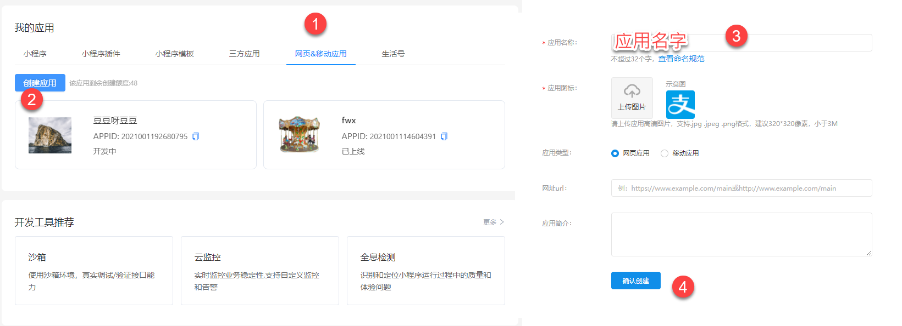

### 配置应用

**添加功能**

应用创建完成后，系统会自动跳转到应用详情页面。您可以在 **能力列表** 中点击 **添加能力** 来添加 **电脑网站支付** 功能。

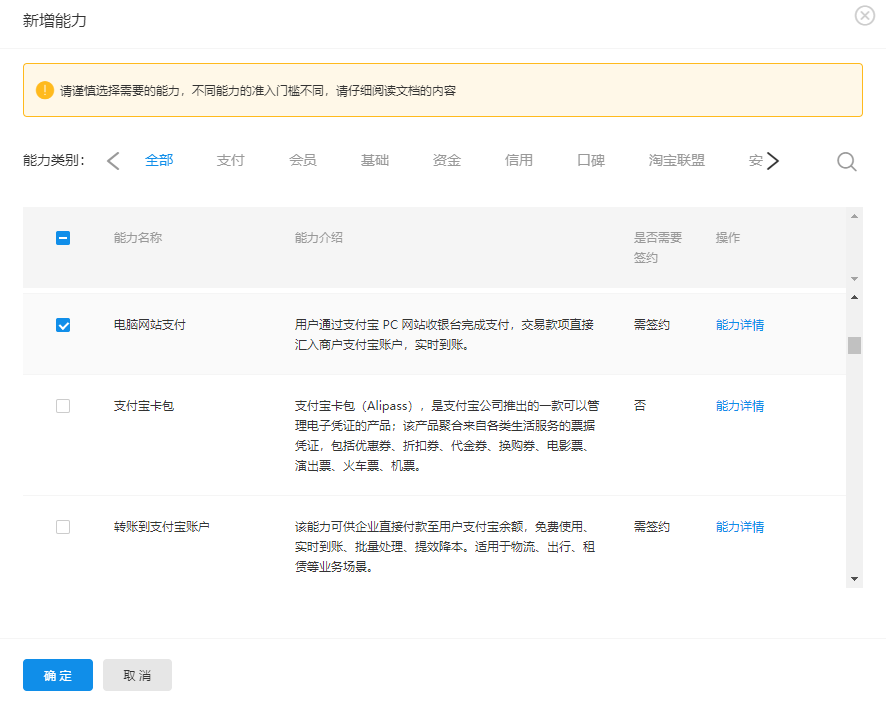

### 开发设置

进入开发设置中完成接口加签方式、IP白名单、应用网关、接口内容加密方式开发信息设置。详情请参见 [配置应用环境](https://opendocs.alipay.com/open/200/105310#配置应用环境)。

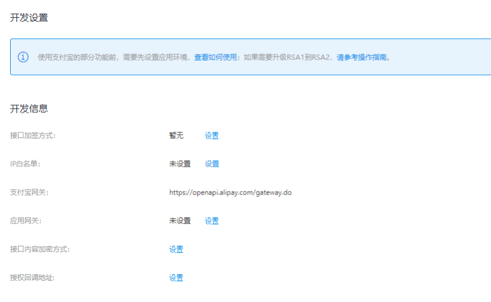

> **注意：**
>
> **接口加签方式：必填。**用于保障商户应用和支付宝交互的安全性，配置详情参见 [接口加签方式配置说明](https://opendocs.alipay.com/mini/introduce/01p6u8)。
>
> **IP白名单：选填。**用于保障用户资金安全，说明详情参见 [IP 白名单接入指南](https://opendocs.alipay.com/open/01qlnn)。
>
> **应用网关：选填。**用于接收支付宝异步通知消息，说明详情参见 [应用网关](https://opendocs.alipay.com/open/200/105310#界面说明如下)。
>
> **接口内容加密方式：选填**。用于加/解密 OpenAPI bizContent 报文内容及加/解密部分用户隐私信息，说明详情参见 [接口内容加密方式](https://opendocs.alipay.com/open/common/104567)。
>
> **授权回调地址：选填。**[第三方应用授权](https://opendocs.alipay.com/isv/10467/xldcyq) 或 [用户信息授权](https://opendocs.alipay.com/open/284/web#关于 redirect_uri 的说明) 后回调地址。授权链接中配置的 redirect_uri 的值必须与此值保持一致 (如：[https://www.alipay.com](https://www.alipay.com/)) ，用户成功授权后将在该 url 后携带授权码等信息并跳转至该页。当填入该地址时，系统会自动进行安全检测，详情请参考 [安全检测](https://opendocs.alipay.com/open/316/106274)。

### 上线应用

商户在添加功能和配置密钥后，即可将应用提交审核，预计会有一个工作日的审核时间，请耐心等待，详细步骤可参考 [上线应用](https://opendocs.alipay.com/open/200/golive/)。

 

# 沙箱环境介绍

### 简介

沙箱环境 (Beta) 是支付宝开放平台为开发者提供的与线上环境完全隔离的联调测试环境，在沙箱环境中完成的调用不会对线上数据造成任何影响，尤其适合涉及资金链路的能力的调试。

**注意：**

- 由于沙箱为模拟环境，在沙箱完成接口开发及主要功能调试后，请务必在正式环境进行完整的功能验收测试。所有返回码及业务逻辑以正式环境为准。
- 为保证沙箱稳定，沙箱环境测试数据会进行定期数据清理。Beta 测试阶段每周日中午 12 点至每周一中午 12 点为维护时间，在此时间内沙箱环境部分功能可能不可用，敬请谅解。
- 请勿在沙箱进行压力测试，以免触发相应的限流措施，导致无法正常使用沙箱环境。

### 支付宝客户端沙箱版

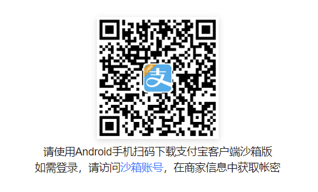


# 配置密钥


在沙箱进行调试前需要确保已经配置密钥/证书用于加签，支付宝提供了 **系统默认密钥** 及 **自定义密钥** 两种方式进行配置。

### 设置沙箱应用的公钥和私钥

开发者如需使用系统默认密钥/证书，可在 **开发信息** 中选择 **系统默认密钥**。

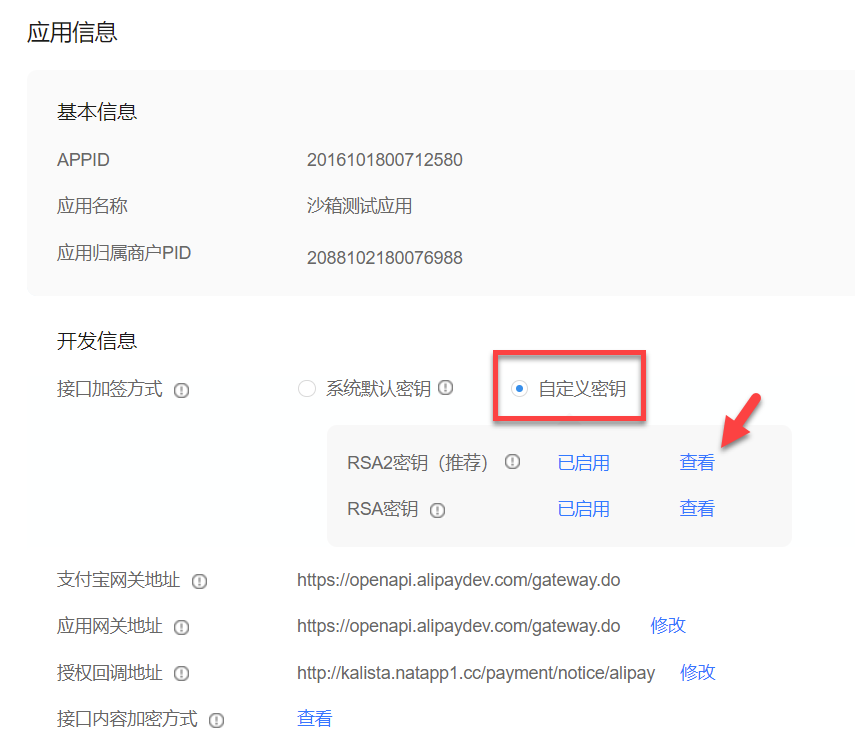

### 安装支付宝开放平台助手

下载支付宝开放平台助手https://opendocs.alipay.com/common/02khjo

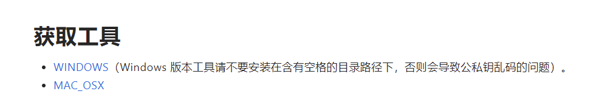

**生成密钥**

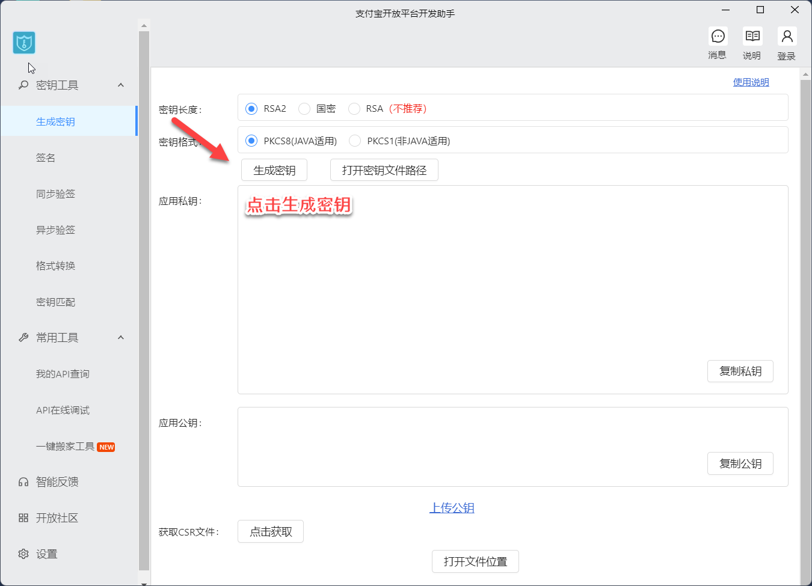

> **详细步骤：**
>
> 会自动生成商户应用公钥和应用私钥。

点击“打开密钥文件路径”，即可找到生成的公私钥。

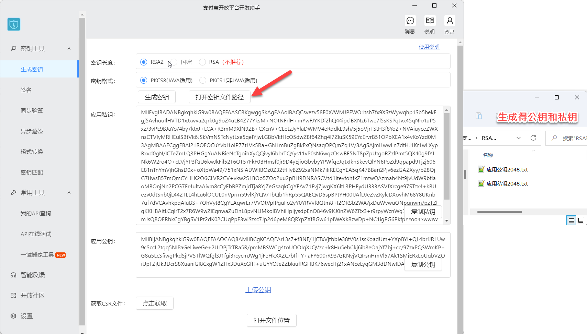

> **注意：**
>
> 生成的私钥需妥善保管，避免遗失，不要泄露。应用私钥需填写到代码中供签名时使用。应用公钥需提供给支付宝账号管理者上传到支付宝开放平台。

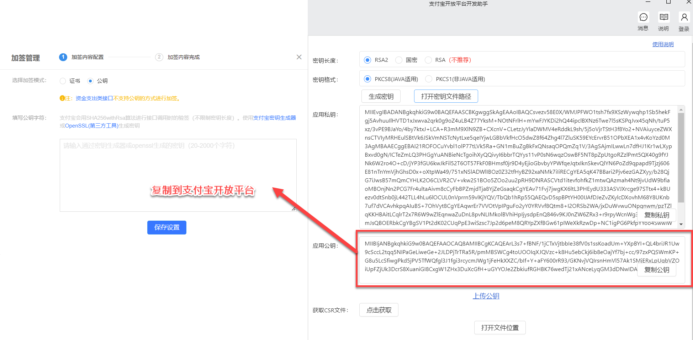

保存设置

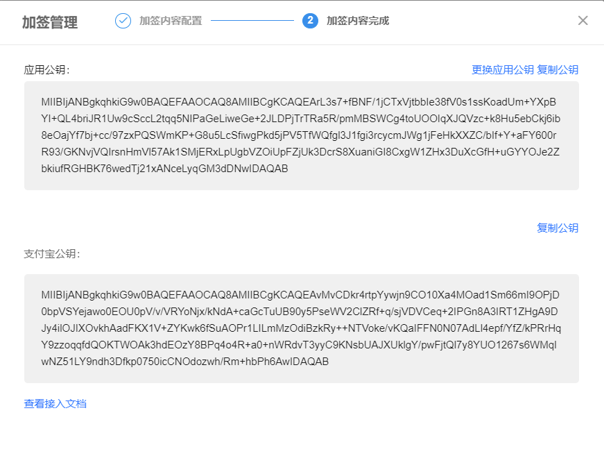

 

# 支付宝引入支付参数

### 创建配置文件

resources目录中创建zfb.properties

```properties
#APPid
alipay.app-id=2016101800712580
#应用私钥
alipay.private-key=MIIEvgIBADANBgkqhkiG9w0BAQEFAASCBKgwggSkAgEAAoIBAQCEcetn4vVF+KnHaSJ0JqdoQklCiOdFFHFhyhixN7EKxJ5kEWw7agl6nbbduG3vy8YqDPCFBHFMYSxViNF4QilBZOSNP7TJfIAjXkWxJhPPdDAMi9dVFIqR9CsvTSjbK0g4d+4+RyLZ9rv9fhktRbPpype7KcCZkFLGtNFVqWxihxdKMUh6ZIbrYzMDNI/6K361XG6KxxDSN4woS49Ygne6tJ2N8HUSws2Mk+fjRbDLg0gTySrqT/wM83RYcnp3H3o898WJ1v6ipBDMtrmIHl7huSRiQs/nH2ttflHZ5Qc7c+JP+Rn8IGmfiF+uWdMwxhrUNZIPctLLqeZTX5ZOvnylAgMBAAECggEBAIJMfPbAbuL+xzD6er3ghVPp2p8NhtEMUpuNMouuqYtZciYqidtN77Nk09H/rpB6XiNihYGnpDsrYm1n5AQ2utWuB7f6k8ahqIKjLVchid3PhbHiJd97DPSYTaAEfgxY4X1EZ+t3Go9q0PmLhANpDp4UBQBKDERHm1gH7eYjfxDSPNmeXHDPyssD8h7ASSQgGLUrmhos+YYkQ37MRHm+EKDEqhueeYIYOZ8evEsPyEEtFSx4YOaE9Tzvh3BuwxdzzEPJjE55If5x4wTo6cp/ZfceI5FXW91+VK5zfL2d+qktJfqwZ5o+pPju/TP2lyMf6g1y/q3zCctDa8uAt1zY+sECgYEA2tyZOIgUbwpLZVi6R2nQUCT/jzt94cH7N4e5jCPXdc+YP+PXveVAv1Av5wVHdBxhwBlfo1OpnYsFcwuJcWj4LPqZx9pF3EWDA1eqoSjttwtF6tqWoaYEukxvMC59dNJdF4qu8nNqxt7Sk0fdIrDmLy34UJUYQ6sgMovDFDm/NpUCgYEAmutcF1XDB6HzXocqhx84CxkbTUdG6fSzbJPFMxQRWrpZ/S/17+kRrMEHXodhMHqWbRp53e2W1Vyhp3y29f7yYzzfZ/T9a7F3tyuh5ILXOLZfK7r/+11WguCVv2YDQV4MOM5/8Sq754QfvFLnvRE/XxI+1+31+oZZcrsXGlBc+dECgYADvYFg1fKDc0mWkc2dKtHEjN1RNVMRaJ9Cc69YFcS43rNbZClrtV9F5bjr2cs+0L1a6xQXVnavmpCdRrUymviizCWUpMZM3WM/y1+/IVPurOKlANdSK+QoyuWbjS/Xr0CoBla3DgHlJCm1GqVM0nkclUyJFAM2JNaIBptu3Q3HgQKBgG3UOh+Y/4FjwWPcs7vD2DmV/RMWWyH2B1YMlRuXOI532uBypgsF0zAEUTMlCzQRVJ/Yy1kY3Xw6Baj188gGjNTqDQBoYVl+IX9MgaO9VtOwB1y7YEtWasSyb7eXnOs0v7luPKo/P6PsuYsLw5r4pVLDXqY6385SfQuns8NGAgRhAoGBANl3bs3SO9gH9XcUO1vGrocJ2fsmEkU5nxregC8VP+/ipsak2GA/woTLwa9ZXEq5+lAIK8DhioZrgw3rDnJ1pDwOC217V4C9K3S+m4iEFw4+S8qzC/GDuhnCG6Tt54RDtIc6slmQ3Q19OYozILaVRP0rGJPvHNOOXShQjFVzHv2T
#支付宝公钥
alipay.public-key=MIIBIjANBgkqhkiG9w0BAQEFAAOCAQ8AMIIBCgKCAQEAvMvCDkr4rtpYywjn9CO10Xa4MOad1Sm66mI9OPjD0bpVSYejawo0EOU0pV/v/VRYoNjx/kNdA+caGcTuUB90y5PseWV2ClZRf+q/sjVDVCeq+2IPGn8A3IRT1ZHgA9DJy4ilOJIXOvkhAadFKX1V+ZYKwk6fSuAOPr1LILmMzOdiBzkRy++NTVoke/vKQaIFFN0N07AdLl4epf/YfZ/kPRrHqY9zzoqqfdQOKTWOAk3hdEOzY8BPq4o4R+a0+nWRdvT3yyC9KNsbUAJXUklgY/pwFjtQl7y8YUO1267s6WMqIwNZ51LY9ndh3Dfkp0750icCNOdozwh/Rm+hbPh6AwIDAQAB
#网关
alipay.gateway=https://openapi.alipaydev.com/gateway.do
#回调地址
alipay.notify_url=http://liliwoya.natapp1.cc
```

**配置详情**

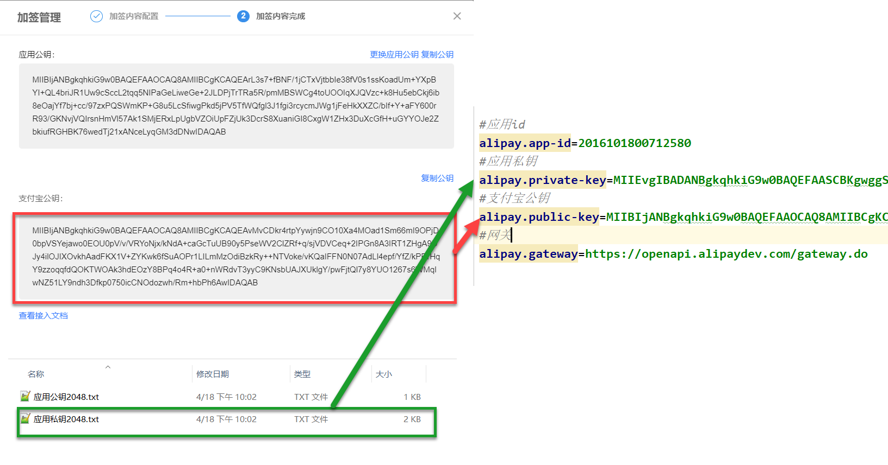

### 读取配置文件

在config目录下创建ZfbPayConfig

```java
/**
 * 读取支付宝配置文件
 */
@Configuration
@PropertySource("classpath:zfb.properties") //读取配置文件
@ConfigurationProperties(prefix="alipay") //读取alipay节点
@Data
@Slf4j
public class ZfbPayConfig {
  //应用id
  private String appId;
  //应用私钥
  private String privateKey;
  //支付宝公钥
  private String publicKey;
  //网关
  private String gateway;
  // 接收结果通知地址
  private String notifyUrl;
}
```

### 测试配置文件

```Java
/**
 * 测试支付宝配置文件
 * @return
 */
@GetMapping("/getZfbConfig")
public BaseResult getZfbConfig(){
  // 获取APPid
  return BaseResult.ok(wxPayConfig.getAppid());
 }
```


# 设置支付宝客户端

### 引入支付宝SDK

```xml
<!--  支付宝SDK   -->
<dependency>
  <groupId>com.alipay.sdk</groupId>
  <artifactId>alipay-sdk-java</artifactId>
  <version>4.22.86.ALL</version>
</dependency>
```

### 设置支付宝客户端

```Java
@Configuration
@PropertySource("classpath:zfbinfo.properties") //读取配置文件
@ConfigurationProperties(prefix="alipay") //读取alipay节点
@Data
@Slf4j
public class ZfbPayConfig {

  private String appId;
  private String privateKey;
  private String publicKey;
  private String gateway;
  // 接收结果通知地址
  private String notifyUrl;

  /**
   * 设置支付宝客户端
   * @return
   */
  @Bean
  public AlipayClient setAlipayClient(){
    return new DefaultAlipayClient(gateway,
        appId, privateKey, "json", "utf-8", publicKey, "RSA2");
   }
}
```


# 当面付_支付流程


### 调用流程


# 统一收单下单

### 编写下单收单接口

```Java
/**
 * 统一收单并支付页面接口
 * @param orderNo 订单编号
 * @return
 * @throws Exception
 */
BaseResult pcPay(String orderNo)throws Exception;
```

### 实现下单收单接口

```Java
/**
 * 统一收单支付页面
 * @param
 * @return
 * @throws Exception
 */
@Override
public BaseResult pcPay(String orderNo) throws Exception {
  log.info("info ============= {}",orderNo);
  // 1. 根据订单编号查询订单信息
  OrderInfo orderInfo = iOrderInfoService.findByOrderNo(orderNo);
  // 2. 判断订单是否存在
  if (orderInfo == null){
    return BaseResult.error(CodeEnum.ORDER_ERROR);
   }


  AlipayTradePrecreateRequest request = new AlipayTradePrecreateRequest();
  // 3. 支付请求参数拼接
  JSONObject bizContent = new JSONObject();
  //商户订单号
  bizContent.put("out_trade_no",orderNo);
  //支付金额
  bizContent.put("total_amount",orderInfo.getTotalFee());
  //订单标题
  bizContent.put("subject",orderInfo.getTitle());
  //商户门店编号
  bizContent.put("store_id","00100");
  request.setBizContent(bizContent.toJSONString());
  // 回调
  request.setNotifyUrl(zfbPayConfig.getNotifyUrl().concat(ZfbNotifyType.NATIVE_NOTIFY.getType()));
  AlipayTradePrecreateResponse response = null;
  //支付宝二维码URL
  String qrCode = "";
  try {
    response = alipayClient.execute(request);
    if (!response.isSuccess()) {
      throw new Exception("生成支付宝订单失败:" + response.getMsg() + response.getQrCode());
     }
    qrCode = response.getQrCode();
   } catch (AlipayApiException e) {
    throw new Exception(e.getMessage());
   }
  // 封装支付信息 返回
  PayInfoVO payInfoVO = new PayInfoVO();
  payInfoVO.setOrderNo(orderNo);
  payInfoVO.setCodeUrl(qrCode);
  log.info("payInfo: {}",payInfoVO);
  return BaseResult.ok(payInfoVO);
 }
```

### 编写支付宝下单接口

```Java
@PostMapping("/pcPay/{orderNo}")
public BaseResult pcPay(@PathVariable String orderNo) throws Exception {
  log.info("发起支付请求");
  return zfbPayService.pcPay(orderNo);
 }
```


# 支付完成接收回调请求

### 定义回调通知地址枚举

```Java
@Getter
@AllArgsConstructor
public enum ZfbNotifyType {
  /**
   * 支付通知
   */
  NATIVE_NOTIFY("/api/zfb-pay/alyPayNotify"),
  /**
   * 退款结果通知
   */
  REFUND_NOTIFY("/api/zfb-pay/refunds/notify");
  /**
   * 类型
   */
  private final String type;
}
```

### 设置回调地址

```Java
request.setNotifyUrl(zfbPayConfig.getNotifyUrl().concat(ZfbNotifyType.NATIVE_NOTIFY.getType()));
```

### 编写支付宝回调接口

```Java
@PostMapping("/alyPayNotify")
public String pcPay(HttpServletRequest request, HttpServletResponse response) throws Exception {
  //检查异步通知的签名是否合法
  if (!ZfbVerifierUtils.isValid(request, zfbPayConfig.getPublicKey())) {
    log.error("支付宝签名验证失败！");
    return "fail";
   }
  return "success";
 }
```

# 验证支付宝异步通知签名是否合法

```Java
/**
 * 验证支付宝异步通知签名是否合法
 * @param request
 * @return
 */
public static boolean isValid(HttpServletRequest request,String alipayPublickey){
  //获取支付宝POST过来反馈信息
  Map<String,String> params = new HashMap<String,String>();
  Map<String, String[]> parameters = request.getParameterMap();
  for (Object v : parameters.entrySet()) {
    Map.Entry<String, String[]> item = (Map.Entry<String, String[]>) v;
    params.put(item.getKey(), item.getValue()[0]);
   }
  try {
    return AlipaySignature.rsaCheckV1(params, alipayPublickey, "utf-8", "RSA2");
   } catch (AlipayApiException e) {
    // TODO Auto-generated catch block
    e.printStackTrace();
   } //调用SDK验证签名
  return false;
 }
```


# 修改订单状态

```Java
/**
 * 修改订单状态
 * @param request
 * @throws GeneralSecurityException
 */
@Transactional(rollbackFor = Exception.class)
@Override
public void updateOrderStatus(HttpServletRequest request) throws GeneralSecurityException {
  // TODO 验签成功后
  //按照支付结果异步通知中的描述，对支付结果中的业务内容进行1\2\3\4二次校验，校验成功后在response中返回success，校验失败返回failure
  // 1  支付状态
  String status = request.getParameter("trade_status");
  if(status.equals("TRADE_SUCCESS")){//交易成功
    // 2. 获取订单状态
    String orderNo =request.getParameter("out_trade_no");
    // 3. 支付宝交易号
    String paySn = request.getParameter("trade_no");
    // 4. 支付金额
    String totalAmount = request.getParameter("total_amount");
    // 5. 修改订单状态
    iOrderInfoService.updateOrderStatus(orderNo, OrderStatus.SUCCESS);
    // 6.添加交易记录
    PaymentInfo paymentInfo = new PaymentInfo();
    paymentInfo.setOrderNo(orderNo);
    paymentInfo.setTransactionId(paySn);
    // 微信  支付宝
    paymentInfo.setPaymentType(PayType.ALIPAY.getType());
    // 支付金额
    paymentInfo.setTradeState(status);
    paymentInfo.setPayerTotal(new Double(Double.parseDouble(totalAmount)).intValue());
    paymentInfo.setCreateTime(LocalDateTime.now());
    iPaymentInfoService.save(paymentInfo);
   }
 }
```


# 统一收单交易退款接口


### 简介

当交易发生之后一段时间内，由于买家或者卖家的原因需要退款时，卖家可以通过退款接口将支付款退还给买家，支付宝将在收到退款请求并且验证成功之后，按照退款规则将支付款按原路退到买家帐号上。

> 注意：
>
> - 同一笔交易的退款至少间隔3s后发起
> - 当前接口与PC退款、批量退款等其他退款产品无幂等关系，当商户侧同一笔退款请求已使用了当前接口申请退款的情况下，【不要使用其他退款产品再次进行退款】，可能造成【重复退款】。

### 编写退款接口

```Java
/**
 * 申请退款
 *
 * @param orderNo 订单编号
 * @param reason  退款理由
 * @return
 */
@PostMapping("/refund/{orderNo}/{reason}")
public BaseResult refund(@PathVariable String orderNo, @PathVariable String reason) throws IOException, AlipayApiException {
  zfbPayService.refund(orderNo, reason);
  return BaseResult.ok();
 }
```

### 编写退款接口实现类

```Java
/**
 * 修改订单状态
 * @param orderNo 退款编号
 * @param reason 退款理由
 * @throws IOException
 * @throws AlipayApiException
 */
@Transactional(rollbackFor = Exception.class)
@Override
public void refund(String orderNo, String reason) throws IOException, AlipayApiException {
  log.info("*************  创建退款单 ******");
  // 1. 根据订单编号创建退款单
  RefundInfo refundInfo = iRefundInfoService.createRefundsByOrderNo(orderNo, reason);
  // 2. 组装参数
  AlipayTradeRefundRequest request = new AlipayTradeRefundRequest();
  JSONObject bizContent = new JSONObject();
  // 退款单号
  bizContent.put("out_trade_no", refundInfo.getOrderNo());
  // 退款金额
  bizContent.put("refund_amount", refundInfo.getRefund());
  bizContent.put("refund_reason", reason);


  request.setBizContent(bizContent.toString());
  // 3. 发送请求
  AlipayTradeRefundResponse response = alipayClient.execute(request);
  if(response.isSuccess()){
    log.info("调用成功===>{}",response.getSubMsg());
    // 4. 修改订单状态
    iOrderInfoService.updateOrderStatus(refundInfo.getOrderNo(), OrderStatus.REFUND_SUCCESS);
    //5. 修改退款单状态
    iRefundInfoService.updateOrderStatusAliPay(response.getOutTradeNo());
   } else {
    log.error("调用失败=>{}",response.getSubMsg());
   }
 }
```


# 交易状态查询

### 简介

该接口提供所有支付宝支付订单的查询，商户可以通过该接口主动查询订单状态，完成下一步的业务逻辑。

### 编写查询交易状态接口

```Java
/**
 * 查询交易记录
 * @param orderNo 订单编号
 * @return
 */
BaseResult queryPayStatus(String orderNo) throws Exception;
```

### 编写查询交易状态实现类

```Java
/**
 * 查询交易状态
 * @param orderNo
 * @return
 */
@Override
public BaseResult queryPayStatus(String orderNo) throws Exception {
  AlipayTradeQueryRequest request = new AlipayTradeQueryRequest();
  JSONObject bizContent = new JSONObject();
  bizContent.put("out_trade_no", orderNo);//订单编号
  request.setBizContent(bizContent.toJSONString());
  AlipayTradeQueryResponse response = alipayClient.execute(request);
  if(response.isSuccess()){
    System.out.println("调用成功");
    return BaseResult.ok(response.getBody());
   } else {
    log.error("查询交易记录失败==============>",response.getCode());
    throw new Exception("调用失败");
   }
 }
```

### 编写查询订单控制层

```Java
/**
 * 查询订单
 *
 * @param orderNo
 * @return
 */
@GetMapping("/queryOrder/{orderNo}")
public BaseResult queryOrder(@PathVariable String orderNo) throws Exception {
  return iZfbPayService.queryPayStatus(orderNo);
 }
```


# 前端项目使用说明


### 安装node.js

node.js官网https://nodejs.org/en/。

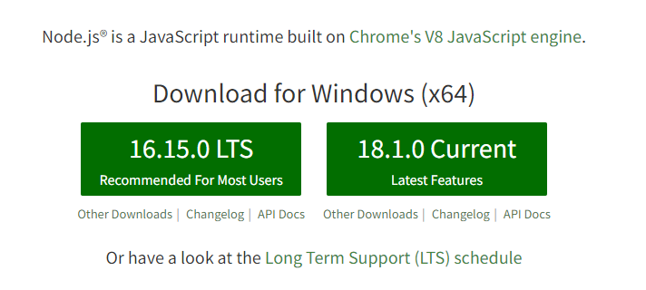

### 下载依赖包

在前端项目根路径打开命令行终端

```sh
npm install
```

> **注意：**
>
> 如果下载速度慢，就安装cnpm可以加快安装速度。安装命令npm install -g cnpm --registry=[https://registry.npm.taobao.org](https://registry.npm.taobao.org/)
>
> 安装成功后在执行：cnpm install

### 启动启动项目

```sh
npm run serve
```

### 目录结构说明

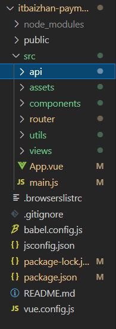

- api：接口
- assets：静态资源
- components：公共组件
- router：页面路由
- utils：http工具
- views：页面
- main.js：主函数入口
