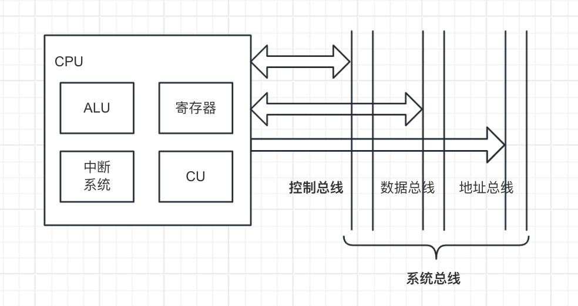

# 计算题

画图题：95页  例题4.1   例题4.2

汉明码计算：100页

加法与减法运算：238页 例题6.10     272页   例题6.30

# 第一章 计算机系统概论

- **目标程序**：计算机将其翻译成机器能够识别的机器语言程序
- 一个存储单元可存储一串二进制代码，称这串二进制代码为一个存储字，这串二进制代码的位数称为存储字长。
- 机器字长是指CPU一次能够处理数据的位数，通常与CPU的寄存器位数有关。

# 第二章 计算机的发展及应用

- **总线的分类（按连接部件不同）**
	- 片内总线
	- 系统总线：指CPU、主存、I/O设备（通过I/O接口）各大部件之间的信息传输线。
	- 通信总线
- **总线性能指标**
	- 总线宽度：通常是指数据总线的根数，用bit（位）表示。
	- 总线带宽：总线带宽可理解为总线的数据传输速率。
- **常见的的集中式控制优先权仲裁方式**
	- 链式查询
		- 只需要很少几根线就能按一定优先次序实现总线控制，并且很容易扩充设备，但对电路故障很敏感，且优先级别较低的设备很难获得请求。
	- 计数器定时查询
   		- 优先次序可以改变，这种方式对电路故障不如链式查询方式敏感，但增加了控制线（设备地址）数，控制也较复杂。
	- 独立请求方式
		- 这种方式的特点是：响应速度快，优先次序控制灵活（通过程序改变），但控制线数量多，总线控制更复杂。
- **总线周期分为4个阶段**
	- 申请分配阶段、寻址阶段、传数阶段、结束阶段
- **同步通信：**通信双方由统一时标控制数据传送称为同步通信。
- 异步通信的应答方式又可分为不互锁、半互锁和全互锁。
- **分离式通信的特点（简答）**
	- 各模块欲占用总线使用权都必须提出申请。
	- 在得到总线使用权后，主模块在限定的时间内向对方传送消息，采用同步方式传送，不再等待对方的回答信号。
	- 各模块在准备数据的过程中都不占用总线，使总线可接受其他模块的请求。
	- 总线被占用时都在做有效工作，或者通过它发送命令，或者通过它传送数据，不存在空闲等待时间，充分地利用了总线的有效占用，从而实现了总线在多个主、从模块间进行信息交叉重叠并行方式传送，这对大型计算机系统是极为重要的。

# 第四章 存储器

- **半导体存储器**
	- 其优点是体积小、功耗低、存取时间短，是一种易失性存储器。
- 存储器有3个主要性能指标：速度、容量和每位价格。
- 寄存器速度最，位价最高，容量最小。
- 存取时间
	- 指启动一次存储器操作（读或写）到完成该操作所需的全部时间。
- 存取周期
	- 指存储器进行连续两次独立的存储操作所需的最小间隔时间。
- 地址线是单向输入的，其位数与芯片容量有关。
- 半导体存储芯片的译码驱动方式有两种：线选法和重合法。
- 静态RAM是用触发器工作原理存储信息的，信息读出后，它仍保持其原状态，不需要再生。
- 动态RAM是靠电容存储电荷的原理来寄存信息。电容上的电荷一般只能维持1～2ms，因此即使电源不掉电，信息也会自动消失。为此，必须在2ms内对其所有存储单元恢复一次原始状态，这个过程称为再生或刷新。

#### 三种刷新方式（简答）

- 集中刷新
	- 集中刷新是在规定的一个刷新周期内，对全部存储单元集中一段时间逐行进行刷新，此时必须停止读/写操作。
- 分散刷新
	- 分散刷新是指对每行存储单元的刷新分散到每个存取周期内完成。其中把机器的存取周期周期Tc分成两段，前半段Tm用来读/写或维持信息，后半段Tr用来刷新。
- 异步刷新
	- 每隔一段时间（刷新时间/芯片行数）在刷新周期时间内，对存储芯片的每一行各刷新一遍。

#### 动态RAM与静态RAM的比较（简答）

1. 在同样大小的芯片中，动态RAM的集成度远高于静态RAM。
2. 静态RAM靠触发器的工作原理来存储信息，动态RAM是靠电容存储电荷的原理来寄存信息。
3. 动态RAM行、列地址按先后顺序输送，减少了芯片引脚，封装尺寸也减少。
4. 动态RAM的功耗比静态RAM小。
5. 动态RAM的价格比静态RAM的价格便宜。
6. 动态RAM被广泛应用于计算机的主存。
7. 动态RAM的速度比静态RAM低。
8. 动态RAM需要再生，静态RAM不需要再生。
9. 容量不大的高速缓冲器大多用静态RAM实现。

#### 只读存储器

- PROM是可以实现一次性编程的只读存储器。
- EPROM是一种可擦除可编程的只读存储器。

#### 高速缓冲器

- 高速缓冲Cache用来解决主存与CPU速度不匹配的问题。
- 当Cache内容已满，无法接受来自主存块的信息时，就由Cache内的替换机构按一定的替换算法来确定应从Cache内移出哪个块返回主存，而把新的主存块调如Cache。
- 写直达法
	- 即写操作时数据既存入Cache，又写入主存。

#### Cache---主存地址映射

- 由主存地址映射到Cache地址称为地址映射。映射方式：直接映射、全相联映射、组相联映射。
- 全相联映射允许主存中的每一字块映射到Cache中的任何一块为位置上。

# 第五章 输入输出系统

#### I/O设备与主机的联系方式

- 对I/O地址码的编址可采用两种方式
	- 统一编址
		- 将I/O地址看作存储器地址的一部分。
	- 不统一编址
		- I/O地址和存储器地址是分开的，所有对I/O设备的访问必须有专用的I/O指令。

#### I/O设备与主机信息传送的控制方式

- 程序查询方式是由CPU通过程序不断查询I/O设备是否已做好准备，从而控制I/O设备与主机交换信息。

#### 程序中断方式的接口电路

- 每台外部设备都必须配置一个中断请求触发器INTR，当其位“1”时，表示该设备向CPU提出中断请求。
- 向量地址用来寻找设备的中断服务程序的入口地址。

#### I/O中断处理过程

- CPU响应I/O设备中断请求的条件时必须满足CPU中的允许中断触发器``EINT为“1”`。
- 中断嵌套
	- 计算机在处理中断的过程中，有可能出现新的中断请求，此时如果CPU暂停现在执行的中断服务程序，转去处理新的中断请求，这种现象被称为中断嵌套，或多重中断。
- 多重中断的服务流程（简答）
	- CPU一但响应了某中断源的中断请求之后，便由硬件线路自动关中断，即中断允许触发器EINT被置为“0”，以确保该中断服务程序的顺利执行，如果不用开中断指令将EINT置“1”，则意味着CPU不能再响应其他任何一个中断源的中断请求。对于多重中断，开中断指令提前至“保护现场”之后，意味着在保护现场后，若有级别更高的中断源提出请求（这是实现多重中断的必要条件），CPU也可以响应，即再次中断现行的服务程序，转至新的中断服务程序。

#### DMA方式

- DMA与主存交换数据采用三种方法
	- 停止CPU访问主存
	- 周期挪用
	- DMA 与CPU交替访问

- DMA接口组成，有以下几个逻辑部件
	- 主存地址寄存器（AR）
	- 字计数器（WC）
	- 数据缓冲寄存器（BR）
	- DMA控制逻辑
	- 中断机构
	- 设备地址寄存器（DAR）
- 与程序中断方式相比，DMA方式有如下特点（简答）
	- 从数据传送看，程序中断方式看程序传送，DMA方式靠硬件传送。
	- 从CPU响应时间看，程序中断方式是在一条指令执行结束时响应，而DMA方式可以在指令周期内的任一存取周期结束时响应。
	- 程序中断方式有处理异常事件的能力，DMA方式没有这种能力，主要用于大批数据的传送，如硬盘存取、图像处理、高速数据采集系统等，可提高数据吞吐量。
	- 程序中断方式需要中断现行程序，故需要保护现场；DMA方式不中断现行程序，无需保护现场。
	- DMA的优先级比程序中断的优先级高。

#### DMA的接口类型

- 选择型DMA接口特别适用于数据传输率很高的设备。

# 第六章 计算机的运算方法

#### 无符号数和有符号数

- 原码中的“零”有两种表示形式。
- 补码中的“零”只有一种表现形式。
- 反码中的“零”也有两种表现形式。

#### 定点运算

- 不论是正数还是负数，移位后其符号位均不变，这是算术移位的重要特点。
- 计算机中采用1位符号位判断时，为了节省时间，通常用符号位产生的进位与最高有效位产生的进位异或操作后，按其结果进行判断。若异或结果为1，即为溢出；若异或结果为0，则无溢出。

#### 算术逻辑单元

- ALU是既能完成算术运算又能完成逻辑运算的部件。
- 并行加法器由若干个全加器组成。

# 第七章 指令系统

#### 机器指令

- 指令是由操作码和指令码两部分组成的。
	- 操作码用来指明该指令所要完成的操作。
	- 地址可被认为是一个无符号的整数。

#### 寻址

- 指令寻址分为顺序寻址和跳跃寻址。
- 立即寻址的特点
	- 是操作数本身设在指令字内，即形式地址A不是操作数的地址，而是操作数本身。
- 直接寻址的特点
	- 指令字中的形式地址A就是操作数的真实地址EA。
- 变址寻址主要用于处理数组的问题。
- 相对寻址常被用于转移类指令。

# 第八章 CPU的结构和功能

#### CPU结构

- CPU必须具有控制程序的顺行执行（称指令控制）、产生完成每条指令所需的控制命令（称操作控制）、对各种操作加以时间上的控制（称时间控制）、对数据进行算术运算和逻辑运算（算术加工）以及处理中断等功能。

#### CPU结构框图

- 根据CPU的功能不难设想，要想取指令，必须有一个寄存器用于存放当前指令的地址；

- 要分析指令，必须有存放当前指令的寄存器和对指令操作码进行编译的部件；

- 要执行指令，必须有一个能发出各种操作命令序列的控制部件CU；

- 要完成算术运算和逻辑运算，必须有存放操作数的寄存器和实现逻辑运算的部件ALU；

- 为了处理异常情况和特殊请求，还必须有中断系统。

- 可见，CPU可由四大部分组成。

#### CPU的寄存器

- PC
	- 程序计数器，存放现行指令的地址，通常具有计数功能。当遇到转移类指令时，PC的值可被修改。
- IR
	- 指令寄存器，存放当前欲执行的指令。

#### 控制单元和中断系统

- 控制单元（CU）是提供完成计算机全部指令操作的微操作命令序列部件。

#### 影响流水线性能的因素

- 三种相关
	- 结构相关
	- 数据相关
	- 控制相关

#### 流水线性能

- 吞吐率
	- 吞吐率是指单位时间内流水线所完成指令或输出结果的数量。
- 超标量技术
	- 它是指在每个时钟周期内可以同时并发多条独立指令。
- 寻找中断服务程序的入口地址
	- 硬件向量法
	- 软件查询法

# 第九章 控制单元的功能

- 每个节拍的宽度正好对应一个时钟周期。
- 常见的控制方式有：同步控制、异步控制、联合控制和人工控制四种。
