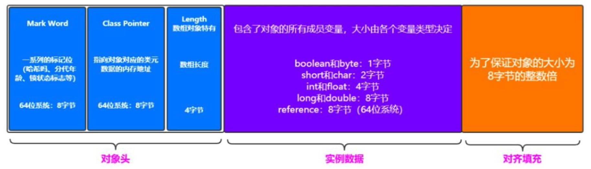

# JVM介绍

## 什么是JVM

JVM是Java Virtual Machine（Java虚拟机）的缩写。一台执行Java程序的机器。

## Java语言执行原理

**计算机高级语言**

1. 编译型语言（C）：文本文件（.c）--> 编译器 --> 可执行文件（.exe） --> 执行机器指令。

	特点：运行速度快，不可跨平台运行。

2. 解释型语言（Js）：文本文件 --> 解释器 --> 翻译成机器指令并执行。

	特点：运行速度慢，可跨平台运行。

**JAVA语言**：**先编译，后解释执行**。

文本文件（java）-->  编译器 --> class文件（虚拟指令）--> JAVA虚拟机（JVM）--> 解释成机器指令并执行。

## JDK+JRE+JVM

1. JDK（Java开发环境）：JRE+工具（编译器、调试器、其他工具）+类库

	编译器：将JAVA文件编译成JVM能够看懂的字节码文件（Class文件）。

2. JRE（Java运行环境）：JVM+JAVA解释器

	Java解释器：将虚拟指令解释为机器指令执行。

3. JVM（Java虚拟机）

## Java字节码文件结构

[文档链接](https://docs.oracle.com/javase/specs/jvms/se20/html/jvms-4.html)

```xml
ClassFile {
    u4             magic;            // 标识class文件
    u2             minor_version;    // 副版本号
    u2             major_version;    // 主版本号
    u2             constant_pool_count;
    cp_info        constant_pool[constant_pool_count-1];
    u2             access_flags;
    u2             this_class;
    u2             super_class;
    u2             interfaces_count;
    u2             interfaces[interfaces_count];
    u2             fields_count;
    field_info     fields[fields_count];
    u2             methods_count;
    method_info    methods[methods_count];
    u2             attributes_count;
    attribute_info attributes[attributes_count];
}
```

**什么是u2、u4**

​	u2：代表数据占两个字节。  U4：代表数据占四个字节。

**JDK编译对应的版本号**

​	JDK8 --> 52

# 类加载机制

## 类加载过程

1. **`装载`**
  1. 获取全限定类名，将class文件转换成二进制流。
  2. 将二进制流类中的的描述信息存入方法区。如创建时间、版本、作者等。
  3. 将java.lang.Class对象存入堆中。


2. **`链接`**
	1. 验证：验证被加载类的正确性。如文件的格式、元数据等。
	2. 准备：在方法区中为静态变量分配空间，并设置初始值。一般来说，int = 0，float = 0.0，boolean = false。
	3. 解析：把类的符号引用转为直接引用。
3. **`初始化`**
	1. 为类的静态变量设置默认值、执行静态代码块。


## 类加载器

- **`分类`**

	不同的类加载器加载不同的类：

	**启动类加载器（Bootstrap ClassLoader）：**主要负责加载JAVA中的一些核心类库，主要是位于<JAVA_HOME>/bin/rt.jar中

	**扩展类加载器（Extension ClassLoader）：**主要加载JAVA中的一些拓展类，位于<JAVA_HOME>/lib/ext中，是启动类加载器的子类。

	**应用类加载器（App ClassLoader）：**主要用于加载CLASSpATH路径下我们自己写的类，是拓展类加载器的子类。

- **`双亲委派模型`**

	如果一个类加载器收到了类加载请求，它并不会自己先去加载，而是把这个请求委托给父类的加载器去执行，如果父类的加载器还存在其他的父类加载器，则进一步向上委托，依次递归，请求最终将达到顶层的启动类加载器，如果父类的加载器可以完成类加载任务，就成功返回，若父类加载器无法完成加载任务，子加载器才会尝试自己去加载。

	```mermaid
	flowchart BT
	AppClassLoader --> ExtensionClassLoader --> BootstrapClassLoader
	```

	**如何打破双亲委派机制？**

	​	自定义类加载器类，继承ClassLoader类，重写loadClass方法，如Tomcat就是打破了双亲委派机制的经典例子。

# JVM内存模型

## 什么是JVM内存模型

​	JVM需要使用计算机的内存，Java程序运行中所处理的对象或者算法都会使用JVM的内存空间，JVM将内存区划分为5块，这样的结构称之为JVM内存模型。

## JVM为什么进行内存区域划分

​	随着对象数量的增加，JVM内存使用率也在增加，如果JVM内存的使用率达到100%，则无法继续运行程序。为类让JVM内存可以被重复使用，我们需要进行垃圾回收。为了提升垃圾回收的效率，JVM将内存区域进行了划分。

## JVM内存划分

### JVM按照线程是否共享将内存首先分为两大类

- **线程独享区**

	​	只有当前线程能访问数据的区域，线程之间不能共享。

	​	线程独享区随着线程的创建而创建，随线程的销毁而被回收。

- **线程共享区**

	​	所有的线程都可以访问的区域。

	​	当线程被销毁的时候，共享区的数据不会立即回收，需要等待达到垃圾回收的阈值之后才会进行回收。

	

- 代码实例

	```Java
	class Student{
	    int age = 0;
	}
	
	class MyThread extends Thread{
	    private String name;
	    public MyThread(String name) {
	        this.name = name;
	    }
	
	    int a = 0;
	    Student b;
	
	    @Override
	    public void run() {
	        System.out.println(name+" a:"+(++a));
	        System.out.println(name+" b:"+(++b.age));
	    }
	}
	
	class Test{
	    public static void main(String[] args) {
	        MyThread thread1 = new MyThread("线程1");
	        MyThread thread2 = new MyThread("线程2");
	
	        int num = 0;
	        Student student = new Student();
	        thread1.a = num;
	        thread1.b = student;
	        thread2.a = num;
	        thread2.b = student;
	        thread1.start();
	        thread2.start();
	    }
	}
	
	
	输出结果
	线程1 a:1
	线程2 a:1
	线程2 b:2
	线程1 b:1
	```


## 程序计数器

​	程序计数器会记录当前线程要执行指令的内存地址，只占用一小部分内存区域，只记录一个 地址，所以我们认为程序计数器是不会出现内存溢出问题的分区。

## 本地方法栈

​	Java 中有些代码的实现是依赖于其他非 Java 语言的（C++），本地方法栈存储的是维护 非 Java 语句执行过程中产生的数据，一般我们认为本地方法栈不会出现内存的问题。

##  虚拟机栈

### 虚拟机栈的作用

​	存放当前线程中所声明的变量，包括基本数据类型的数据和引用数据类型的引用。

**基本数据类型和引用数据类型划分的标准：**

- 基本数据类型：

	​	`byte、short、int、long、boolean、float、double、char`

	​	变量在声明的时候，能够确认占用内存的大小。 

- 引用数据类型：

	​	`对象、数组、接口`

	​	变量在声明的时候，不能确认占用内存的大小。

	​	引用数据类型将值的引用存放到虚拟机栈中，而对象存放在堆内存中，引用数据类型占用 4 个字节存放地址。

## 栈帧(先进后出)

​	每一个线程都会对应一个虚拟机栈，线程中的每个方法都会创建一个栈帧，存放本次方法执 行过程中所需要的所有数据。 

​	如果我们一个线程中有多个方法的嵌套调用，虚拟机栈会对栈帧进行压栈和出栈操作。正在 执行的方法一定在栈顶，我们只能获取栈顶的栈帧，栈帧在虚拟机栈中先进后出。


## 栈帧的数据结构

### 局部变量

​	存放当前方法的局部变量，基本数据类型存值，引用数据类型存堆内存地址。 

### 操作数栈

​	对方法中的变量提供计算的区域。 

### 常量数据的引用

​	常量数据会存放到方法区的常量池中，不管是基本数据类型还是引用数据类型都会存放常量池的地址 

### 方法返回值的地址

​	方法返回数据会存到计算机内存的寄存器中。


##  虚拟机栈溢出异常

​	由于栈帧调用的深度太深，会出现虚拟机栈溢出异常（SOF 异常）。一般手动方法的调用是不会出现这个异常的，如果出现这个异常 ，`99%是由于递归`。

​	可以通过修改虚拟机栈的内存大小设置栈帧的最大深度，指令为：`-Xss 虚拟机栈内存大小`

​	一般栈帧深度达到 3000~5000 即可

​	太小：虚拟机栈容易溢出。

​	太大：每个线程占据的内存过大，影响线程数量。

##  方法区

​	在 java8 之后，我们把方法区称之为元空间（MetaSpace），方法区在逻辑上属于堆的一部分，但一些具体机制和堆有所区别，如：一些 JVM 的方法区是可以不进行垃圾回收的，关闭 JVM 时才会释放方法区内存。所以方法区还有一个别名叫非堆，目的是和堆分开。

​	方法区会存储`类信息、静态变量、常量`（JDK8 之后不存放字符串常量）、`本地机器指令`。

​	如果加载大量 class 文件，也会造成方法区内存溢出，如一个 tomcat 运行 20~30 个项目。

# JVM 执行引擎

## 什么是JVM执行引擎

​	执行引擎是 Java 虚拟机核心的组成部分之一。JVM 的将字节码装载到内存，但字节码并不能够直接运行在操作系统之上。为了执行内存中的字节码文件指令, 执行引擎(Execution Engine)就要将**字节码指令**解释/编译为对应平台上的**本地机器**指令。

​	执行引擎的翻译过程有两种：1、通过解释器将字节码文件转为机器指令执行；2、使用即时编译器(JIT)将字节码文件的二进制流编译成机器指令执行。

​	目前市面的主流 JVM 采用解释器与即时编译器并存的架构。在 Java 虚拟机运行时，**`解释器`**和**`即时编译器`**相互协作，取长补短。在今天，Java 程序的运行性能早已脱胎换骨,已经达到了可以和 C/C++程序一较高下的地步。

## 解释器与即时编译器

​	**解释器**每次解释都会将字节码文件解释为机器指令。整体效率较低，但当程序启动后, 解释器可以马上发挥作用，省去编译的时间，立即执行。

​	**即时编译器**则会将字节码文件编译为机器指令，存在方法区中，编译完成后直接执行本  地机器指令即可。编译器把代码编译成本地代码需要一定的执行时间，但编译为本地代码后   执行效率高。

​	当 Java 虚拟器启动时，解释器首先发挥作用，不必等待即时编译器全部编译完成后再执行。随着时间的推移，编译器把越来越多的代码编译成本地代码，此时运行本地机器指令，   获得更高的执行效率。


# 堆内存模型

​	JVM 将对象存放在堆内存中，堆内存所需要的空间是比较大的。我们对于 JVM 的调优也主要是针对堆内存的调优，比如分配堆内存的空间，那么我们如何能确定堆内存需要分配多少空间呢？我们需要大概计算每个对象所占的空间大小。

## JAVA对象内存布局



`JAVA对象在内存中的主要有以下部分：`

- **对象头**

	​	MarkWord：一系列标记位（哈希码、分代年龄、锁状态标记等），在 64 位系统中占

	8 字节。

	​	ClassPoint：对象对应的类信息的内存地址，在 64 位系统中占 8 字节。

	​	Length：数组对象特有，表示数组长度，占 4 字节。

- **示例数据**

	​	包含了对象的所有成员变量，大小由变量类型决定。byte、boolean：1 字节

	​	short：2 字节char：2~3 字节int、float：4 字节

	​	long、double、引用数据类型：8 字节

- **对齐填充**

	​	将对象大小填充为 8 字节的整数倍。

## JVM内存溢出和垃圾回收机制

**`为什么要进行垃圾回收？`**

​	如果对象只创建不回收，会造成堆内存溢出（OOM）异常。

**`为什么要进行堆内存分区？`**

	1. 提高搜索垃圾的效率。
	1. 垃圾回收后可以更好的利用内存空间，存放大对象。
	1. 尽可能的减少GC次数。

## JVM堆内存的划分

### 老年代

​	对象会优先分配到新生代内存中，每次 GC 后没有回收的对象年龄加 1，年龄到15 还没有被回收，对象会存放到老年代内存中；如果对象较大，超过新生代内存的一半，对象也会存放到老年代区域。

### 新生代

​	为了减少young区垃圾回收后的空间碎片，新生代又分为Eden 区和两个Survivor 区，且始终有一个 Suvivor 区保持闲置。对象会先存放到 Eden 区当中，Eden 区空间满了之后会进行 young 区的垃圾回收，之后将 young 区所有存活的对象复制到闲置的 Suvivor 区中，并清空 Eden 区和正在使用的 Survivor 区。

`注：闲置出来的S0或S1解决了空间碎片化的问题(即空间不足以放下更大的对象)。`


## YoungGC和OldGC

### YoungGC

​	新生代区域的垃圾回收称之为 YoungGC，也叫 MinorGC，Eden 区满后会触发YoungGC。

### OldGC

​	老年代区域的垃圾回收称之为 OldGC，也叫 MajorGC，OldGC 非常浪费性能， 所以我们的 JVM 调优要尽可能减少 OldGC 的次数， OldGC 往往伴随着 YoungGC。YoungGC+OldGC = FullGC。

### 问题

#### Survivor区空间并不大，如果满了怎么办？

	1. 一般情况下GC会回收95%的对象，且超过15次GC的对象会存放的Old区，所以Survivor并不容易满。
	1. 如果Survivor区满了，会触发担保机制，提前将对象存入Old区。

#### 为什么需要Survivor区？

​	为了减少垃圾回收带来的空间碎片，空间碎片过多会频繁的触发YoungGC。

#### 为什么需要两块Survivor区？

​	为了减少Survivor区的空间碎片。
